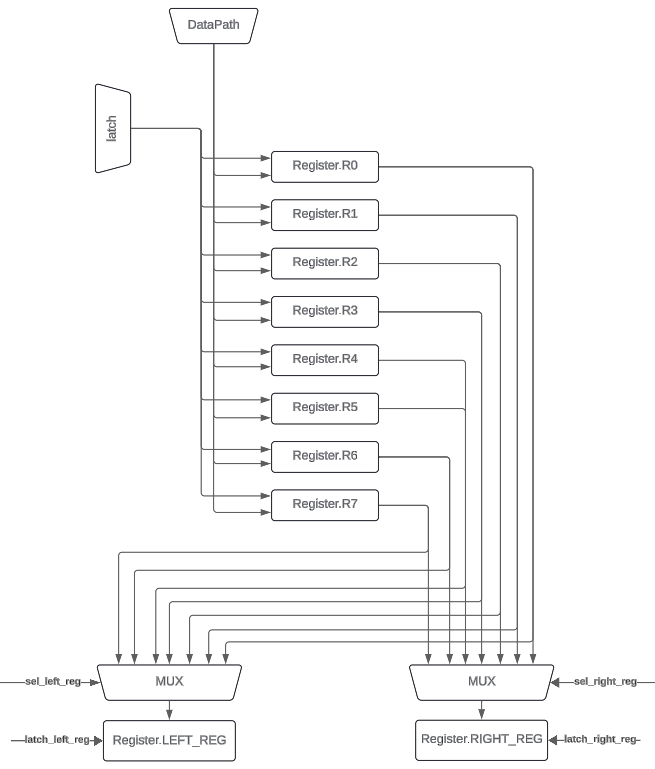

## Asm. Транслятор и модель

* Хоробрых Даниил Евгеньевич, P3216
* `asm | risc | neum | mc -> hw | instr | struct | stream | mem | pstr | prob2 | cache`
* Базовый вариант
* Без усложнения
___

### Язык программирования
``` 
<program> ::= <data_section> <code_section>

<data_section> ::= ".data:" <data_definitions>
    
<data_definitions> ::= <data_definition>*
<data_definition>  ::= <label> ":" <data_value>
                     |  <label> ":" "buf" <number>
    
<data_value> ::= <number>
               | <string>

<code_section> ::= ".code:" <instructions>

<instructions> ::= <instruction>*

<instruction> ::= <opcode> <operands> <comment>?
                | <opcode_no_operands> <comment>?
                | <label_only>
    
<opcode> ::= "mov" | "mva" | "st" | "sta" | "ld" | "lda" | "add" | "sub" | "mul" | "div" | "mod" | "inc" | "dec"
           | "neg" | "cmp" | "test" | "jmp" | "jz" | "jnz" | "jge"
    
<opcode_no_operands> ::= "hlt"

<label_only> ::= <label> ":"

<operands> ::= <operand> <operand>?
<operand> ::= <reg> | <label>
    
<comment> ::= ";" <any_text>
<any_text> ::= <letter> <any_char>*
<any_char> ::= <letter> | <digit> | <symbol>
<symbol> ::= " " | "," | "." | "!" | "?" | "-" | "+" | "*" | "/" | "%" | "&" | "|"

<reg> ::= "r0" | "r1" | "r2" | "r3" | "r4" | "r5" | "r6" | "r7"
<label> ::= <identifier>

<identifier> ::= <letter> <alpanumeric>*

<number> ::= <digit> <digit>*

<string> ::= "\"" <printable_char>* "\""
    
<printable_char> ::= <letter> | <digit> | <symbol>

<letter> ::= [a-zA-Z]
<digit> ::= [0-9]
<alphanumeric> ::= <letter> | <digit>
```

Команды выполняются последовательно, поддерживаются однострочные комментарии, начинающиеся с ```;```. 

**Операции:**

- `mov`: переслать значение из ячейки памяти, обозначенной ```label``` в регистр ```reg```
- `mva`: переслать адрес ячейки памяти, обозначенной `label` в регистр `reg`
- `st label reg`: сохранить значение регистра `reg` в ячейку памяти, обозначенную `label`
- `sta reg1 reg2`: сохранить значение из регистра `reg2` по адресу, содержащемуся в регистре `reg1`
- `ld reg label`: Загрузить значение из ячейки памяти, обозначенной `label`, в регистр `reg`
- `lda reg1 reg2`: Загрузить значение из адреса, содержащегося в регистре `reg2`, в регистр `reg1`
- `add reg1 reg2`: Добавить значения из регистров `reg1` и `reg2`, результат сохранить в `reg1`
- `sub reg1 reg2`: Вычесть значение регистра `reg2` из значения регистра `reg1`, результат сохранить в `reg1`
- `mul reg1 reg2`: Умножить значения из регистров `reg1` и `reg2`, результат сохранить в `reg1`.
- `div reg1 reg2`: Разделить значение регистра `reg1` на значение регистра `reg2`, результат сохранить в `reg1`.
- `mod reg1 reg2`: Вычислить остаток от деления значения регистра `reg1` на значение регистра `reg2`, результат 
сохранить в `reg1`.
- `inc reg`: Увеличить значение в регистре `reg` на 1.
- `dec reg`: Уменьшить значение в регистре `reg` на 1.
- `neg reg`: Изменить знак значения в регистре `reg`.
- `cmp reg1 reg2`: Сравнить значения в регистрах `reg1` и `reg2`.
- `test reg1 reg2`: Побитовое И значений в регистрах `reg1` и `reg2`.
- `jmp label`: Перейти к метке `label`.
- `jz label`: Перейти к метке `label`, если результат предыдущей команды сравнения был нулевым.
- `jnz label`: Перейти к метке `label`, если результат предыдущей команды сравнения был ненулевым.
- `jge label`: Перейти к метке `label`, если результат предыдущей команды сравнения был больше или равен нулю.
- `hlt`: Остановить выполнение программы.

Метки для переходов определяются на отдельных строчках:
```
label:
    inc r0
```

И в другом месте (неважно, до или после определения) сослаться на эту метку:
```jmp label```

Транслятор поставит на место использования метки адрес той инструкции, перед которой она определена (или ячейку памяти, 
в которой находится этот адрес для команд `mva`, `lda`, `sta`).

В программе не может быть дублирующихся меток, определенных в разных местах с одним именем

Пример кода приведен в директории [examples](examples "examples").
___

### Организация памяти
- Архитектура памяти - Фон-Неймановская
- Размер машинного слова - 32 бита
- Адресация - абсолютная
- Данные в памяти хранятся в следующем виде:

| address | memory            |
|---------|-------------------|
| 0       | jmp first_address |
| 1       | input address     |
| 2       | output address    |
| 3       | data              | 
| ...     | ...               |
| n - 1   | data              |
| n       | command #1        |
| n + 1   | command #2        |
| ...     | ...               |

За организацию статической памяти отвечает транслятор, выделяя требуемые метки и буфферы во время перевода кода в 
машинный код. Неиспользуемые ячейки памяти инициализируются `0`.

- В `0` ячейке располагается команда `jmp first_address`, которая отвечает за переход счетчика команд к первой команде 
(в машине программа начинает исполняться всегда с `0` адреса).
- Затем идут 2 ячейки с адресами `1` и `2` которые в памяти не используются, а отвечают за перенаправление данных из/в 
внешние устройства (`input address` и `output_address` соответственно). В программе реализуется memory-mapped 
архитектура взаимодействия с внешними устройствами.
- Начиная с `3` ячейки располагаются переменные, определенные в секции `.data`, а также адреса для перехода по меткам 
из кода. Все данные в памяти хранятся в целочисленном виде, строки хранятся посимвольно и перед записью преобразуются 
в ASCII-код. Хранение строк реализовано в формате `pstr` (сначала загружается длина строки, затем в следующих `n` 
строках - символы).
- После всех данных с начинают располагаться инструкции программы из секции `.code`.

#### Регистры


Реализация приведена в [RegFile](reg_file.py)
- В процессоре присутствуют 8 регистров общего назначения, пронумерованные от r0 до r7.
- `latch_reg` - У каждого из регистров есть два входа - данные и сигнал `sel`. При вызове на DataPath сигнала 
`latch_register` передается конкретный регистр, в который нужно записать данные. 
- Для выхода данных из RegFile в DataPath есть два регистра - `LEFT_REG` и `RIGHT_REG`, запись в которые происходит 
через MUX.
- Регистры `LEFT_REG` и `RIGHT_REG` связаны с ALU
- Также есть регистры, запись и чтение из/в которые пользователю недоступна:
  * `Address Register`
  * `Data Register`
  * `Program Counter`
  * `mProgram`
  * `mpc`
  * `program`
___
### Система команд

Особенности процессора:
* Машинное слово - 32 бита, знаковое
* Доступ к памяти осуществляется по адресу, хранящемуся в специальном регистре `address_register`. Установка адреса 
осуществляется путем защелкивания или из `ALU`, или из регистра `program_counter`. Из памяти данные попадают в 
регистр `data_register`.
* Обработка данных осуществляется между регистрами с помощью `ALU`, данные в регистр попадают из `data_register`.
* Поток управления:
  * Инкрементирование текущего значения в `program_counter`
  * Переход на адрес, расположенный в операнде текущей программы с помощью безусловного (`jmp`) и условных 
(`jz`, `jnz`, `jge`) переходов.

#### Набор инструкций
| Инструкция | Кол-во тактов |
|------------|---------------|
| MOV        | 1             |
| MVA        | 1             |
| ST         | 3             |
| STA        | 3             |
| LD         | 3             |
| LDA        | 3             |
| ADD        | 1             |
| SUB        | 1             |
| MUL        | 1             |
| DIV        | 1             |
| INC        | 1             |
| DEC        | 1             |
| MOD        | 1             |
| NEG        | 1             |
| CMP        | 1             |
| TEST       | 1             |
| JMP        | 1             |
| JZ         | 1             |
| JNZ        | 1             |
| JGE        | 1             |
| HLT        | 1             |

Также перед каждой инструкцией выполняется цикл выборки инструкции, который занимает `1` такт

Подробное описание инструкций приведено в пункте [Язык программирования](#язык-программирования).

#### Кодирование инструкций
- Машинный код сериализуется в список JSON
- Один элемент списка - одна инструкция

Пример:
```json
[
  {
        "index": 0,
        "opcode": "jmp",
        "terms": [
            101
        ]
    }
]
```

- `index`: индекс команды внутри программы
- `opcode`: строка с кодом операции
- `terms`: список аргументов команды (может быть пустым)

Тип данных инструкций - `Command`, тип данных opcode - `Opcode` (Описаны в модуле [isa](isa.py)).
___

### Транслятор
Интерфейс командной строки: `translator.py <input_file> <output_file>`

Реализовано в модуле translator

Этапы транслирования (функция `translate(program: str)`):
1) Обработка секции с данными, размещение их в памяти
2) Обработка секции с кодом, создание списка инструкций. Создание списка меток и их адресов
3) Расположение адресов меток в памяти данных
4) Замена в инструкциях названий меток на их реальные адреса
5) Замена в инструкциях `JMP, JZ, JNZ, JGE, LD, ST` относительной адресации на абсолютную. Замена команды `mov` 
на команду `ld`.

Также во время обработки строк кода происходит удаление комментариев и пропуск пустых строк.

После работы транслятора в результате имеется список памяти, который на этапе запуска процессора будет загружен 
в основную память.

Правила трансляции:
- В секции `.data` одна переменная занимает одну строку
- В секции `.code` одна инструкция занимает одну строку
- Метки и названия секций располагаются на отдельных строках
- Нельзя переназначать метки, ссылаться можно только на существующие

___
### Модель процессора
Интерфейс командной строки: `machine.py <machine_code_file` `input_file`

Реализовано в модуле [machine](machine.py)

#### DataPath


Реализован в классе `DataPath`.
`memory` - однопортовая память, поэтому либо читаем, либо пишем
Сигналы (обрабатываются за 1 такт, реализованы в виде методов класса):
- `latch_ar` записать в Address Register значение:
  * `program counter` - из program counter
  * `ALU` - результат выполнения операции в ALU
- `Read` - прочитать из памяти значение по адресу в Address Register, записать его в Data Register
- `Write` - записать в память значение из Data Register по адресу из Address Register
- `sel_right_alu` - записать в правый операнд ALU значение:
  * `+1` - единицу
  * `0` - ноль
  * `right_reg` - значение из правого операнда RegFile
- `sel_left_alu` - записать в левый операнд ALU значение:
  * `control_unit` - адрес из program операнда
  * `left_reg` - значение из левого операнда RegFile
- `check_flags` - проверить флаги:
  * `sign` - sign_flag == True
  * `zero` - zero_flag == True
  * `not zero` - zero_flag == False

Флаги устройства ALU:
- `zero` - отражает наличие нулевого значения в результате ALU
- `sign` - отражает наличие отрицательного значения в результате ALU

#### ControlUnit


Реализован в классе `ControlUnit`.
- Микропрограммное управление
- Есть память микрокоманд, которая включает список сигналов, которые выполняются за 1 такт
- Моделирование производится потактово, каждый такт вызывается метод `decode_and_execute_micro_instruction` 
который выполняет инструкцию, расположенную по адресу mpc в памяти микрокоманд. Состояние процессора во время каждого 
такта записывается в журнал
- Сигналы, требующие передачи конкретных регистров, изменяются в момент исполнения (в них вместо None подставляется 
требуемый операнд из программы). Таким способом реализована выгрузка операнда из программы.
- Начало симуляции происходит в функции simulate. 

  Сигналы (обрабатываются за 1 такт, реализованы в виде методов класса):
- `latch_mpc` - записать в mpc значение:
  * `+1` - mpc + 1
  * `0` - ноль
  * `mpc_address` - адрес инструкции в памяти микрокоманд
- `mpc_of_opcode` - Получить значение адреса инструкции в памяти микрокоманд по opcode текущей инструкции
- `latch_program_counter` - записать в program counter значение:
  * `+1` - program counter + 1
  * `jmp_address` - адрес для перехода из операнда program. Обычное поведение latch_program_counter - +1. 
  При выполнении jmp проверяется флаг перехода из ALU, если он False, то выполняется +1.

Особенности работы модели:
- Цикл симуляции осуществляется в функции `simulation`
- Шаг моделирования соответствует одному такту с выводом состояния в журнал
- Для журнала состояний процессора используется стандартный модуль `logging`
- Количество инструкций для моделирования ограничено
- Остановка моделирования осуществляется при:
  * превышении лимита количества выполняемых инструкций
  * исключении `EOFError` - если нет данных для чтения из порта ввода
  * исключении `HltError` - если выполнена инструкция `hlt`

---

### Тестирование
Тестирование выполняется при помощи golden тестов.

Тесты реализованы в golden_test.py. Конфигурации:
- [cat](golden/cat.yml)
- [hello_world](golden/hello_world.yml)
- [hello_user](golden/hello_user.yml)
- [prob2](golden/prob2.yml)

Запустить тесты: `poetry run pytest . -v`

Обновить конфигурацию golden тестов: `poetry run pytest . -v --update-golden`

CI при помощи Github Action:
```yml
name: Python CI

on:
  push:
    branches:
      - master

jobs:
  test:
    runs-on: ubuntu-latest

    steps:
      - name: Checkout code
        uses: actions/checkout@v4

      - name: Set up Python
        uses: actions/setup-python@v4
        with:
          python-version: 3.11

      - name: Install dependencies
        run: |
          python -m pip install --upgrade pip
          pip install poetry
          poetry install

      - name: Run tests and collect coverage
        run: |
          poetry run coverage run -m pytest .
          poetry run coverage report -m
        env:
          CI: true

  lint:
    runs-on: ubuntu-latest

    steps:
      - name: Checkout code
        uses: actions/checkout@v4

      - name: Set up Python
        uses: actions/setup-python@v4
        with:
          python-version: 3.11

      - name: Install dependencies
        run: |
          python -m pip install --upgrade pip
          pip install poetry
          poetry install

      - name: Check code formatting with Ruff
        run: poetry run ruff format --check .

      - name: Run Ruff linters
        run: poetry run ruff check .
```
где:
* `poetry` - инструмент управления зависимостями для языка программирования Python
* `coverage` - формирование отчета об уровне покрытия исходного кода
* `pytest` - утилита для запуска тестов
* `ruff` - утилита для форматирования и проверки стиля кода

Пример использования и журнал работы процессора на примере `hello_world`:
```bash
$ python translator.py hello.asm output.json
$ cat output.json
[
    {
        "index": 0,
        "opcode": "jmp",
        "terms": [
            23
        ]
    },
    null,
    null,
    13,
    104,
    101,
    108,
    108,
    111,
    44,
    32,
    119,
    111,
    114,
    108,
    100,
    33,
    13,
    1,
    2,
    0,
    25,
    33,
    {
        "index": 1,
        "opcode": "mva",
        "terms": [
            "r0",
            3
        ]
    },
    {
        "index": 2,
        "opcode": "ld",
        "terms": [
            "r1",
            20
        ]
    },
    {
        "index": 3,
        "opcode": "inc",
        "terms": [
            "r0"
        ]
    },
    {
        "index": 4,
        "opcode": "inc",
        "terms": [
            "r1"
        ]
    },
    {
        "index": 5,
        "opcode": "lda",
        "terms": [
            "r2",
            "r0"
        ]
    },
    {
        "index": 6,
        "opcode": "st",
        "terms": [
            2,
            "r2"
        ]
    },
    {
        "index": 7,
        "opcode": "ld",
        "terms": [
            "r2",
            17
        ]
    },
    {
        "index": 8,
        "opcode": "cmp",
        "terms": [
            "r1",
            "r2"
        ]
    },
    {
        "index": 9,
        "opcode": "jz",
        "terms": [
            33
        ]
    },
    {
        "index": 10,
        "opcode": "jmp",
        "terms": [
            25
        ]
    },
    {
        "index": 11,
        "opcode": "hlt",
        "terms": []
    }
]
$ python machine.py output.json input.txt
DEBUG:root:TICK: 0      PC: 0   AR: 0   DR: 0   R0: 0   R1: 0   R2: 0   R3: 0   R4: 0   R5: 0   R6: 0   R7: 0   LEFT_REG: 0     RIGHT_REG: 0    ALU: 0  MPC: 0  PROGRAM: None   SIGNALS: Signal.LATCH_ADDRESS_REGISTER, AddressRegister.PROGRAM_COUNTER | Signal.SIGNAL_READ | Signal.LATCH_PROGRAM | Signal.LATCH_MPC, MPC.MPC_ADDRESS
DEBUG:root:TICK: 1      PC: 0   AR: 0   DR: jmp(23)     R0: 0   R1: 0   R2: 0   R3: 0   R4: 0   R5: 0   R6: 0   R7: 0   LEFT_REG: 0     RIGHT_REG: 0    ALU: 0  MPC: 25 PROGRAM: jmp(23)    SIGNALS: Signal.LATCH_PROGRAM_COUNTER, PC.MPROGRAM | Signal.LATCH_MPC, MPC.ZERO
DEBUG:root:TICK: 2      PC: 23  AR: 0   DR: jmp(23)     R0: 0   R1: 0   R2: 0   R3: 0   R4: 0   R5: 0   R6: 0   R7: 0   LEFT_REG: 0     RIGHT_REG: 0    ALU: 0  MPC: 0  PROGRAM: jmp(23)    SIGNALS: Signal.LATCH_ADDRESS_REGISTER, AddressRegister.PROGRAM_COUNTER | Signal.SIGNAL_READ | Signal.LATCH_PROGRAM | Signal.LATCH_MPC, MPC.MPC_ADDRESS
DEBUG:root:TICK: 3      PC: 23  AR: 23  DR: mva(r0 3)   R0: 0   R1: 0   R2: 0   R3: 0   R4: 0   R5: 0   R6: 0   R7: 0   LEFT_REG: 0     RIGHT_REG: 0    ALU: 0  MPC: 2  PROGRAM: mva(r0 3)  SIGNALS: Signal.LATCH_LEFT_ALU, LeftAlu.CONTROL_UNIT | Signal.EXECUTE_ALU_OPERATION, ALUOperations.LEFT | Signal.LATCH_REGISTER, Register.ALU,  | Signal.LATCH_PROGRAM_COUNTER, PC.PLUS_ONE | Signal.LATCH_MPC, MPC.ZERO
DEBUG:root:TICK: 4      PC: 24  AR: 23  DR: mva(r0 3)   R0: 3   R1: 0   R2: 0   R3: 0   R4: 0   R5: 0   R6: 0   R7: 0   LEFT_REG: 0     RIGHT_REG: 0    ALU: 3  MPC: 0  PROGRAM: mva(r0 3)  SIGNALS: Signal.LATCH_ADDRESS_REGISTER, AddressRegister.PROGRAM_COUNTER | Signal.SIGNAL_READ | Signal.LATCH_PROGRAM | Signal.LATCH_MPC, MPC.MPC_ADDRESS
DEBUG:root:TICK: 5      PC: 24  AR: 24  DR: ld(r1 20)   R0: 3   R1: 0   R2: 0   R3: 0   R4: 0   R5: 0   R6: 0   R7: 0   LEFT_REG: 0     RIGHT_REG: 0    ALU: 3  MPC: 9  PROGRAM: ld(r1 20)  SIGNALS: Signal.LATCH_LEFT_ALU, LeftAlu.CONTROL_UNIT | Signal.LATCH_RIGHT_ALU, RightAlu.ZERO | Signal.EXECUTE_ALU_OPERATION, ALUOperations.ADD | Signal.LATCH_ADDRESS_REGISTER, AddressRegister.ALU | Signal.LATCH_MPC, MPC.PLUS_ONE
DEBUG:root:TICK: 6      PC: 24  AR: 20  DR: ld(r1 20)   R0: 3   R1: 0   R2: 0   R3: 0   R4: 0   R5: 0   R6: 0   R7: 0   LEFT_REG: 0     RIGHT_REG: 0    ALU: 20 MPC: 10 PROGRAM: ld(r1 20)  SIGNALS: Signal.SIGNAL_READ | Signal.LATCH_MPC, MPC.PLUS_ONE
DEBUG:root:TICK: 7      PC: 24  AR: 20  DR: 0   R0: 3   R1: 0   R2: 0   R3: 0   R4: 0   R5: 0   R6: 0   R7: 0   LEFT_REG: 0     RIGHT_REG: 0    ALU: 20 MPC: 11 PROGRAM: ld(r1 20) SIGNALS: Signal.LATCH_REGISTER, Register.DATA_REGISTER,  | Signal.LATCH_PROGRAM_COUNTER, PC.PLUS_ONE | Signal.LATCH_MPC, MPC.ZERO
DEBUG:root:TICK: 8      PC: 25  AR: 20  DR: 0   R0: 3   R1: 0   R2: 0   R3: 0   R4: 0   R5: 0   R6: 0   R7: 0   LEFT_REG: 0     RIGHT_REG: 0    ALU: 20 MPC: 0  PROGRAM: ld(r1 20) SIGNALS: Signal.LATCH_ADDRESS_REGISTER, AddressRegister.PROGRAM_COUNTER | Signal.SIGNAL_READ | Signal.LATCH_PROGRAM | Signal.LATCH_MPC, MPC.MPC_ADDRESS
DEBUG:root:TICK: 9      PC: 25  AR: 25  DR: inc(r0)     R0: 3   R1: 0   R2: 0   R3: 0   R4: 0   R5: 0   R6: 0   R7: 0   LEFT_REG: 0     RIGHT_REG: 0    ALU: 20 MPC: 19 PROGRAM: inc(r0)    SIGNALS: Signal.LATCH_LEFT_REGISTER_TERM,  | Signal.LATCH_LEFT_ALU, LeftAlu.REGISTER | Signal.LATCH_RIGHT_ALU, RightAlu.PLUS_ONE | Signal.EXECUTE_ALU_OPERATION, ALUOperations.ADD | Signal.LATCH_REGISTER, Register.ALU,  | Signal.LATCH_PROGRAM_COUNTER, PC.PLUS_ONE | Signal.LATCH_MPC, MPC.ZERO
DEBUG:root:TICK: 10     PC: 26  AR: 25  DR: inc(r0)     R0: 4   R1: 0   R2: 0   R3: 0   R4: 0   R5: 0   R6: 0   R7: 0   LEFT_REG: 3     RIGHT_REG: 0    ALU: 4  MPC: 0  PROGRAM: inc(r0)    SIGNALS: Signal.LATCH_ADDRESS_REGISTER, AddressRegister.PROGRAM_COUNTER | Signal.SIGNAL_READ | Signal.LATCH_PROGRAM | Signal.LATCH_MPC, MPC.MPC_ADDRESS
DEBUG:root:TICK: 11     PC: 26  AR: 26  DR: inc(r1)     R0: 4   R1: 0   R2: 0   R3: 0   R4: 0   R5: 0   R6: 0   R7: 0   LEFT_REG: 3     RIGHT_REG: 0    ALU: 4  MPC: 19 PROGRAM: inc
(r1)    SIGNALS: Signal.LATCH_LEFT_REGISTER_TERM,  | Signal.LATCH_LEFT_ALU, LeftAlu.REGISTER | Signal.LATCH_RIGHT_ALU, RightAlu.PLUS_ONE | Signal.EXECUTE_ALU_OPERATION, ALUOperations.ADD | Signal.LATCH_REGISTER, Register.ALU,  | Signal.LATCH_PROGRAM_COUNTER, PC.PLUS_ONE | Signal.LATCH_MPC, MPC.ZERO
DEBUG:root:TICK: 12     PC: 27  AR: 26  DR: inc(r1)     R0: 4   R1: 1   R2: 0   R3: 0   R4: 0   R5: 0   R6: 0   R7: 0   LEFT_REG: 0     RIGHT_REG: 0    ALU: 1  MPC: 0  PROGRAM: inc(r1)    SIGNALS: Signal.LATCH_ADDRESS_REGISTER, AddressRegister.PROGRAM_COUNTER | Signal.SIGNAL_READ | Signal.LATCH_PROGRAM | Signal.LATCH_MPC, MPC.MPC_ADDRESS
DEBUG:root:TICK: 13     PC: 27  AR: 27  DR: lda(r2 r0)  R0: 4   R1: 1   R2: 0   R3: 0   R4: 0   R5: 0   R6: 0   R7: 0   LEFT_REG: 0     RIGHT_REG: 0    ALU: 1  MPC: 12 PROGRAM: lda
(r2 r0) SIGNALS: Signal.LATCH_LEFT_REGISTER_TERM,  | Signal.LATCH_LEFT_ALU, LeftAlu.REGISTER | Signal.LATCH_RIGHT_ALU, RightAlu.ZERO | Signal.EXECUTE_ALU_OPERATION, ALUOperations.LEFT | Signal.LATCH_ADDRESS_REGISTER, AddressRegister.ALU | Signal.LATCH_MPC, MPC.PLUS_ONE
DEBUG:root:TICK: 14     PC: 27  AR: 4   DR: lda(r2 r0)  R0: 4   R1: 1   R2: 0   R3: 0   R4: 0   R5: 0   R6: 0   R7: 0   LEFT_REG: 4     RIGHT_REG: 0    ALU: 4  MPC: 13 PROGRAM: lda(r2 r0) SIGNALS: Signal.SIGNAL_READ | Signal.LATCH_MPC, MPC.PLUS_ONE
DEBUG:root:TICK: 15     PC: 27  AR: 4   DR: 104 R0: 4   R1: 1   R2: 0   R3: 0   R4: 0   R5: 0   R6: 0   R7: 0   LEFT_REG: 4     RIGHT_REG: 0    ALU: 4  MPC: 14 PROGRAM: lda(r2 r0)SIGNALS: Signal.LATCH_REGISTER, Register.DATA_REGISTER,  | Signal.LATCH_PROGRAM_COUNTER, PC.PLUS_ONE | Signal.LATCH_MPC, MPC.ZERO
DEBUG:root:TICK: 16     PC: 28  AR: 4   DR: 104 R0: 4   R1: 1   R2: 104 R3: 0   R4: 0   R5: 0   R6: 0   R7: 0   LEFT_REG: 4     RIGHT_REG: 0    ALU: 4  MPC: 0  PROGRAM: lda(r2 r0)SIGNALS: Signal.LATCH_ADDRESS_REGISTER, AddressRegister.PROGRAM_COUNTER | Signal.SIGNAL_READ | Signal.LATCH_PROGRAM | Signal.LATCH_MPC, MPC.MPC_ADDRESS
DEBUG:root:TICK: 17     PC: 28  AR: 28  DR: st(2 r2)    R0: 4   R1: 1   R2: 104 R3: 0   R4: 0   R5: 0   R6: 0   R7: 0   LEFT_REG: 4     RIGHT_REG: 0    ALU: 4  MPC: 3  PROGRAM: st(
2 r2)   SIGNALS: Signal.LATCH_LEFT_ALU, LeftAlu.CONTROL_UNIT | Signal.LATCH_RIGHT_ALU, RightAlu.ZERO | Signal.EXECUTE_ALU_OPERATION, ALUOperations.ADD | Signal.LATCH_ADDRESS_REGISTER, AddressRegister.ALU | Signal.LATCH_MPC, MPC.PLUS_ONE
DEBUG:root:TICK: 18     PC: 28  AR: 2   DR: st(2 r2)    R0: 4   R1: 1   R2: 104 R3: 0   R4: 0   R5: 0   R6: 0   R7: 0   LEFT_REG: 4     RIGHT_REG: 0    ALU: 2  MPC: 4  PROGRAM: st(
2 r2)   SIGNALS: Signal.LATCH_LEFT_REGISTER_TERM,  | Signal.LATCH_LEFT_ALU, LeftAlu.REGISTER | Signal.LATCH_RIGHT_ALU, RightAlu.ZERO | Signal.EXECUTE_ALU_OPERATION, ALUOperations.LEFT | Signal.LATCH_DATA_REGISTER, DataRegister.ALU | Signal.LATCH_MPC, MPC.PLUS_ONE
DEBUG:root:TICK: 19     PC: 28  AR: 2   DR: 104 R0: 4   R1: 1   R2: 104 R3: 0   R4: 0   R5: 0   R6: 0   R7: 0   LEFT_REG: 104   RIGHT_REG: 0    ALU: 104        MPC: 5  PROGRAM: st(2 r2)   SIGNALS: Signal.SIGNAL_WRITE | Signal.LATCH_PROGRAM_COUNTER, PC.PLUS_ONE | Signal.LATCH_MPC, MPC.ZERO
INFO:root:output: ['h'] << h
DEBUG:root:TICK: 20     PC: 29  AR: 2   DR: 104 R0: 4   R1: 1   R2: 104 R3: 0   R4: 0   R5: 0   R6: 0   R7: 0   LEFT_REG: 104   RIGHT_REG: 0    ALU: 104        MPC: 0  PROGRAM: st(2 r2)   SIGNALS: Signal.LATCH_ADDRESS_REGISTER, AddressRegister.PROGRAM_COUNTER | Signal.SIGNAL_READ | Signal.LATCH_PROGRAM | Signal.LATCH_MPC, MPC.MPC_ADDRESS
DEBUG:root:TICK: 21     PC: 29  AR: 29  DR: ld(r2 17)   R0: 4   R1: 1   R2: 104 R3: 0   R4: 0   R5: 0   R6: 0   R7: 0   LEFT_REG: 104   RIGHT_REG: 0    ALU: 104        MPC: 9  PROG
RAM: ld(r2 17)  SIGNALS: Signal.LATCH_LEFT_ALU, LeftAlu.CONTROL_UNIT | Signal.LATCH_RIGHT_ALU, RightAlu.ZERO | Signal.EXECUTE_ALU_OPERATION, ALUOperations.ADD | Signal.LATCH_ADDRESS_REGISTER, AddressRegister.ALU | Signal.LATCH_MPC, MPC.PLUS_ONE
DEBUG:root:TICK: 22     PC: 29  AR: 17  DR: ld(r2 17)   R0: 4   R1: 1   R2: 104 R3: 0   R4: 0   R5: 0   R6: 0   R7: 0   LEFT_REG: 104   RIGHT_REG: 0    ALU: 17 MPC: 10 PROGRAM: ld(r2 17)  SIGNALS: Signal.SIGNAL_READ | Signal.LATCH_MPC, MPC.PLUS_ONE
DEBUG:root:TICK: 23     PC: 29  AR: 17  DR: 13  R0: 4   R1: 1   R2: 104 R3: 0   R4: 0   R5: 0   R6: 0   R7: 0   LEFT_REG: 104   RIGHT_REG: 0    ALU: 17 MPC: 11 PROGRAM: ld(r2 17) SIGNALS: Signal.LATCH_REGISTER, Register.DATA_REGISTER,  | Signal.LATCH_PROGRAM_COUNTER, PC.PLUS_ONE | Signal.LATCH_MPC, MPC.ZERO
DEBUG:root:TICK: 24     PC: 30  AR: 17  DR: 13  R0: 4   R1: 1   R2: 13  R3: 0   R4: 0   R5: 0   R6: 0   R7: 0   LEFT_REG: 104   RIGHT_REG: 0    ALU: 17 MPC: 0  PROGRAM: ld(r2 17) SIGNALS: Signal.LATCH_ADDRESS_REGISTER, AddressRegister.PROGRAM_COUNTER | Signal.SIGNAL_READ | Signal.LATCH_PROGRAM | Signal.LATCH_MPC, MPC.MPC_ADDRESS
DEBUG:root:TICK: 25     PC: 30  AR: 30  DR: cmp(r1 r2)  R0: 4   R1: 1   R2: 13  R3: 0   R4: 0   R5: 0   R6: 0   R7: 0   LEFT_REG: 104   RIGHT_REG: 0    ALU: 17 MPC: 23 PROGRAM: cmp
(r1 r2) SIGNALS: Signal.LATCH_LEFT_REGISTER_TERM,  | Signal.LATCH_RIGHT_REGISTER_TERM,  | Signal.LATCH_LEFT_ALU, LeftAlu.REGISTER | Signal.LATCH_RIGHT_ALU, RightAlu.REGISTER | Signal.EXECUTE_ALU_OPERATION, ALUOperations.CMP | Signal.LATCH_PROGRAM_COUNTER, PC.PLUS_ONE | Signal.LATCH_MPC, MPC.ZERO
DEBUG:root:TICK: 26     PC: 31  AR: 30  DR: cmp(r1 r2)  R0: 4   R1: 1   R2: 13  R3: 0   R4: 0   R5: 0   R6: 0   R7: 0   LEFT_REG: 1     RIGHT_REG: 13   ALU: -12        MPC: 0  PROGRAM: cmp(r1 r2) SIGNALS: Signal.LATCH_ADDRESS_REGISTER, AddressRegister.PROGRAM_COUNTER | Signal.SIGNAL_READ | Signal.LATCH_PROGRAM | Signal.LATCH_MPC, MPC.MPC_ADDRESS
DEBUG:root:TICK: 27     PC: 31  AR: 31  DR: jz(33)      R0: 4   R1: 1   R2: 13  R3: 0   R4: 0   R5: 0   R6: 0   R7: 0   LEFT_REG: 1     RIGHT_REG: 13   ALU: -12        MPC: 26 PROGRAM: jz(33)     SIGNALS: Signal.LATCH_PROGRAM_COUNTER, PC.MPROGRAM, Signal.CHECK_ZERO_FLAG | Signal.LATCH_MPC, MPC.ZERO
DEBUG:root:TICK: 28     PC: 32  AR: 31  DR: jz(33)      R0: 4   R1: 1   R2: 13  R3: 0   R4: 0   R5: 0   R6: 0   R7: 0   LEFT_REG: 1     RIGHT_REG: 13   ALU: -12        MPC: 0  PROGRAM: jz(33)     SIGNALS: Signal.LATCH_ADDRESS_REGISTER, AddressRegister.PROGRAM_COUNTER | Signal.SIGNAL_READ | Signal.LATCH_PROGRAM | Signal.LATCH_MPC, MPC.MPC_ADDRESS
DEBUG:root:TICK: 29     PC: 32  AR: 32  DR: jmp(25)     R0: 4   R1: 1   R2: 13  R3: 0   R4: 0   R5: 0   R6: 0   R7: 0   LEFT_REG: 1     RIGHT_REG: 13   ALU: -12        MPC: 25 PROGRAM: jmp(25)    SIGNALS: Signal.LATCH_PROGRAM_COUNTER, PC.MPROGRAM | Signal.LATCH_MPC, MPC.ZERO
DEBUG:root:TICK: 30     PC: 25  AR: 32  DR: jmp(25)     R0: 4   R1: 1   R2: 13  R3: 0   R4: 0   R5: 0   R6: 0   R7: 0   LEFT_REG: 1     RIGHT_REG: 13   ALU: -12        MPC: 0  PROGRAM: jmp(25)    SIGNALS: Signal.LATCH_ADDRESS_REGISTER, AddressRegister.PROGRAM_COUNTER | Signal.SIGNAL_READ | Signal.LATCH_PROGRAM | Signal.LATCH_MPC, MPC.MPC_ADDRESS
DEBUG:root:TICK: 31     PC: 25  AR: 25  DR: inc(r0)     R0: 4   R1: 1   R2: 13  R3: 0   R4: 0   R5: 0   R6: 0   R7: 0   LEFT_REG: 1     RIGHT_REG: 13   ALU: -12        MPC: 19 PROG
RAM: inc(r0)    SIGNALS: Signal.LATCH_LEFT_REGISTER_TERM,  | Signal.LATCH_LEFT_ALU, LeftAlu.REGISTER | Signal.LATCH_RIGHT_ALU, RightAlu.PLUS_ONE | Signal.EXECUTE_ALU_OPERATION, ALUOperations.ADD | Signal.LATCH_REGISTER, Register.ALU,  | Signal.LATCH_PROGRAM_COUNTER, PC.PLUS_ONE | Signal.LATCH_MPC, MPC.ZERO
DEBUG:root:TICK: 32     PC: 26  AR: 25  DR: inc(r0)     R0: 5   R1: 1   R2: 13  R3: 0   R4: 0   R5: 0   R6: 0   R7: 0   LEFT_REG: 4     RIGHT_REG: 13   ALU: 5  MPC: 0  PROGRAM: inc(r0)    SIGNALS: Signal.LATCH_ADDRESS_REGISTER, AddressRegister.PROGRAM_COUNTER | Signal.SIGNAL_READ | Signal.LATCH_PROGRAM | Signal.LATCH_MPC, MPC.MPC_ADDRESS
DEBUG:root:TICK: 33     PC: 26  AR: 26  DR: inc(r1)     R0: 5   R1: 1   R2: 13  R3: 0   R4: 0   R5: 0   R6: 0   R7: 0   LEFT_REG: 4     RIGHT_REG: 13   ALU: 5  MPC: 19 PROGRAM: inc
(r1)    SIGNALS: Signal.LATCH_LEFT_REGISTER_TERM,  | Signal.LATCH_LEFT_ALU, LeftAlu.REGISTER | Signal.LATCH_RIGHT_ALU, RightAlu.PLUS_ONE | Signal.EXECUTE_ALU_OPERATION, ALUOperations.ADD | Signal.LATCH_REGISTER, Register.ALU,  | Signal.LATCH_PROGRAM_COUNTER, PC.PLUS_ONE | Signal.LATCH_MPC, MPC.ZERO
DEBUG:root:TICK: 34     PC: 27  AR: 26  DR: inc(r1)     R0: 5   R1: 2   R2: 13  R3: 0   R4: 0   R5: 0   R6: 0   R7: 0   LEFT_REG: 1     RIGHT_REG: 13   ALU: 2  MPC: 0  PROGRAM: inc(r1)    SIGNALS: Signal.LATCH_ADDRESS_REGISTER, AddressRegister.PROGRAM_COUNTER | Signal.SIGNAL_READ | Signal.LATCH_PROGRAM | Signal.LATCH_MPC, MPC.MPC_ADDRESS
DEBUG:root:TICK: 35     PC: 27  AR: 27  DR: lda(r2 r0)  R0: 5   R1: 2   R2: 13  R3: 0   R4: 0   R5: 0   R6: 0   R7: 0   LEFT_REG: 1     RIGHT_REG: 13   ALU: 2  MPC: 12 PROGRAM: lda
(r2 r0) SIGNALS: Signal.LATCH_LEFT_REGISTER_TERM,  | Signal.LATCH_LEFT_ALU, LeftAlu.REGISTER | Signal.LATCH_RIGHT_ALU, RightAlu.ZERO | Signal.EXECUTE_ALU_OPERATION, ALUOperations.LEFT | Signal.LATCH_ADDRESS_REGISTER, AddressRegister.ALU | Signal.LATCH_MPC, MPC.PLUS_ONE
DEBUG:root:TICK: 36     PC: 27  AR: 5   DR: lda(r2 r0)  R0: 5   R1: 2   R2: 13  R3: 0   R4: 0   R5: 0   R6: 0   R7: 0   LEFT_REG: 5     RIGHT_REG: 13   ALU: 5  MPC: 13 PROGRAM: lda(r2 r0) SIGNALS: Signal.SIGNAL_READ | Signal.LATCH_MPC, MPC.PLUS_ONE
DEBUG:root:TICK: 37     PC: 27  AR: 5   DR: 101 R0: 5   R1: 2   R2: 13  R3: 0   R4: 0   R5: 0   R6: 0   R7: 0   LEFT_REG: 5     RIGHT_REG: 13   ALU: 5  MPC: 14 PROGRAM: lda(r2 r0)SIGNALS: Signal.LATCH_REGISTER, Register.DATA_REGISTER,  | Signal.LATCH_PROGRAM_COUNTER, PC.PLUS_ONE | Signal.LATCH_MPC, MPC.ZERO
DEBUG:root:TICK: 38     PC: 28  AR: 5   DR: 101 R0: 5   R1: 2   R2: 101 R3: 0   R4: 0   R5: 0   R6: 0   R7: 0   LEFT_REG: 5     RIGHT_REG: 13   ALU: 5  MPC: 0  PROGRAM: lda(r2 r0)SIGNALS: Signal.LATCH_ADDRESS_REGISTER, AddressRegister.PROGRAM_COUNTER | Signal.SIGNAL_READ | Signal.LATCH_PROGRAM | Signal.LATCH_MPC, MPC.MPC_ADDRESS
DEBUG:root:TICK: 39     PC: 28  AR: 28  DR: st(2 r2)    R0: 5   R1: 2   R2: 101 R3: 0   R4: 0   R5: 0   R6: 0   R7: 0   LEFT_REG: 5     RIGHT_REG: 13   ALU: 5  MPC: 3  PROGRAM: st(
2 r2)   SIGNALS: Signal.LATCH_LEFT_ALU, LeftAlu.CONTROL_UNIT | Signal.LATCH_RIGHT_ALU, RightAlu.ZERO | Signal.EXECUTE_ALU_OPERATION, ALUOperations.ADD | Signal.LATCH_ADDRESS_REGISTER, AddressRegister.ALU | Signal.LATCH_MPC, MPC.PLUS_ONE
DEBUG:root:TICK: 40     PC: 28  AR: 2   DR: st(2 r2)    R0: 5   R1: 2   R2: 101 R3: 0   R4: 0   R5: 0   R6: 0   R7: 0   LEFT_REG: 5     RIGHT_REG: 13   ALU: 2  MPC: 4  PROGRAM: st(
2 r2)   SIGNALS: Signal.LATCH_LEFT_REGISTER_TERM,  | Signal.LATCH_LEFT_ALU, LeftAlu.REGISTER | Signal.LATCH_RIGHT_ALU, RightAlu.ZERO | Signal.EXECUTE_ALU_OPERATION, ALUOperations.LEFT | Signal.LATCH_DATA_REGISTER, DataRegister.ALU | Signal.LATCH_MPC, MPC.PLUS_ONE
DEBUG:root:TICK: 41     PC: 28  AR: 2   DR: 101 R0: 5   R1: 2   R2: 101 R3: 0   R4: 0   R5: 0   R6: 0   R7: 0   LEFT_REG: 101   RIGHT_REG: 13   ALU: 101        MPC: 5  PROGRAM: st(2 r2)   SIGNALS: Signal.SIGNAL_WRITE | Signal.LATCH_PROGRAM_COUNTER, PC.PLUS_ONE | Signal.LATCH_MPC, MPC.ZERO
INFO:root:output: ['h', 'e'] << e
DEBUG:root:TICK: 42     PC: 29  AR: 2   DR: 101 R0: 5   R1: 2   R2: 101 R3: 0   R4: 0   R5: 0   R6: 0   R7: 0   LEFT_REG: 101   RIGHT_REG: 13   ALU: 101        MPC: 0  PROGRAM: st(2 r2)   SIGNALS: Signal.LATCH_ADDRESS_REGISTER, AddressRegister.PROGRAM_COUNTER | Signal.SIGNAL_READ | Signal.LATCH_PROGRAM | Signal.LATCH_MPC, MPC.MPC_ADDRESS
DEBUG:root:TICK: 43     PC: 29  AR: 29  DR: ld(r2 17)   R0: 5   R1: 2   R2: 101 R3: 0   R4: 0   R5: 0   R6: 0   R7: 0   LEFT_REG: 101   RIGHT_REG: 13   ALU: 101        MPC: 9  PROG
RAM: ld(r2 17)  SIGNALS: Signal.LATCH_LEFT_ALU, LeftAlu.CONTROL_UNIT | Signal.LATCH_RIGHT_ALU, RightAlu.ZERO | Signal.EXECUTE_ALU_OPERATION, ALUOperations.ADD | Signal.LATCH_ADDRESS_REGISTER, AddressRegister.ALU | Signal.LATCH_MPC, MPC.PLUS_ONE
DEBUG:root:TICK: 44     PC: 29  AR: 17  DR: ld(r2 17)   R0: 5   R1: 2   R2: 101 R3: 0   R4: 0   R5: 0   R6: 0   R7: 0   LEFT_REG: 101   RIGHT_REG: 13   ALU: 17 MPC: 10 PROGRAM: ld(r2 17)  SIGNALS: Signal.SIGNAL_READ | Signal.LATCH_MPC, MPC.PLUS_ONE
DEBUG:root:TICK: 45     PC: 29  AR: 17  DR: 13  R0: 5   R1: 2   R2: 101 R3: 0   R4: 0   R5: 0   R6: 0   R7: 0   LEFT_REG: 101   RIGHT_REG: 13   ALU: 17 MPC: 11 PROGRAM: ld(r2 17) SIGNALS: Signal.LATCH_REGISTER, Register.DATA_REGISTER,  | Signal.LATCH_PROGRAM_COUNTER, PC.PLUS_ONE | Signal.LATCH_MPC, MPC.ZERO
DEBUG:root:TICK: 46     PC: 30  AR: 17  DR: 13  R0: 5   R1: 2   R2: 13  R3: 0   R4: 0   R5: 0   R6: 0   R7: 0   LEFT_REG: 101   RIGHT_REG: 13   ALU: 17 MPC: 0  PROGRAM: ld(r2 17) SIGNALS: Signal.LATCH_ADDRESS_REGISTER, AddressRegister.PROGRAM_COUNTER | Signal.SIGNAL_READ | Signal.LATCH_PROGRAM | Signal.LATCH_MPC, MPC.MPC_ADDRESS
DEBUG:root:TICK: 47     PC: 30  AR: 30  DR: cmp(r1 r2)  R0: 5   R1: 2   R2: 13  R3: 0   R4: 0   R5: 0   R6: 0   R7: 0   LEFT_REG: 101   RIGHT_REG: 13   ALU: 17 MPC: 23 PROGRAM: cmp
(r1 r2) SIGNALS: Signal.LATCH_LEFT_REGISTER_TERM,  | Signal.LATCH_RIGHT_REGISTER_TERM,  | Signal.LATCH_LEFT_ALU, LeftAlu.REGISTER | Signal.LATCH_RIGHT_ALU, RightAlu.REGISTER | Signal.EXECUTE_ALU_OPERATION, ALUOperations.CMP | Signal.LATCH_PROGRAM_COUNTER, PC.PLUS_ONE | Signal.LATCH_MPC, MPC.ZERO
DEBUG:root:TICK: 48     PC: 31  AR: 30  DR: cmp(r1 r2)  R0: 5   R1: 2   R2: 13  R3: 0   R4: 0   R5: 0   R6: 0   R7: 0   LEFT_REG: 2     RIGHT_REG: 13   ALU: -11        MPC: 0  PROGRAM: cmp(r1 r2) SIGNALS: Signal.LATCH_ADDRESS_REGISTER, AddressRegister.PROGRAM_COUNTER | Signal.SIGNAL_READ | Signal.LATCH_PROGRAM | Signal.LATCH_MPC, MPC.MPC_ADDRESS
DEBUG:root:TICK: 49     PC: 31  AR: 31  DR: jz(33)      R0: 5   R1: 2   R2: 13  R3: 0   R4: 0   R5: 0   R6: 0   R7: 0   LEFT_REG: 2     RIGHT_REG: 13   ALU: -11        MPC: 26 PROGRAM: jz(33)     SIGNALS: Signal.LATCH_PROGRAM_COUNTER, PC.MPROGRAM, Signal.CHECK_ZERO_FLAG | Signal.LATCH_MPC, MPC.ZERO
DEBUG:root:TICK: 50     PC: 32  AR: 31  DR: jz(33)      R0: 5   R1: 2   R2: 13  R3: 0   R4: 0   R5: 0   R6: 0   R7: 0   LEFT_REG: 2     RIGHT_REG: 13   ALU: -11        MPC: 0  PROGRAM: jz(33)     SIGNALS: Signal.LATCH_ADDRESS_REGISTER, AddressRegister.PROGRAM_COUNTER | Signal.SIGNAL_READ | Signal.LATCH_PROGRAM | Signal.LATCH_MPC, MPC.MPC_ADDRESS
DEBUG:root:TICK: 51     PC: 32  AR: 32  DR: jmp(25)     R0: 5   R1: 2   R2: 13  R3: 0   R4: 0   R5: 0   R6: 0   R7: 0   LEFT_REG: 2     RIGHT_REG: 13   ALU: -11        MPC: 25 PROGRAM: jmp(25)    SIGNALS: Signal.LATCH_PROGRAM_COUNTER, PC.MPROGRAM | Signal.LATCH_MPC, MPC.ZERO
DEBUG:root:TICK: 52     PC: 25  AR: 32  DR: jmp(25)     R0: 5   R1: 2   R2: 13  R3: 0   R4: 0   R5: 0   R6: 0   R7: 0   LEFT_REG: 2     RIGHT_REG: 13   ALU: -11        MPC: 0  PROGRAM: jmp(25)    SIGNALS: Signal.LATCH_ADDRESS_REGISTER, AddressRegister.PROGRAM_COUNTER | Signal.SIGNAL_READ | Signal.LATCH_PROGRAM | Signal.LATCH_MPC, MPC.MPC_ADDRESS
DEBUG:root:TICK: 53     PC: 25  AR: 25  DR: inc(r0)     R0: 5   R1: 2   R2: 13  R3: 0   R4: 0   R5: 0   R6: 0   R7: 0   LEFT_REG: 2     RIGHT_REG: 13   ALU: -11        MPC: 19 PROG
RAM: inc(r0)    SIGNALS: Signal.LATCH_LEFT_REGISTER_TERM,  | Signal.LATCH_LEFT_ALU, LeftAlu.REGISTER | Signal.LATCH_RIGHT_ALU, RightAlu.PLUS_ONE | Signal.EXECUTE_ALU_OPERATION, ALUOperations.ADD | Signal.LATCH_REGISTER, Register.ALU,  | Signal.LATCH_PROGRAM_COUNTER, PC.PLUS_ONE | Signal.LATCH_MPC, MPC.ZERO
DEBUG:root:TICK: 54     PC: 26  AR: 25  DR: inc(r0)     R0: 6   R1: 2   R2: 13  R3: 0   R4: 0   R5: 0   R6: 0   R7: 0   LEFT_REG: 5     RIGHT_REG: 13   ALU: 6  MPC: 0  PROGRAM: inc(r0)    SIGNALS: Signal.LATCH_ADDRESS_REGISTER, AddressRegister.PROGRAM_COUNTER | Signal.SIGNAL_READ | Signal.LATCH_PROGRAM | Signal.LATCH_MPC, MPC.MPC_ADDRESS
DEBUG:root:TICK: 55     PC: 26  AR: 26  DR: inc(r1)     R0: 6   R1: 2   R2: 13  R3: 0   R4: 0   R5: 0   R6: 0   R7: 0   LEFT_REG: 5     RIGHT_REG: 13   ALU: 6  MPC: 19 PROGRAM: inc
(r1)    SIGNALS: Signal.LATCH_LEFT_REGISTER_TERM,  | Signal.LATCH_LEFT_ALU, LeftAlu.REGISTER | Signal.LATCH_RIGHT_ALU, RightAlu.PLUS_ONE | Signal.EXECUTE_ALU_OPERATION, ALUOperations.ADD | Signal.LATCH_REGISTER, Register.ALU,  | Signal.LATCH_PROGRAM_COUNTER, PC.PLUS_ONE | Signal.LATCH_MPC, MPC.ZERO
DEBUG:root:TICK: 56     PC: 27  AR: 26  DR: inc(r1)     R0: 6   R1: 3   R2: 13  R3: 0   R4: 0   R5: 0   R6: 0   R7: 0   LEFT_REG: 2     RIGHT_REG: 13   ALU: 3  MPC: 0  PROGRAM: inc(r1)    SIGNALS: Signal.LATCH_ADDRESS_REGISTER, AddressRegister.PROGRAM_COUNTER | Signal.SIGNAL_READ | Signal.LATCH_PROGRAM | Signal.LATCH_MPC, MPC.MPC_ADDRESS
DEBUG:root:TICK: 57     PC: 27  AR: 27  DR: lda(r2 r0)  R0: 6   R1: 3   R2: 13  R3: 0   R4: 0   R5: 0   R6: 0   R7: 0   LEFT_REG: 2     RIGHT_REG: 13   ALU: 3  MPC: 12 PROGRAM: lda
(r2 r0) SIGNALS: Signal.LATCH_LEFT_REGISTER_TERM,  | Signal.LATCH_LEFT_ALU, LeftAlu.REGISTER | Signal.LATCH_RIGHT_ALU, RightAlu.ZERO | Signal.EXECUTE_ALU_OPERATION, ALUOperations.LEFT | Signal.LATCH_ADDRESS_REGISTER, AddressRegister.ALU | Signal.LATCH_MPC, MPC.PLUS_ONE
DEBUG:root:TICK: 58     PC: 27  AR: 6   DR: lda(r2 r0)  R0: 6   R1: 3   R2: 13  R3: 0   R4: 0   R5: 0   R6: 0   R7: 0   LEFT_REG: 6     RIGHT_REG: 13   ALU: 6  MPC: 13 PROGRAM: lda(r2 r0) SIGNALS: Signal.SIGNAL_READ | Signal.LATCH_MPC, MPC.PLUS_ONE
DEBUG:root:TICK: 59     PC: 27  AR: 6   DR: 108 R0: 6   R1: 3   R2: 13  R3: 0   R4: 0   R5: 0   R6: 0   R7: 0   LEFT_REG: 6     RIGHT_REG: 13   ALU: 6  MPC: 14 PROGRAM: lda(r2 r0)SIGNALS: Signal.LATCH_REGISTER, Register.DATA_REGISTER,  | Signal.LATCH_PROGRAM_COUNTER, PC.PLUS_ONE | Signal.LATCH_MPC, MPC.ZERO
DEBUG:root:TICK: 60     PC: 28  AR: 6   DR: 108 R0: 6   R1: 3   R2: 108 R3: 0   R4: 0   R5: 0   R6: 0   R7: 0   LEFT_REG: 6     RIGHT_REG: 13   ALU: 6  MPC: 0  PROGRAM: lda(r2 r0)SIGNALS: Signal.LATCH_ADDRESS_REGISTER, AddressRegister.PROGRAM_COUNTER | Signal.SIGNAL_READ | Signal.LATCH_PROGRAM | Signal.LATCH_MPC, MPC.MPC_ADDRESS
DEBUG:root:TICK: 61     PC: 28  AR: 28  DR: st(2 r2)    R0: 6   R1: 3   R2: 108 R3: 0   R4: 0   R5: 0   R6: 0   R7: 0   LEFT_REG: 6     RIGHT_REG: 13   ALU: 6  MPC: 3  PROGRAM: st(
2 r2)   SIGNALS: Signal.LATCH_LEFT_ALU, LeftAlu.CONTROL_UNIT | Signal.LATCH_RIGHT_ALU, RightAlu.ZERO | Signal.EXECUTE_ALU_OPERATION, ALUOperations.ADD | Signal.LATCH_ADDRESS_REGISTER, AddressRegister.ALU | Signal.LATCH_MPC, MPC.PLUS_ONE
DEBUG:root:TICK: 62     PC: 28  AR: 2   DR: st(2 r2)    R0: 6   R1: 3   R2: 108 R3: 0   R4: 0   R5: 0   R6: 0   R7: 0   LEFT_REG: 6     RIGHT_REG: 13   ALU: 2  MPC: 4  PROGRAM: st(
2 r2)   SIGNALS: Signal.LATCH_LEFT_REGISTER_TERM,  | Signal.LATCH_LEFT_ALU, LeftAlu.REGISTER | Signal.LATCH_RIGHT_ALU, RightAlu.ZERO | Signal.EXECUTE_ALU_OPERATION, ALUOperations.LEFT | Signal.LATCH_DATA_REGISTER, DataRegister.ALU | Signal.LATCH_MPC, MPC.PLUS_ONE
DEBUG:root:TICK: 63     PC: 28  AR: 2   DR: 108 R0: 6   R1: 3   R2: 108 R3: 0   R4: 0   R5: 0   R6: 0   R7: 0   LEFT_REG: 108   RIGHT_REG: 13   ALU: 108        MPC: 5  PROGRAM: st(2 r2)   SIGNALS: Signal.SIGNAL_WRITE | Signal.LATCH_PROGRAM_COUNTER, PC.PLUS_ONE | Signal.LATCH_MPC, MPC.ZERO
INFO:root:output: ['h', 'e', 'l'] << l
DEBUG:root:TICK: 64     PC: 29  AR: 2   DR: 108 R0: 6   R1: 3   R2: 108 R3: 0   R4: 0   R5: 0   R6: 0   R7: 0   LEFT_REG: 108   RIGHT_REG: 13   ALU: 108        MPC: 0  PROGRAM: st(2 r2)   SIGNALS: Signal.LATCH_ADDRESS_REGISTER, AddressRegister.PROGRAM_COUNTER | Signal.SIGNAL_READ | Signal.LATCH_PROGRAM | Signal.LATCH_MPC, MPC.MPC_ADDRESS
DEBUG:root:TICK: 65     PC: 29  AR: 29  DR: ld(r2 17)   R0: 6   R1: 3   R2: 108 R3: 0   R4: 0   R5: 0   R6: 0   R7: 0   LEFT_REG: 108   RIGHT_REG: 13   ALU: 108        MPC: 9  PROG
RAM: ld(r2 17)  SIGNALS: Signal.LATCH_LEFT_ALU, LeftAlu.CONTROL_UNIT | Signal.LATCH_RIGHT_ALU, RightAlu.ZERO | Signal.EXECUTE_ALU_OPERATION, ALUOperations.ADD | Signal.LATCH_ADDRESS_REGISTER, AddressRegister.ALU | Signal.LATCH_MPC, MPC.PLUS_ONE
DEBUG:root:TICK: 66     PC: 29  AR: 17  DR: ld(r2 17)   R0: 6   R1: 3   R2: 108 R3: 0   R4: 0   R5: 0   R6: 0   R7: 0   LEFT_REG: 108   RIGHT_REG: 13   ALU: 17 MPC: 10 PROGRAM: ld(r2 17)  SIGNALS: Signal.SIGNAL_READ | Signal.LATCH_MPC, MPC.PLUS_ONE
DEBUG:root:TICK: 67     PC: 29  AR: 17  DR: 13  R0: 6   R1: 3   R2: 108 R3: 0   R4: 0   R5: 0   R6: 0   R7: 0   LEFT_REG: 108   RIGHT_REG: 13   ALU: 17 MPC: 11 PROGRAM: ld(r2 17) SIGNALS: Signal.LATCH_REGISTER, Register.DATA_REGISTER,  | Signal.LATCH_PROGRAM_COUNTER, PC.PLUS_ONE | Signal.LATCH_MPC, MPC.ZERO
DEBUG:root:TICK: 68     PC: 30  AR: 17  DR: 13  R0: 6   R1: 3   R2: 13  R3: 0   R4: 0   R5: 0   R6: 0   R7: 0   LEFT_REG: 108   RIGHT_REG: 13   ALU: 17 MPC: 0  PROGRAM: ld(r2 17) SIGNALS: Signal.LATCH_ADDRESS_REGISTER, AddressRegister.PROGRAM_COUNTER | Signal.SIGNAL_READ | Signal.LATCH_PROGRAM | Signal.LATCH_MPC, MPC.MPC_ADDRESS
DEBUG:root:TICK: 69     PC: 30  AR: 30  DR: cmp(r1 r2)  R0: 6   R1: 3   R2: 13  R3: 0   R4: 0   R5: 0   R6: 0   R7: 0   LEFT_REG: 108   RIGHT_REG: 13   ALU: 17 MPC: 23 PROGRAM: cmp
(r1 r2) SIGNALS: Signal.LATCH_LEFT_REGISTER_TERM,  | Signal.LATCH_RIGHT_REGISTER_TERM,  | Signal.LATCH_LEFT_ALU, LeftAlu.REGISTER | Signal.LATCH_RIGHT_ALU, RightAlu.REGISTER | Signal.EXECUTE_ALU_OPERATION, ALUOperations.CMP | Signal.LATCH_PROGRAM_COUNTER, PC.PLUS_ONE | Signal.LATCH_MPC, MPC.ZERO
DEBUG:root:TICK: 70     PC: 31  AR: 30  DR: cmp(r1 r2)  R0: 6   R1: 3   R2: 13  R3: 0   R4: 0   R5: 0   R6: 0   R7: 0   LEFT_REG: 3     RIGHT_REG: 13   ALU: -10        MPC: 0  PROGRAM: cmp(r1 r2) SIGNALS: Signal.LATCH_ADDRESS_REGISTER, AddressRegister.PROGRAM_COUNTER | Signal.SIGNAL_READ | Signal.LATCH_PROGRAM | Signal.LATCH_MPC, MPC.MPC_ADDRESS
DEBUG:root:TICK: 71     PC: 31  AR: 31  DR: jz(33)      R0: 6   R1: 3   R2: 13  R3: 0   R4: 0   R5: 0   R6: 0   R7: 0   LEFT_REG: 3     RIGHT_REG: 13   ALU: -10        MPC: 26 PROGRAM: jz(33)     SIGNALS: Signal.LATCH_PROGRAM_COUNTER, PC.MPROGRAM, Signal.CHECK_ZERO_FLAG | Signal.LATCH_MPC, MPC.ZERO
DEBUG:root:TICK: 72     PC: 32  AR: 31  DR: jz(33)      R0: 6   R1: 3   R2: 13  R3: 0   R4: 0   R5: 0   R6: 0   R7: 0   LEFT_REG: 3     RIGHT_REG: 13   ALU: -10        MPC: 0  PROGRAM: jz(33)     SIGNALS: Signal.LATCH_ADDRESS_REGISTER, AddressRegister.PROGRAM_COUNTER | Signal.SIGNAL_READ | Signal.LATCH_PROGRAM | Signal.LATCH_MPC, MPC.MPC_ADDRESS
DEBUG:root:TICK: 73     PC: 32  AR: 32  DR: jmp(25)     R0: 6   R1: 3   R2: 13  R3: 0   R4: 0   R5: 0   R6: 0   R7: 0   LEFT_REG: 3     RIGHT_REG: 13   ALU: -10        MPC: 25 PROGRAM: jmp(25)    SIGNALS: Signal.LATCH_PROGRAM_COUNTER, PC.MPROGRAM | Signal.LATCH_MPC, MPC.ZERO
DEBUG:root:TICK: 74     PC: 25  AR: 32  DR: jmp(25)     R0: 6   R1: 3   R2: 13  R3: 0   R4: 0   R5: 0   R6: 0   R7: 0   LEFT_REG: 3     RIGHT_REG: 13   ALU: -10        MPC: 0  PROGRAM: jmp(25)    SIGNALS: Signal.LATCH_ADDRESS_REGISTER, AddressRegister.PROGRAM_COUNTER | Signal.SIGNAL_READ | Signal.LATCH_PROGRAM | Signal.LATCH_MPC, MPC.MPC_ADDRESS
DEBUG:root:TICK: 75     PC: 25  AR: 25  DR: inc(r0)     R0: 6   R1: 3   R2: 13  R3: 0   R4: 0   R5: 0   R6: 0   R7: 0   LEFT_REG: 3     RIGHT_REG: 13   ALU: -10        MPC: 19 PROG
RAM: inc(r0)    SIGNALS: Signal.LATCH_LEFT_REGISTER_TERM,  | Signal.LATCH_LEFT_ALU, LeftAlu.REGISTER | Signal.LATCH_RIGHT_ALU, RightAlu.PLUS_ONE | Signal.EXECUTE_ALU_OPERATION, ALUOperations.ADD | Signal.LATCH_REGISTER, Register.ALU,  | Signal.LATCH_PROGRAM_COUNTER, PC.PLUS_ONE | Signal.LATCH_MPC, MPC.ZERO
DEBUG:root:TICK: 76     PC: 26  AR: 25  DR: inc(r0)     R0: 7   R1: 3   R2: 13  R3: 0   R4: 0   R5: 0   R6: 0   R7: 0   LEFT_REG: 6     RIGHT_REG: 13   ALU: 7  MPC: 0  PROGRAM: inc(r0)    SIGNALS: Signal.LATCH_ADDRESS_REGISTER, AddressRegister.PROGRAM_COUNTER | Signal.SIGNAL_READ | Signal.LATCH_PROGRAM | Signal.LATCH_MPC, MPC.MPC_ADDRESS
DEBUG:root:TICK: 77     PC: 26  AR: 26  DR: inc(r1)     R0: 7   R1: 3   R2: 13  R3: 0   R4: 0   R5: 0   R6: 0   R7: 0   LEFT_REG: 6     RIGHT_REG: 13   ALU: 7  MPC: 19 PROGRAM: inc
(r1)    SIGNALS: Signal.LATCH_LEFT_REGISTER_TERM,  | Signal.LATCH_LEFT_ALU, LeftAlu.REGISTER | Signal.LATCH_RIGHT_ALU, RightAlu.PLUS_ONE | Signal.EXECUTE_ALU_OPERATION, ALUOperations.ADD | Signal.LATCH_REGISTER, Register.ALU,  | Signal.LATCH_PROGRAM_COUNTER, PC.PLUS_ONE | Signal.LATCH_MPC, MPC.ZERO
DEBUG:root:TICK: 78     PC: 27  AR: 26  DR: inc(r1)     R0: 7   R1: 4   R2: 13  R3: 0   R4: 0   R5: 0   R6: 0   R7: 0   LEFT_REG: 3     RIGHT_REG: 13   ALU: 4  MPC: 0  PROGRAM: inc(r1)    SIGNALS: Signal.LATCH_ADDRESS_REGISTER, AddressRegister.PROGRAM_COUNTER | Signal.SIGNAL_READ | Signal.LATCH_PROGRAM | Signal.LATCH_MPC, MPC.MPC_ADDRESS
DEBUG:root:TICK: 79     PC: 27  AR: 27  DR: lda(r2 r0)  R0: 7   R1: 4   R2: 13  R3: 0   R4: 0   R5: 0   R6: 0   R7: 0   LEFT_REG: 3     RIGHT_REG: 13   ALU: 4  MPC: 12 PROGRAM: lda
(r2 r0) SIGNALS: Signal.LATCH_LEFT_REGISTER_TERM,  | Signal.LATCH_LEFT_ALU, LeftAlu.REGISTER | Signal.LATCH_RIGHT_ALU, RightAlu.ZERO | Signal.EXECUTE_ALU_OPERATION, ALUOperations.LEFT | Signal.LATCH_ADDRESS_REGISTER, AddressRegister.ALU | Signal.LATCH_MPC, MPC.PLUS_ONE
DEBUG:root:TICK: 80     PC: 27  AR: 7   DR: lda(r2 r0)  R0: 7   R1: 4   R2: 13  R3: 0   R4: 0   R5: 0   R6: 0   R7: 0   LEFT_REG: 7     RIGHT_REG: 13   ALU: 7  MPC: 13 PROGRAM: lda(r2 r0) SIGNALS: Signal.SIGNAL_READ | Signal.LATCH_MPC, MPC.PLUS_ONE
DEBUG:root:TICK: 81     PC: 27  AR: 7   DR: 108 R0: 7   R1: 4   R2: 13  R3: 0   R4: 0   R5: 0   R6: 0   R7: 0   LEFT_REG: 7     RIGHT_REG: 13   ALU: 7  MPC: 14 PROGRAM: lda(r2 r0)SIGNALS: Signal.LATCH_REGISTER, Register.DATA_REGISTER,  | Signal.LATCH_PROGRAM_COUNTER, PC.PLUS_ONE | Signal.LATCH_MPC, MPC.ZERO
DEBUG:root:TICK: 82     PC: 28  AR: 7   DR: 108 R0: 7   R1: 4   R2: 108 R3: 0   R4: 0   R5: 0   R6: 0   R7: 0   LEFT_REG: 7     RIGHT_REG: 13   ALU: 7  MPC: 0  PROGRAM: lda(r2 r0)SIGNALS: Signal.LATCH_ADDRESS_REGISTER, AddressRegister.PROGRAM_COUNTER | Signal.SIGNAL_READ | Signal.LATCH_PROGRAM | Signal.LATCH_MPC, MPC.MPC_ADDRESS
DEBUG:root:TICK: 83     PC: 28  AR: 28  DR: st(2 r2)    R0: 7   R1: 4   R2: 108 R3: 0   R4: 0   R5: 0   R6: 0   R7: 0   LEFT_REG: 7     RIGHT_REG: 13   ALU: 7  MPC: 3  PROGRAM: st(
2 r2)   SIGNALS: Signal.LATCH_LEFT_ALU, LeftAlu.CONTROL_UNIT | Signal.LATCH_RIGHT_ALU, RightAlu.ZERO | Signal.EXECUTE_ALU_OPERATION, ALUOperations.ADD | Signal.LATCH_ADDRESS_REGISTER, AddressRegister.ALU | Signal.LATCH_MPC, MPC.PLUS_ONE
DEBUG:root:TICK: 84     PC: 28  AR: 2   DR: st(2 r2)    R0: 7   R1: 4   R2: 108 R3: 0   R4: 0   R5: 0   R6: 0   R7: 0   LEFT_REG: 7     RIGHT_REG: 13   ALU: 2  MPC: 4  PROGRAM: st(
2 r2)   SIGNALS: Signal.LATCH_LEFT_REGISTER_TERM,  | Signal.LATCH_LEFT_ALU, LeftAlu.REGISTER | Signal.LATCH_RIGHT_ALU, RightAlu.ZERO | Signal.EXECUTE_ALU_OPERATION, ALUOperations.LEFT | Signal.LATCH_DATA_REGISTER, DataRegister.ALU | Signal.LATCH_MPC, MPC.PLUS_ONE
DEBUG:root:TICK: 85     PC: 28  AR: 2   DR: 108 R0: 7   R1: 4   R2: 108 R3: 0   R4: 0   R5: 0   R6: 0   R7: 0   LEFT_REG: 108   RIGHT_REG: 13   ALU: 108        MPC: 5  PROGRAM: st(2 r2)   SIGNALS: Signal.SIGNAL_WRITE | Signal.LATCH_PROGRAM_COUNTER, PC.PLUS_ONE | Signal.LATCH_MPC, MPC.ZERO
INFO:root:output: ['h', 'e', 'l', 'l'] << l
DEBUG:root:TICK: 86     PC: 29  AR: 2   DR: 108 R0: 7   R1: 4   R2: 108 R3: 0   R4: 0   R5: 0   R6: 0   R7: 0   LEFT_REG: 108   RIGHT_REG: 13   ALU: 108        MPC: 0  PROGRAM: st(2 r2)   SIGNALS: Signal.LATCH_ADDRESS_REGISTER, AddressRegister.PROGRAM_COUNTER | Signal.SIGNAL_READ | Signal.LATCH_PROGRAM | Signal.LATCH_MPC, MPC.MPC_ADDRESS
DEBUG:root:TICK: 87     PC: 29  AR: 29  DR: ld(r2 17)   R0: 7   R1: 4   R2: 108 R3: 0   R4: 0   R5: 0   R6: 0   R7: 0   LEFT_REG: 108   RIGHT_REG: 13   ALU: 108        MPC: 9  PROG
RAM: ld(r2 17)  SIGNALS: Signal.LATCH_LEFT_ALU, LeftAlu.CONTROL_UNIT | Signal.LATCH_RIGHT_ALU, RightAlu.ZERO | Signal.EXECUTE_ALU_OPERATION, ALUOperations.ADD | Signal.LATCH_ADDRESS_REGISTER, AddressRegister.ALU | Signal.LATCH_MPC, MPC.PLUS_ONE
DEBUG:root:TICK: 88     PC: 29  AR: 17  DR: ld(r2 17)   R0: 7   R1: 4   R2: 108 R3: 0   R4: 0   R5: 0   R6: 0   R7: 0   LEFT_REG: 108   RIGHT_REG: 13   ALU: 17 MPC: 10 PROGRAM: ld(r2 17)  SIGNALS: Signal.SIGNAL_READ | Signal.LATCH_MPC, MPC.PLUS_ONE
DEBUG:root:TICK: 89     PC: 29  AR: 17  DR: 13  R0: 7   R1: 4   R2: 108 R3: 0   R4: 0   R5: 0   R6: 0   R7: 0   LEFT_REG: 108   RIGHT_REG: 13   ALU: 17 MPC: 11 PROGRAM: ld(r2 17) SIGNALS: Signal.LATCH_REGISTER, Register.DATA_REGISTER,  | Signal.LATCH_PROGRAM_COUNTER, PC.PLUS_ONE | Signal.LATCH_MPC, MPC.ZERO
DEBUG:root:TICK: 90     PC: 30  AR: 17  DR: 13  R0: 7   R1: 4   R2: 13  R3: 0   R4: 0   R5: 0   R6: 0   R7: 0   LEFT_REG: 108   RIGHT_REG: 13   ALU: 17 MPC: 0  PROGRAM: ld(r2 17) SIGNALS: Signal.LATCH_ADDRESS_REGISTER, AddressRegister.PROGRAM_COUNTER | Signal.SIGNAL_READ | Signal.LATCH_PROGRAM | Signal.LATCH_MPC, MPC.MPC_ADDRESS
DEBUG:root:TICK: 91     PC: 30  AR: 30  DR: cmp(r1 r2)  R0: 7   R1: 4   R2: 13  R3: 0   R4: 0   R5: 0   R6: 0   R7: 0   LEFT_REG: 108   RIGHT_REG: 13   ALU: 17 MPC: 23 PROGRAM: cmp
(r1 r2) SIGNALS: Signal.LATCH_LEFT_REGISTER_TERM,  | Signal.LATCH_RIGHT_REGISTER_TERM,  | Signal.LATCH_LEFT_ALU, LeftAlu.REGISTER | Signal.LATCH_RIGHT_ALU, RightAlu.REGISTER | Signal.EXECUTE_ALU_OPERATION, ALUOperations.CMP | Signal.LATCH_PROGRAM_COUNTER, PC.PLUS_ONE | Signal.LATCH_MPC, MPC.ZERO
DEBUG:root:TICK: 92     PC: 31  AR: 30  DR: cmp(r1 r2)  R0: 7   R1: 4   R2: 13  R3: 0   R4: 0   R5: 0   R6: 0   R7: 0   LEFT_REG: 4     RIGHT_REG: 13   ALU: -9 MPC: 0  PROGRAM: cmp(r1 r2) SIGNALS: Signal.LATCH_ADDRESS_REGISTER, AddressRegister.PROGRAM_COUNTER | Signal.SIGNAL_READ | Signal.LATCH_PROGRAM | Signal.LATCH_MPC, MPC.MPC_ADDRESS
DEBUG:root:TICK: 93     PC: 31  AR: 31  DR: jz(33)      R0: 7   R1: 4   R2: 13  R3: 0   R4: 0   R5: 0   R6: 0   R7: 0   LEFT_REG: 4     RIGHT_REG: 13   ALU: -9 MPC: 26 PROGRAM: jz(33)     SIGNALS: Signal.LATCH_PROGRAM_COUNTER, PC.MPROGRAM, Signal.CHECK_ZERO_FLAG | Signal.LATCH_MPC, MPC.ZERO
DEBUG:root:TICK: 94     PC: 32  AR: 31  DR: jz(33)      R0: 7   R1: 4   R2: 13  R3: 0   R4: 0   R5: 0   R6: 0   R7: 0   LEFT_REG: 4     RIGHT_REG: 13   ALU: -9 MPC: 0  PROGRAM: jz(33)     SIGNALS: Signal.LATCH_ADDRESS_REGISTER, AddressRegister.PROGRAM_COUNTER | Signal.SIGNAL_READ | Signal.LATCH_PROGRAM | Signal.LATCH_MPC, MPC.MPC_ADDRESS
DEBUG:root:TICK: 95     PC: 32  AR: 32  DR: jmp(25)     R0: 7   R1: 4   R2: 13  R3: 0   R4: 0   R5: 0   R6: 0   R7: 0   LEFT_REG: 4     RIGHT_REG: 13   ALU: -9 MPC: 25 PROGRAM: jmp(25)    SIGNALS: Signal.LATCH_PROGRAM_COUNTER, PC.MPROGRAM | Signal.LATCH_MPC, MPC.ZERO
DEBUG:root:TICK: 96     PC: 25  AR: 32  DR: jmp(25)     R0: 7   R1: 4   R2: 13  R3: 0   R4: 0   R5: 0   R6: 0   R7: 0   LEFT_REG: 4     RIGHT_REG: 13   ALU: -9 MPC: 0  PROGRAM: jmp(25)    SIGNALS: Signal.LATCH_ADDRESS_REGISTER, AddressRegister.PROGRAM_COUNTER | Signal.SIGNAL_READ | Signal.LATCH_PROGRAM | Signal.LATCH_MPC, MPC.MPC_ADDRESS
DEBUG:root:TICK: 97     PC: 25  AR: 25  DR: inc(r0)     R0: 7   R1: 4   R2: 13  R3: 0   R4: 0   R5: 0   R6: 0   R7: 0   LEFT_REG: 4     RIGHT_REG: 13   ALU: -9 MPC: 19 PROGRAM: inc
(r0)    SIGNALS: Signal.LATCH_LEFT_REGISTER_TERM,  | Signal.LATCH_LEFT_ALU, LeftAlu.REGISTER | Signal.LATCH_RIGHT_ALU, RightAlu.PLUS_ONE | Signal.EXECUTE_ALU_OPERATION, ALUOperations.ADD | Signal.LATCH_REGISTER, Register.ALU,  | Signal.LATCH_PROGRAM_COUNTER, PC.PLUS_ONE | Signal.LATCH_MPC, MPC.ZERO
DEBUG:root:TICK: 98     PC: 26  AR: 25  DR: inc(r0)     R0: 8   R1: 4   R2: 13  R3: 0   R4: 0   R5: 0   R6: 0   R7: 0   LEFT_REG: 7     RIGHT_REG: 13   ALU: 8  MPC: 0  PROGRAM: inc(r0)    SIGNALS: Signal.LATCH_ADDRESS_REGISTER, AddressRegister.PROGRAM_COUNTER | Signal.SIGNAL_READ | Signal.LATCH_PROGRAM | Signal.LATCH_MPC, MPC.MPC_ADDRESS
DEBUG:root:TICK: 99     PC: 26  AR: 26  DR: inc(r1)     R0: 8   R1: 4   R2: 13  R3: 0   R4: 0   R5: 0   R6: 0   R7: 0   LEFT_REG: 7     RIGHT_REG: 13   ALU: 8  MPC: 19 PROGRAM: inc
(r1)    SIGNALS: Signal.LATCH_LEFT_REGISTER_TERM,  | Signal.LATCH_LEFT_ALU, LeftAlu.REGISTER | Signal.LATCH_RIGHT_ALU, RightAlu.PLUS_ONE | Signal.EXECUTE_ALU_OPERATION, ALUOperations.ADD | Signal.LATCH_REGISTER, Register.ALU,  | Signal.LATCH_PROGRAM_COUNTER, PC.PLUS_ONE | Signal.LATCH_MPC, MPC.ZERO
DEBUG:root:TICK: 100    PC: 27  AR: 26  DR: inc(r1)     R0: 8   R1: 5   R2: 13  R3: 0   R4: 0   R5: 0   R6: 0   R7: 0   LEFT_REG: 4     RIGHT_REG: 13   ALU: 5  MPC: 0  PROGRAM: inc(r1)    SIGNALS: Signal.LATCH_ADDRESS_REGISTER, AddressRegister.PROGRAM_COUNTER | Signal.SIGNAL_READ | Signal.LATCH_PROGRAM | Signal.LATCH_MPC, MPC.MPC_ADDRESS
DEBUG:root:TICK: 101    PC: 27  AR: 27  DR: lda(r2 r0)  R0: 8   R1: 5   R2: 13  R3: 0   R4: 0   R5: 0   R6: 0   R7: 0   LEFT_REG: 4     RIGHT_REG: 13   ALU: 5  MPC: 12 PROGRAM: lda
(r2 r0) SIGNALS: Signal.LATCH_LEFT_REGISTER_TERM,  | Signal.LATCH_LEFT_ALU, LeftAlu.REGISTER | Signal.LATCH_RIGHT_ALU, RightAlu.ZERO | Signal.EXECUTE_ALU_OPERATION, ALUOperations.LEFT | Signal.LATCH_ADDRESS_REGISTER, AddressRegister.ALU | Signal.LATCH_MPC, MPC.PLUS_ONE
DEBUG:root:TICK: 102    PC: 27  AR: 8   DR: lda(r2 r0)  R0: 8   R1: 5   R2: 13  R3: 0   R4: 0   R5: 0   R6: 0   R7: 0   LEFT_REG: 8     RIGHT_REG: 13   ALU: 8  MPC: 13 PROGRAM: lda(r2 r0) SIGNALS: Signal.SIGNAL_READ | Signal.LATCH_MPC, MPC.PLUS_ONE
DEBUG:root:TICK: 103    PC: 27  AR: 8   DR: 111 R0: 8   R1: 5   R2: 13  R3: 0   R4: 0   R5: 0   R6: 0   R7: 0   LEFT_REG: 8     RIGHT_REG: 13   ALU: 8  MPC: 14 PROGRAM: lda(r2 r0)SIGNALS: Signal.LATCH_REGISTER, Register.DATA_REGISTER,  | Signal.LATCH_PROGRAM_COUNTER, PC.PLUS_ONE | Signal.LATCH_MPC, MPC.ZERO
DEBUG:root:TICK: 104    PC: 28  AR: 8   DR: 111 R0: 8   R1: 5   R2: 111 R3: 0   R4: 0   R5: 0   R6: 0   R7: 0   LEFT_REG: 8     RIGHT_REG: 13   ALU: 8  MPC: 0  PROGRAM: lda(r2 r0)SIGNALS: Signal.LATCH_ADDRESS_REGISTER, AddressRegister.PROGRAM_COUNTER | Signal.SIGNAL_READ | Signal.LATCH_PROGRAM | Signal.LATCH_MPC, MPC.MPC_ADDRESS
DEBUG:root:TICK: 105    PC: 28  AR: 28  DR: st(2 r2)    R0: 8   R1: 5   R2: 111 R3: 0   R4: 0   R5: 0   R6: 0   R7: 0   LEFT_REG: 8     RIGHT_REG: 13   ALU: 8  MPC: 3  PROGRAM: st(
2 r2)   SIGNALS: Signal.LATCH_LEFT_ALU, LeftAlu.CONTROL_UNIT | Signal.LATCH_RIGHT_ALU, RightAlu.ZERO | Signal.EXECUTE_ALU_OPERATION, ALUOperations.ADD | Signal.LATCH_ADDRESS_REGISTER, AddressRegister.ALU | Signal.LATCH_MPC, MPC.PLUS_ONE
DEBUG:root:TICK: 106    PC: 28  AR: 2   DR: st(2 r2)    R0: 8   R1: 5   R2: 111 R3: 0   R4: 0   R5: 0   R6: 0   R7: 0   LEFT_REG: 8     RIGHT_REG: 13   ALU: 2  MPC: 4  PROGRAM: st(
2 r2)   SIGNALS: Signal.LATCH_LEFT_REGISTER_TERM,  | Signal.LATCH_LEFT_ALU, LeftAlu.REGISTER | Signal.LATCH_RIGHT_ALU, RightAlu.ZERO | Signal.EXECUTE_ALU_OPERATION, ALUOperations.LEFT | Signal.LATCH_DATA_REGISTER, DataRegister.ALU | Signal.LATCH_MPC, MPC.PLUS_ONE
DEBUG:root:TICK: 107    PC: 28  AR: 2   DR: 111 R0: 8   R1: 5   R2: 111 R3: 0   R4: 0   R5: 0   R6: 0   R7: 0   LEFT_REG: 111   RIGHT_REG: 13   ALU: 111        MPC: 5  PROGRAM: st(2 r2)   SIGNALS: Signal.SIGNAL_WRITE | Signal.LATCH_PROGRAM_COUNTER, PC.PLUS_ONE | Signal.LATCH_MPC, MPC.ZERO
INFO:root:output: ['h', 'e', 'l', 'l', 'o'] << o
DEBUG:root:TICK: 108    PC: 29  AR: 2   DR: 111 R0: 8   R1: 5   R2: 111 R3: 0   R4: 0   R5: 0   R6: 0   R7: 0   LEFT_REG: 111   RIGHT_REG: 13   ALU: 111        MPC: 0  PROGRAM: st(2 r2)   SIGNALS: Signal.LATCH_ADDRESS_REGISTER, AddressRegister.PROGRAM_COUNTER | Signal.SIGNAL_READ | Signal.LATCH_PROGRAM | Signal.LATCH_MPC, MPC.MPC_ADDRESS
DEBUG:root:TICK: 109    PC: 29  AR: 29  DR: ld(r2 17)   R0: 8   R1: 5   R2: 111 R3: 0   R4: 0   R5: 0   R6: 0   R7: 0   LEFT_REG: 111   RIGHT_REG: 13   ALU: 111        MPC: 9  PROG
RAM: ld(r2 17)  SIGNALS: Signal.LATCH_LEFT_ALU, LeftAlu.CONTROL_UNIT | Signal.LATCH_RIGHT_ALU, RightAlu.ZERO | Signal.EXECUTE_ALU_OPERATION, ALUOperations.ADD | Signal.LATCH_ADDRESS_REGISTER, AddressRegister.ALU | Signal.LATCH_MPC, MPC.PLUS_ONE
DEBUG:root:TICK: 110    PC: 29  AR: 17  DR: ld(r2 17)   R0: 8   R1: 5   R2: 111 R3: 0   R4: 0   R5: 0   R6: 0   R7: 0   LEFT_REG: 111   RIGHT_REG: 13   ALU: 17 MPC: 10 PROGRAM: ld(r2 17)  SIGNALS: Signal.SIGNAL_READ | Signal.LATCH_MPC, MPC.PLUS_ONE
DEBUG:root:TICK: 111    PC: 29  AR: 17  DR: 13  R0: 8   R1: 5   R2: 111 R3: 0   R4: 0   R5: 0   R6: 0   R7: 0   LEFT_REG: 111   RIGHT_REG: 13   ALU: 17 MPC: 11 PROGRAM: ld(r2 17) SIGNALS: Signal.LATCH_REGISTER, Register.DATA_REGISTER,  | Signal.LATCH_PROGRAM_COUNTER, PC.PLUS_ONE | Signal.LATCH_MPC, MPC.ZERO
DEBUG:root:TICK: 112    PC: 30  AR: 17  DR: 13  R0: 8   R1: 5   R2: 13  R3: 0   R4: 0   R5: 0   R6: 0   R7: 0   LEFT_REG: 111   RIGHT_REG: 13   ALU: 17 MPC: 0  PROGRAM: ld(r2 17) SIGNALS: Signal.LATCH_ADDRESS_REGISTER, AddressRegister.PROGRAM_COUNTER | Signal.SIGNAL_READ | Signal.LATCH_PROGRAM | Signal.LATCH_MPC, MPC.MPC_ADDRESS
DEBUG:root:TICK: 113    PC: 30  AR: 30  DR: cmp(r1 r2)  R0: 8   R1: 5   R2: 13  R3: 0   R4: 0   R5: 0   R6: 0   R7: 0   LEFT_REG: 111   RIGHT_REG: 13   ALU: 17 MPC: 23 PROGRAM: cmp
(r1 r2) SIGNALS: Signal.LATCH_LEFT_REGISTER_TERM,  | Signal.LATCH_RIGHT_REGISTER_TERM,  | Signal.LATCH_LEFT_ALU, LeftAlu.REGISTER | Signal.LATCH_RIGHT_ALU, RightAlu.REGISTER | Signal.EXECUTE_ALU_OPERATION, ALUOperations.CMP | Signal.LATCH_PROGRAM_COUNTER, PC.PLUS_ONE | Signal.LATCH_MPC, MPC.ZERO
DEBUG:root:TICK: 114    PC: 31  AR: 30  DR: cmp(r1 r2)  R0: 8   R1: 5   R2: 13  R3: 0   R4: 0   R5: 0   R6: 0   R7: 0   LEFT_REG: 5     RIGHT_REG: 13   ALU: -8 MPC: 0  PROGRAM: cmp(r1 r2) SIGNALS: Signal.LATCH_ADDRESS_REGISTER, AddressRegister.PROGRAM_COUNTER | Signal.SIGNAL_READ | Signal.LATCH_PROGRAM | Signal.LATCH_MPC, MPC.MPC_ADDRESS
DEBUG:root:TICK: 115    PC: 31  AR: 31  DR: jz(33)      R0: 8   R1: 5   R2: 13  R3: 0   R4: 0   R5: 0   R6: 0   R7: 0   LEFT_REG: 5     RIGHT_REG: 13   ALU: -8 MPC: 26 PROGRAM: jz(33)     SIGNALS: Signal.LATCH_PROGRAM_COUNTER, PC.MPROGRAM, Signal.CHECK_ZERO_FLAG | Signal.LATCH_MPC, MPC.ZERO
DEBUG:root:TICK: 116    PC: 32  AR: 31  DR: jz(33)      R0: 8   R1: 5   R2: 13  R3: 0   R4: 0   R5: 0   R6: 0   R7: 0   LEFT_REG: 5     RIGHT_REG: 13   ALU: -8 MPC: 0  PROGRAM: jz(33)     SIGNALS: Signal.LATCH_ADDRESS_REGISTER, AddressRegister.PROGRAM_COUNTER | Signal.SIGNAL_READ | Signal.LATCH_PROGRAM | Signal.LATCH_MPC, MPC.MPC_ADDRESS
DEBUG:root:TICK: 117    PC: 32  AR: 32  DR: jmp(25)     R0: 8   R1: 5   R2: 13  R3: 0   R4: 0   R5: 0   R6: 0   R7: 0   LEFT_REG: 5     RIGHT_REG: 13   ALU: -8 MPC: 25 PROGRAM: jmp(25)    SIGNALS: Signal.LATCH_PROGRAM_COUNTER, PC.MPROGRAM | Signal.LATCH_MPC, MPC.ZERO
DEBUG:root:TICK: 118    PC: 25  AR: 32  DR: jmp(25)     R0: 8   R1: 5   R2: 13  R3: 0   R4: 0   R5: 0   R6: 0   R7: 0   LEFT_REG: 5     RIGHT_REG: 13   ALU: -8 MPC: 0  PROGRAM: jmp(25)    SIGNALS: Signal.LATCH_ADDRESS_REGISTER, AddressRegister.PROGRAM_COUNTER | Signal.SIGNAL_READ | Signal.LATCH_PROGRAM | Signal.LATCH_MPC, MPC.MPC_ADDRESS
DEBUG:root:TICK: 119    PC: 25  AR: 25  DR: inc(r0)     R0: 8   R1: 5   R2: 13  R3: 0   R4: 0   R5: 0   R6: 0   R7: 0   LEFT_REG: 5     RIGHT_REG: 13   ALU: -8 MPC: 19 PROGRAM: inc
(r0)    SIGNALS: Signal.LATCH_LEFT_REGISTER_TERM,  | Signal.LATCH_LEFT_ALU, LeftAlu.REGISTER | Signal.LATCH_RIGHT_ALU, RightAlu.PLUS_ONE | Signal.EXECUTE_ALU_OPERATION, ALUOperations.ADD | Signal.LATCH_REGISTER, Register.ALU,  | Signal.LATCH_PROGRAM_COUNTER, PC.PLUS_ONE | Signal.LATCH_MPC, MPC.ZERO
DEBUG:root:TICK: 120    PC: 26  AR: 25  DR: inc(r0)     R0: 9   R1: 5   R2: 13  R3: 0   R4: 0   R5: 0   R6: 0   R7: 0   LEFT_REG: 8     RIGHT_REG: 13   ALU: 9  MPC: 0  PROGRAM: inc(r0)    SIGNALS: Signal.LATCH_ADDRESS_REGISTER, AddressRegister.PROGRAM_COUNTER | Signal.SIGNAL_READ | Signal.LATCH_PROGRAM | Signal.LATCH_MPC, MPC.MPC_ADDRESS
DEBUG:root:TICK: 121    PC: 26  AR: 26  DR: inc(r1)     R0: 9   R1: 5   R2: 13  R3: 0   R4: 0   R5: 0   R6: 0   R7: 0   LEFT_REG: 8     RIGHT_REG: 13   ALU: 9  MPC: 19 PROGRAM: inc
(r1)    SIGNALS: Signal.LATCH_LEFT_REGISTER_TERM,  | Signal.LATCH_LEFT_ALU, LeftAlu.REGISTER | Signal.LATCH_RIGHT_ALU, RightAlu.PLUS_ONE | Signal.EXECUTE_ALU_OPERATION, ALUOperations.ADD | Signal.LATCH_REGISTER, Register.ALU,  | Signal.LATCH_PROGRAM_COUNTER, PC.PLUS_ONE | Signal.LATCH_MPC, MPC.ZERO
DEBUG:root:TICK: 122    PC: 27  AR: 26  DR: inc(r1)     R0: 9   R1: 6   R2: 13  R3: 0   R4: 0   R5: 0   R6: 0   R7: 0   LEFT_REG: 5     RIGHT_REG: 13   ALU: 6  MPC: 0  PROGRAM: inc(r1)    SIGNALS: Signal.LATCH_ADDRESS_REGISTER, AddressRegister.PROGRAM_COUNTER | Signal.SIGNAL_READ | Signal.LATCH_PROGRAM | Signal.LATCH_MPC, MPC.MPC_ADDRESS
DEBUG:root:TICK: 123    PC: 27  AR: 27  DR: lda(r2 r0)  R0: 9   R1: 6   R2: 13  R3: 0   R4: 0   R5: 0   R6: 0   R7: 0   LEFT_REG: 5     RIGHT_REG: 13   ALU: 6  MPC: 12 PROGRAM: lda
(r2 r0) SIGNALS: Signal.LATCH_LEFT_REGISTER_TERM,  | Signal.LATCH_LEFT_ALU, LeftAlu.REGISTER | Signal.LATCH_RIGHT_ALU, RightAlu.ZERO | Signal.EXECUTE_ALU_OPERATION, ALUOperations.LEFT | Signal.LATCH_ADDRESS_REGISTER, AddressRegister.ALU | Signal.LATCH_MPC, MPC.PLUS_ONE
DEBUG:root:TICK: 124    PC: 27  AR: 9   DR: lda(r2 r0)  R0: 9   R1: 6   R2: 13  R3: 0   R4: 0   R5: 0   R6: 0   R7: 0   LEFT_REG: 9     RIGHT_REG: 13   ALU: 9  MPC: 13 PROGRAM: lda(r2 r0) SIGNALS: Signal.SIGNAL_READ | Signal.LATCH_MPC, MPC.PLUS_ONE
DEBUG:root:TICK: 125    PC: 27  AR: 9   DR: 44  R0: 9   R1: 6   R2: 13  R3: 0   R4: 0   R5: 0   R6: 0   R7: 0   LEFT_REG: 9     RIGHT_REG: 13   ALU: 9  MPC: 14 PROGRAM: lda(r2 r0)SIGNALS: Signal.LATCH_REGISTER, Register.DATA_REGISTER,  | Signal.LATCH_PROGRAM_COUNTER, PC.PLUS_ONE | Signal.LATCH_MPC, MPC.ZERO
DEBUG:root:TICK: 126    PC: 28  AR: 9   DR: 44  R0: 9   R1: 6   R2: 44  R3: 0   R4: 0   R5: 0   R6: 0   R7: 0   LEFT_REG: 9     RIGHT_REG: 13   ALU: 9  MPC: 0  PROGRAM: lda(r2 r0)SIGNALS: Signal.LATCH_ADDRESS_REGISTER, AddressRegister.PROGRAM_COUNTER | Signal.SIGNAL_READ | Signal.LATCH_PROGRAM | Signal.LATCH_MPC, MPC.MPC_ADDRESS
DEBUG:root:TICK: 127    PC: 28  AR: 28  DR: st(2 r2)    R0: 9   R1: 6   R2: 44  R3: 0   R4: 0   R5: 0   R6: 0   R7: 0   LEFT_REG: 9     RIGHT_REG: 13   ALU: 9  MPC: 3  PROGRAM: st(
2 r2)   SIGNALS: Signal.LATCH_LEFT_ALU, LeftAlu.CONTROL_UNIT | Signal.LATCH_RIGHT_ALU, RightAlu.ZERO | Signal.EXECUTE_ALU_OPERATION, ALUOperations.ADD | Signal.LATCH_ADDRESS_REGISTER, AddressRegister.ALU | Signal.LATCH_MPC, MPC.PLUS_ONE
DEBUG:root:TICK: 128    PC: 28  AR: 2   DR: st(2 r2)    R0: 9   R1: 6   R2: 44  R3: 0   R4: 0   R5: 0   R6: 0   R7: 0   LEFT_REG: 9     RIGHT_REG: 13   ALU: 2  MPC: 4  PROGRAM: st(
2 r2)   SIGNALS: Signal.LATCH_LEFT_REGISTER_TERM,  | Signal.LATCH_LEFT_ALU, LeftAlu.REGISTER | Signal.LATCH_RIGHT_ALU, RightAlu.ZERO | Signal.EXECUTE_ALU_OPERATION, ALUOperations.LEFT | Signal.LATCH_DATA_REGISTER, DataRegister.ALU | Signal.LATCH_MPC, MPC.PLUS_ONE
DEBUG:root:TICK: 129    PC: 28  AR: 2   DR: 44  R0: 9   R1: 6   R2: 44  R3: 0   R4: 0   R5: 0   R6: 0   R7: 0   LEFT_REG: 44    RIGHT_REG: 13   ALU: 44 MPC: 5  PROGRAM: st(2 r2)  SIGNALS: Signal.SIGNAL_WRITE | Signal.LATCH_PROGRAM_COUNTER, PC.PLUS_ONE | Signal.LATCH_MPC, MPC.ZERO
INFO:root:output: ['h', 'e', 'l', 'l', 'o', ','] << ,
DEBUG:root:TICK: 130    PC: 29  AR: 2   DR: 44  R0: 9   R1: 6   R2: 44  R3: 0   R4: 0   R5: 0   R6: 0   R7: 0   LEFT_REG: 44    RIGHT_REG: 13   ALU: 44 MPC: 0  PROGRAM: st(2 r2)  SIGNALS: Signal.LATCH_ADDRESS_REGISTER, AddressRegister.PROGRAM_COUNTER | Signal.SIGNAL_READ | Signal.LATCH_PROGRAM | Signal.LATCH_MPC, MPC.MPC_ADDRESS
DEBUG:root:TICK: 131    PC: 29  AR: 29  DR: ld(r2 17)   R0: 9   R1: 6   R2: 44  R3: 0   R4: 0   R5: 0   R6: 0   R7: 0   LEFT_REG: 44    RIGHT_REG: 13   ALU: 44 MPC: 9  PROGRAM: ld(
r2 17)  SIGNALS: Signal.LATCH_LEFT_ALU, LeftAlu.CONTROL_UNIT | Signal.LATCH_RIGHT_ALU, RightAlu.ZERO | Signal.EXECUTE_ALU_OPERATION, ALUOperations.ADD | Signal.LATCH_ADDRESS_REGISTER, AddressRegister.ALU | Signal.LATCH_MPC, MPC.PLUS_ONE
DEBUG:root:TICK: 132    PC: 29  AR: 17  DR: ld(r2 17)   R0: 9   R1: 6   R2: 44  R3: 0   R4: 0   R5: 0   R6: 0   R7: 0   LEFT_REG: 44    RIGHT_REG: 13   ALU: 17 MPC: 10 PROGRAM: ld(r2 17)  SIGNALS: Signal.SIGNAL_READ | Signal.LATCH_MPC, MPC.PLUS_ONE
DEBUG:root:TICK: 133    PC: 29  AR: 17  DR: 13  R0: 9   R1: 6   R2: 44  R3: 0   R4: 0   R5: 0   R6: 0   R7: 0   LEFT_REG: 44    RIGHT_REG: 13   ALU: 17 MPC: 11 PROGRAM: ld(r2 17) SIGNALS: Signal.LATCH_REGISTER, Register.DATA_REGISTER,  | Signal.LATCH_PROGRAM_COUNTER, PC.PLUS_ONE | Signal.LATCH_MPC, MPC.ZERO
DEBUG:root:TICK: 134    PC: 30  AR: 17  DR: 13  R0: 9   R1: 6   R2: 13  R3: 0   R4: 0   R5: 0   R6: 0   R7: 0   LEFT_REG: 44    RIGHT_REG: 13   ALU: 17 MPC: 0  PROGRAM: ld(r2 17) SIGNALS: Signal.LATCH_ADDRESS_REGISTER, AddressRegister.PROGRAM_COUNTER | Signal.SIGNAL_READ | Signal.LATCH_PROGRAM | Signal.LATCH_MPC, MPC.MPC_ADDRESS
DEBUG:root:TICK: 135    PC: 30  AR: 30  DR: cmp(r1 r2)  R0: 9   R1: 6   R2: 13  R3: 0   R4: 0   R5: 0   R6: 0   R7: 0   LEFT_REG: 44    RIGHT_REG: 13   ALU: 17 MPC: 23 PROGRAM: cmp
(r1 r2) SIGNALS: Signal.LATCH_LEFT_REGISTER_TERM,  | Signal.LATCH_RIGHT_REGISTER_TERM,  | Signal.LATCH_LEFT_ALU, LeftAlu.REGISTER | Signal.LATCH_RIGHT_ALU, RightAlu.REGISTER | Signal.EXECUTE_ALU_OPERATION, ALUOperations.CMP | Signal.LATCH_PROGRAM_COUNTER, PC.PLUS_ONE | Signal.LATCH_MPC, MPC.ZERO
DEBUG:root:TICK: 136    PC: 31  AR: 30  DR: cmp(r1 r2)  R0: 9   R1: 6   R2: 13  R3: 0   R4: 0   R5: 0   R6: 0   R7: 0   LEFT_REG: 6     RIGHT_REG: 13   ALU: -7 MPC: 0  PROGRAM: cmp(r1 r2) SIGNALS: Signal.LATCH_ADDRESS_REGISTER, AddressRegister.PROGRAM_COUNTER | Signal.SIGNAL_READ | Signal.LATCH_PROGRAM | Signal.LATCH_MPC, MPC.MPC_ADDRESS
DEBUG:root:TICK: 137    PC: 31  AR: 31  DR: jz(33)      R0: 9   R1: 6   R2: 13  R3: 0   R4: 0   R5: 0   R6: 0   R7: 0   LEFT_REG: 6     RIGHT_REG: 13   ALU: -7 MPC: 26 PROGRAM: jz(33)     SIGNALS: Signal.LATCH_PROGRAM_COUNTER, PC.MPROGRAM, Signal.CHECK_ZERO_FLAG | Signal.LATCH_MPC, MPC.ZERO
DEBUG:root:TICK: 138    PC: 32  AR: 31  DR: jz(33)      R0: 9   R1: 6   R2: 13  R3: 0   R4: 0   R5: 0   R6: 0   R7: 0   LEFT_REG: 6     RIGHT_REG: 13   ALU: -7 MPC: 0  PROGRAM: jz(33)     SIGNALS: Signal.LATCH_ADDRESS_REGISTER, AddressRegister.PROGRAM_COUNTER | Signal.SIGNAL_READ | Signal.LATCH_PROGRAM | Signal.LATCH_MPC, MPC.MPC_ADDRESS
DEBUG:root:TICK: 139    PC: 32  AR: 32  DR: jmp(25)     R0: 9   R1: 6   R2: 13  R3: 0   R4: 0   R5: 0   R6: 0   R7: 0   LEFT_REG: 6     RIGHT_REG: 13   ALU: -7 MPC: 25 PROGRAM: jmp(25)    SIGNALS: Signal.LATCH_PROGRAM_COUNTER, PC.MPROGRAM | Signal.LATCH_MPC, MPC.ZERO
DEBUG:root:TICK: 140    PC: 25  AR: 32  DR: jmp(25)     R0: 9   R1: 6   R2: 13  R3: 0   R4: 0   R5: 0   R6: 0   R7: 0   LEFT_REG: 6     RIGHT_REG: 13   ALU: -7 MPC: 0  PROGRAM: jmp(25)    SIGNALS: Signal.LATCH_ADDRESS_REGISTER, AddressRegister.PROGRAM_COUNTER | Signal.SIGNAL_READ | Signal.LATCH_PROGRAM | Signal.LATCH_MPC, MPC.MPC_ADDRESS
DEBUG:root:TICK: 141    PC: 25  AR: 25  DR: inc(r0)     R0: 9   R1: 6   R2: 13  R3: 0   R4: 0   R5: 0   R6: 0   R7: 0   LEFT_REG: 6     RIGHT_REG: 13   ALU: -7 MPC: 19 PROGRAM: inc
(r0)    SIGNALS: Signal.LATCH_LEFT_REGISTER_TERM,  | Signal.LATCH_LEFT_ALU, LeftAlu.REGISTER | Signal.LATCH_RIGHT_ALU, RightAlu.PLUS_ONE | Signal.EXECUTE_ALU_OPERATION, ALUOperations.ADD | Signal.LATCH_REGISTER, Register.ALU,  | Signal.LATCH_PROGRAM_COUNTER, PC.PLUS_ONE | Signal.LATCH_MPC, MPC.ZERO
DEBUG:root:TICK: 142    PC: 26  AR: 25  DR: inc(r0)     R0: 10  R1: 6   R2: 13  R3: 0   R4: 0   R5: 0   R6: 0   R7: 0   LEFT_REG: 9     RIGHT_REG: 13   ALU: 10 MPC: 0  PROGRAM: inc(r0)    SIGNALS: Signal.LATCH_ADDRESS_REGISTER, AddressRegister.PROGRAM_COUNTER | Signal.SIGNAL_READ | Signal.LATCH_PROGRAM | Signal.LATCH_MPC, MPC.MPC_ADDRESS
DEBUG:root:TICK: 143    PC: 26  AR: 26  DR: inc(r1)     R0: 10  R1: 6   R2: 13  R3: 0   R4: 0   R5: 0   R6: 0   R7: 0   LEFT_REG: 9     RIGHT_REG: 13   ALU: 10 MPC: 19 PROGRAM: inc
(r1)    SIGNALS: Signal.LATCH_LEFT_REGISTER_TERM,  | Signal.LATCH_LEFT_ALU, LeftAlu.REGISTER | Signal.LATCH_RIGHT_ALU, RightAlu.PLUS_ONE | Signal.EXECUTE_ALU_OPERATION, ALUOperations.ADD | Signal.LATCH_REGISTER, Register.ALU,  | Signal.LATCH_PROGRAM_COUNTER, PC.PLUS_ONE | Signal.LATCH_MPC, MPC.ZERO
DEBUG:root:TICK: 144    PC: 27  AR: 26  DR: inc(r1)     R0: 10  R1: 7   R2: 13  R3: 0   R4: 0   R5: 0   R6: 0   R7: 0   LEFT_REG: 6     RIGHT_REG: 13   ALU: 7  MPC: 0  PROGRAM: inc(r1)    SIGNALS: Signal.LATCH_ADDRESS_REGISTER, AddressRegister.PROGRAM_COUNTER | Signal.SIGNAL_READ | Signal.LATCH_PROGRAM | Signal.LATCH_MPC, MPC.MPC_ADDRESS
DEBUG:root:TICK: 145    PC: 27  AR: 27  DR: lda(r2 r0)  R0: 10  R1: 7   R2: 13  R3: 0   R4: 0   R5: 0   R6: 0   R7: 0   LEFT_REG: 6     RIGHT_REG: 13   ALU: 7  MPC: 12 PROGRAM: lda
(r2 r0) SIGNALS: Signal.LATCH_LEFT_REGISTER_TERM,  | Signal.LATCH_LEFT_ALU, LeftAlu.REGISTER | Signal.LATCH_RIGHT_ALU, RightAlu.ZERO | Signal.EXECUTE_ALU_OPERATION, ALUOperations.LEFT | Signal.LATCH_ADDRESS_REGISTER, AddressRegister.ALU | Signal.LATCH_MPC, MPC.PLUS_ONE
DEBUG:root:TICK: 146    PC: 27  AR: 10  DR: lda(r2 r0)  R0: 10  R1: 7   R2: 13  R3: 0   R4: 0   R5: 0   R6: 0   R7: 0   LEFT_REG: 10    RIGHT_REG: 13   ALU: 10 MPC: 13 PROGRAM: lda(r2 r0) SIGNALS: Signal.SIGNAL_READ | Signal.LATCH_MPC, MPC.PLUS_ONE
DEBUG:root:TICK: 147    PC: 27  AR: 10  DR: 32  R0: 10  R1: 7   R2: 13  R3: 0   R4: 0   R5: 0   R6: 0   R7: 0   LEFT_REG: 10    RIGHT_REG: 13   ALU: 10 MPC: 14 PROGRAM: lda(r2 r0)SIGNALS: Signal.LATCH_REGISTER, Register.DATA_REGISTER,  | Signal.LATCH_PROGRAM_COUNTER, PC.PLUS_ONE | Signal.LATCH_MPC, MPC.ZERO
DEBUG:root:TICK: 148    PC: 28  AR: 10  DR: 32  R0: 10  R1: 7   R2: 32  R3: 0   R4: 0   R5: 0   R6: 0   R7: 0   LEFT_REG: 10    RIGHT_REG: 13   ALU: 10 MPC: 0  PROGRAM: lda(r2 r0)SIGNALS: Signal.LATCH_ADDRESS_REGISTER, AddressRegister.PROGRAM_COUNTER | Signal.SIGNAL_READ | Signal.LATCH_PROGRAM | Signal.LATCH_MPC, MPC.MPC_ADDRESS
DEBUG:root:TICK: 149    PC: 28  AR: 28  DR: st(2 r2)    R0: 10  R1: 7   R2: 32  R3: 0   R4: 0   R5: 0   R6: 0   R7: 0   LEFT_REG: 10    RIGHT_REG: 13   ALU: 10 MPC: 3  PROGRAM: st(
2 r2)   SIGNALS: Signal.LATCH_LEFT_ALU, LeftAlu.CONTROL_UNIT | Signal.LATCH_RIGHT_ALU, RightAlu.ZERO | Signal.EXECUTE_ALU_OPERATION, ALUOperations.ADD | Signal.LATCH_ADDRESS_REGISTER, AddressRegister.ALU | Signal.LATCH_MPC, MPC.PLUS_ONE
DEBUG:root:TICK: 150    PC: 28  AR: 2   DR: st(2 r2)    R0: 10  R1: 7   R2: 32  R3: 0   R4: 0   R5: 0   R6: 0   R7: 0   LEFT_REG: 10    RIGHT_REG: 13   ALU: 2  MPC: 4  PROGRAM: st(
2 r2)   SIGNALS: Signal.LATCH_LEFT_REGISTER_TERM,  | Signal.LATCH_LEFT_ALU, LeftAlu.REGISTER | Signal.LATCH_RIGHT_ALU, RightAlu.ZERO | Signal.EXECUTE_ALU_OPERATION, ALUOperations.LEFT | Signal.LATCH_DATA_REGISTER, DataRegister.ALU | Signal.LATCH_MPC, MPC.PLUS_ONE
DEBUG:root:TICK: 151    PC: 28  AR: 2   DR: 32  R0: 10  R1: 7   R2: 32  R3: 0   R4: 0   R5: 0   R6: 0   R7: 0   LEFT_REG: 32    RIGHT_REG: 13   ALU: 32 MPC: 5  PROGRAM: st(2 r2)  SIGNALS: Signal.SIGNAL_WRITE | Signal.LATCH_PROGRAM_COUNTER, PC.PLUS_ONE | Signal.LATCH_MPC, MPC.ZERO
INFO:root:output: ['h', 'e', 'l', 'l', 'o', ',', ' '] <<
DEBUG:root:TICK: 152    PC: 29  AR: 2   DR: 32  R0: 10  R1: 7   R2: 32  R3: 0   R4: 0   R5: 0   R6: 0   R7: 0   LEFT_REG: 32    RIGHT_REG: 13   ALU: 32 MPC: 0  PROGRAM: st(2 r2)  SIGNALS: Signal.LATCH_ADDRESS_REGISTER, AddressRegister.PROGRAM_COUNTER | Signal.SIGNAL_READ | Signal.LATCH_PROGRAM | Signal.LATCH_MPC, MPC.MPC_ADDRESS
DEBUG:root:TICK: 153    PC: 29  AR: 29  DR: ld(r2 17)   R0: 10  R1: 7   R2: 32  R3: 0   R4: 0   R5: 0   R6: 0   R7: 0   LEFT_REG: 32    RIGHT_REG: 13   ALU: 32 MPC: 9  PROGRAM: ld(
r2 17)  SIGNALS: Signal.LATCH_LEFT_ALU, LeftAlu.CONTROL_UNIT | Signal.LATCH_RIGHT_ALU, RightAlu.ZERO | Signal.EXECUTE_ALU_OPERATION, ALUOperations.ADD | Signal.LATCH_ADDRESS_REGISTER, AddressRegister.ALU | Signal.LATCH_MPC, MPC.PLUS_ONE
DEBUG:root:TICK: 154    PC: 29  AR: 17  DR: ld(r2 17)   R0: 10  R1: 7   R2: 32  R3: 0   R4: 0   R5: 0   R6: 0   R7: 0   LEFT_REG: 32    RIGHT_REG: 13   ALU: 17 MPC: 10 PROGRAM: ld(r2 17)  SIGNALS: Signal.SIGNAL_READ | Signal.LATCH_MPC, MPC.PLUS_ONE
DEBUG:root:TICK: 155    PC: 29  AR: 17  DR: 13  R0: 10  R1: 7   R2: 32  R3: 0   R4: 0   R5: 0   R6: 0   R7: 0   LEFT_REG: 32    RIGHT_REG: 13   ALU: 17 MPC: 11 PROGRAM: ld(r2 17) SIGNALS: Signal.LATCH_REGISTER, Register.DATA_REGISTER,  | Signal.LATCH_PROGRAM_COUNTER, PC.PLUS_ONE | Signal.LATCH_MPC, MPC.ZERO
DEBUG:root:TICK: 156    PC: 30  AR: 17  DR: 13  R0: 10  R1: 7   R2: 13  R3: 0   R4: 0   R5: 0   R6: 0   R7: 0   LEFT_REG: 32    RIGHT_REG: 13   ALU: 17 MPC: 0  PROGRAM: ld(r2 17) SIGNALS: Signal.LATCH_ADDRESS_REGISTER, AddressRegister.PROGRAM_COUNTER | Signal.SIGNAL_READ | Signal.LATCH_PROGRAM | Signal.LATCH_MPC, MPC.MPC_ADDRESS
DEBUG:root:TICK: 157    PC: 30  AR: 30  DR: cmp(r1 r2)  R0: 10  R1: 7   R2: 13  R3: 0   R4: 0   R5: 0   R6: 0   R7: 0   LEFT_REG: 32    RIGHT_REG: 13   ALU: 17 MPC: 23 PROGRAM: cmp
(r1 r2) SIGNALS: Signal.LATCH_LEFT_REGISTER_TERM,  | Signal.LATCH_RIGHT_REGISTER_TERM,  | Signal.LATCH_LEFT_ALU, LeftAlu.REGISTER | Signal.LATCH_RIGHT_ALU, RightAlu.REGISTER | Signal.EXECUTE_ALU_OPERATION, ALUOperations.CMP | Signal.LATCH_PROGRAM_COUNTER, PC.PLUS_ONE | Signal.LATCH_MPC, MPC.ZERO
DEBUG:root:TICK: 158    PC: 31  AR: 30  DR: cmp(r1 r2)  R0: 10  R1: 7   R2: 13  R3: 0   R4: 0   R5: 0   R6: 0   R7: 0   LEFT_REG: 7     RIGHT_REG: 13   ALU: -6 MPC: 0  PROGRAM: cmp(r1 r2) SIGNALS: Signal.LATCH_ADDRESS_REGISTER, AddressRegister.PROGRAM_COUNTER | Signal.SIGNAL_READ | Signal.LATCH_PROGRAM | Signal.LATCH_MPC, MPC.MPC_ADDRESS
DEBUG:root:TICK: 159    PC: 31  AR: 31  DR: jz(33)      R0: 10  R1: 7   R2: 13  R3: 0   R4: 0   R5: 0   R6: 0   R7: 0   LEFT_REG: 7     RIGHT_REG: 13   ALU: -6 MPC: 26 PROGRAM: jz(33)     SIGNALS: Signal.LATCH_PROGRAM_COUNTER, PC.MPROGRAM, Signal.CHECK_ZERO_FLAG | Signal.LATCH_MPC, MPC.ZERO
DEBUG:root:TICK: 160    PC: 32  AR: 31  DR: jz(33)      R0: 10  R1: 7   R2: 13  R3: 0   R4: 0   R5: 0   R6: 0   R7: 0   LEFT_REG: 7     RIGHT_REG: 13   ALU: -6 MPC: 0  PROGRAM: jz(33)     SIGNALS: Signal.LATCH_ADDRESS_REGISTER, AddressRegister.PROGRAM_COUNTER | Signal.SIGNAL_READ | Signal.LATCH_PROGRAM | Signal.LATCH_MPC, MPC.MPC_ADDRESS
DEBUG:root:TICK: 161    PC: 32  AR: 32  DR: jmp(25)     R0: 10  R1: 7   R2: 13  R3: 0   R4: 0   R5: 0   R6: 0   R7: 0   LEFT_REG: 7     RIGHT_REG: 13   ALU: -6 MPC: 25 PROGRAM: jmp(25)    SIGNALS: Signal.LATCH_PROGRAM_COUNTER, PC.MPROGRAM | Signal.LATCH_MPC, MPC.ZERO
DEBUG:root:TICK: 162    PC: 25  AR: 32  DR: jmp(25)     R0: 10  R1: 7   R2: 13  R3: 0   R4: 0   R5: 0   R6: 0   R7: 0   LEFT_REG: 7     RIGHT_REG: 13   ALU: -6 MPC: 0  PROGRAM: jmp(25)    SIGNALS: Signal.LATCH_ADDRESS_REGISTER, AddressRegister.PROGRAM_COUNTER | Signal.SIGNAL_READ | Signal.LATCH_PROGRAM | Signal.LATCH_MPC, MPC.MPC_ADDRESS
DEBUG:root:TICK: 163    PC: 25  AR: 25  DR: inc(r0)     R0: 10  R1: 7   R2: 13  R3: 0   R4: 0   R5: 0   R6: 0   R7: 0   LEFT_REG: 7     RIGHT_REG: 13   ALU: -6 MPC: 19 PROGRAM: inc
(r0)    SIGNALS: Signal.LATCH_LEFT_REGISTER_TERM,  | Signal.LATCH_LEFT_ALU, LeftAlu.REGISTER | Signal.LATCH_RIGHT_ALU, RightAlu.PLUS_ONE | Signal.EXECUTE_ALU_OPERATION, ALUOperations.ADD | Signal.LATCH_REGISTER, Register.ALU,  | Signal.LATCH_PROGRAM_COUNTER, PC.PLUS_ONE | Signal.LATCH_MPC, MPC.ZERO
DEBUG:root:TICK: 164    PC: 26  AR: 25  DR: inc(r0)     R0: 11  R1: 7   R2: 13  R3: 0   R4: 0   R5: 0   R6: 0   R7: 0   LEFT_REG: 10    RIGHT_REG: 13   ALU: 11 MPC: 0  PROGRAM: inc(r0)    SIGNALS: Signal.LATCH_ADDRESS_REGISTER, AddressRegister.PROGRAM_COUNTER | Signal.SIGNAL_READ | Signal.LATCH_PROGRAM | Signal.LATCH_MPC, MPC.MPC_ADDRESS
DEBUG:root:TICK: 165    PC: 26  AR: 26  DR: inc(r1)     R0: 11  R1: 7   R2: 13  R3: 0   R4: 0   R5: 0   R6: 0   R7: 0   LEFT_REG: 10    RIGHT_REG: 13   ALU: 11 MPC: 19 PROGRAM: inc
(r1)    SIGNALS: Signal.LATCH_LEFT_REGISTER_TERM,  | Signal.LATCH_LEFT_ALU, LeftAlu.REGISTER | Signal.LATCH_RIGHT_ALU, RightAlu.PLUS_ONE | Signal.EXECUTE_ALU_OPERATION, ALUOperations.ADD | Signal.LATCH_REGISTER, Register.ALU,  | Signal.LATCH_PROGRAM_COUNTER, PC.PLUS_ONE | Signal.LATCH_MPC, MPC.ZERO
DEBUG:root:TICK: 166    PC: 27  AR: 26  DR: inc(r1)     R0: 11  R1: 8   R2: 13  R3: 0   R4: 0   R5: 0   R6: 0   R7: 0   LEFT_REG: 7     RIGHT_REG: 13   ALU: 8  MPC: 0  PROGRAM: inc(r1)    SIGNALS: Signal.LATCH_ADDRESS_REGISTER, AddressRegister.PROGRAM_COUNTER | Signal.SIGNAL_READ | Signal.LATCH_PROGRAM | Signal.LATCH_MPC, MPC.MPC_ADDRESS
DEBUG:root:TICK: 167    PC: 27  AR: 27  DR: lda(r2 r0)  R0: 11  R1: 8   R2: 13  R3: 0   R4: 0   R5: 0   R6: 0   R7: 0   LEFT_REG: 7     RIGHT_REG: 13   ALU: 8  MPC: 12 PROGRAM: lda
(r2 r0) SIGNALS: Signal.LATCH_LEFT_REGISTER_TERM,  | Signal.LATCH_LEFT_ALU, LeftAlu.REGISTER | Signal.LATCH_RIGHT_ALU, RightAlu.ZERO | Signal.EXECUTE_ALU_OPERATION, ALUOperations.LEFT | Signal.LATCH_ADDRESS_REGISTER, AddressRegister.ALU | Signal.LATCH_MPC, MPC.PLUS_ONE
DEBUG:root:TICK: 168    PC: 27  AR: 11  DR: lda(r2 r0)  R0: 11  R1: 8   R2: 13  R3: 0   R4: 0   R5: 0   R6: 0   R7: 0   LEFT_REG: 11    RIGHT_REG: 13   ALU: 11 MPC: 13 PROGRAM: lda(r2 r0) SIGNALS: Signal.SIGNAL_READ | Signal.LATCH_MPC, MPC.PLUS_ONE
DEBUG:root:TICK: 169    PC: 27  AR: 11  DR: 119 R0: 11  R1: 8   R2: 13  R3: 0   R4: 0   R5: 0   R6: 0   R7: 0   LEFT_REG: 11    RIGHT_REG: 13   ALU: 11 MPC: 14 PROGRAM: lda(r2 r0)SIGNALS: Signal.LATCH_REGISTER, Register.DATA_REGISTER,  | Signal.LATCH_PROGRAM_COUNTER, PC.PLUS_ONE | Signal.LATCH_MPC, MPC.ZERO
DEBUG:root:TICK: 170    PC: 28  AR: 11  DR: 119 R0: 11  R1: 8   R2: 119 R3: 0   R4: 0   R5: 0   R6: 0   R7: 0   LEFT_REG: 11    RIGHT_REG: 13   ALU: 11 MPC: 0  PROGRAM: lda(r2 r0)SIGNALS: Signal.LATCH_ADDRESS_REGISTER, AddressRegister.PROGRAM_COUNTER | Signal.SIGNAL_READ | Signal.LATCH_PROGRAM | Signal.LATCH_MPC, MPC.MPC_ADDRESS
DEBUG:root:TICK: 171    PC: 28  AR: 28  DR: st(2 r2)    R0: 11  R1: 8   R2: 119 R3: 0   R4: 0   R5: 0   R6: 0   R7: 0   LEFT_REG: 11    RIGHT_REG: 13   ALU: 11 MPC: 3  PROGRAM: st(
2 r2)   SIGNALS: Signal.LATCH_LEFT_ALU, LeftAlu.CONTROL_UNIT | Signal.LATCH_RIGHT_ALU, RightAlu.ZERO | Signal.EXECUTE_ALU_OPERATION, ALUOperations.ADD | Signal.LATCH_ADDRESS_REGISTER, AddressRegister.ALU | Signal.LATCH_MPC, MPC.PLUS_ONE
DEBUG:root:TICK: 172    PC: 28  AR: 2   DR: st(2 r2)    R0: 11  R1: 8   R2: 119 R3: 0   R4: 0   R5: 0   R6: 0   R7: 0   LEFT_REG: 11    RIGHT_REG: 13   ALU: 2  MPC: 4  PROGRAM: st(
2 r2)   SIGNALS: Signal.LATCH_LEFT_REGISTER_TERM,  | Signal.LATCH_LEFT_ALU, LeftAlu.REGISTER | Signal.LATCH_RIGHT_ALU, RightAlu.ZERO | Signal.EXECUTE_ALU_OPERATION, ALUOperations.LEFT | Signal.LATCH_DATA_REGISTER, DataRegister.ALU | Signal.LATCH_MPC, MPC.PLUS_ONE
DEBUG:root:TICK: 173    PC: 28  AR: 2   DR: 119 R0: 11  R1: 8   R2: 119 R3: 0   R4: 0   R5: 0   R6: 0   R7: 0   LEFT_REG: 119   RIGHT_REG: 13   ALU: 119        MPC: 5  PROGRAM: st(2 r2)   SIGNALS: Signal.SIGNAL_WRITE | Signal.LATCH_PROGRAM_COUNTER, PC.PLUS_ONE | Signal.LATCH_MPC, MPC.ZERO
INFO:root:output: ['h', 'e', 'l', 'l', 'o', ',', ' ', 'w'] << w
DEBUG:root:TICK: 174    PC: 29  AR: 2   DR: 119 R0: 11  R1: 8   R2: 119 R3: 0   R4: 0   R5: 0   R6: 0   R7: 0   LEFT_REG: 119   RIGHT_REG: 13   ALU: 119        MPC: 0  PROGRAM: st(2 r2)   SIGNALS: Signal.LATCH_ADDRESS_REGISTER, AddressRegister.PROGRAM_COUNTER | Signal.SIGNAL_READ | Signal.LATCH_PROGRAM | Signal.LATCH_MPC, MPC.MPC_ADDRESS
DEBUG:root:TICK: 175    PC: 29  AR: 29  DR: ld(r2 17)   R0: 11  R1: 8   R2: 119 R3: 0   R4: 0   R5: 0   R6: 0   R7: 0   LEFT_REG: 119   RIGHT_REG: 13   ALU: 119        MPC: 9  PROG
RAM: ld(r2 17)  SIGNALS: Signal.LATCH_LEFT_ALU, LeftAlu.CONTROL_UNIT | Signal.LATCH_RIGHT_ALU, RightAlu.ZERO | Signal.EXECUTE_ALU_OPERATION, ALUOperations.ADD | Signal.LATCH_ADDRESS_REGISTER, AddressRegister.ALU | Signal.LATCH_MPC, MPC.PLUS_ONE
DEBUG:root:TICK: 176    PC: 29  AR: 17  DR: ld(r2 17)   R0: 11  R1: 8   R2: 119 R3: 0   R4: 0   R5: 0   R6: 0   R7: 0   LEFT_REG: 119   RIGHT_REG: 13   ALU: 17 MPC: 10 PROGRAM: ld(r2 17)  SIGNALS: Signal.SIGNAL_READ | Signal.LATCH_MPC, MPC.PLUS_ONE
DEBUG:root:TICK: 177    PC: 29  AR: 17  DR: 13  R0: 11  R1: 8   R2: 119 R3: 0   R4: 0   R5: 0   R6: 0   R7: 0   LEFT_REG: 119   RIGHT_REG: 13   ALU: 17 MPC: 11 PROGRAM: ld(r2 17) SIGNALS: Signal.LATCH_REGISTER, Register.DATA_REGISTER,  | Signal.LATCH_PROGRAM_COUNTER, PC.PLUS_ONE | Signal.LATCH_MPC, MPC.ZERO
DEBUG:root:TICK: 178    PC: 30  AR: 17  DR: 13  R0: 11  R1: 8   R2: 13  R3: 0   R4: 0   R5: 0   R6: 0   R7: 0   LEFT_REG: 119   RIGHT_REG: 13   ALU: 17 MPC: 0  PROGRAM: ld(r2 17) SIGNALS: Signal.LATCH_ADDRESS_REGISTER, AddressRegister.PROGRAM_COUNTER | Signal.SIGNAL_READ | Signal.LATCH_PROGRAM | Signal.LATCH_MPC, MPC.MPC_ADDRESS
DEBUG:root:TICK: 179    PC: 30  AR: 30  DR: cmp(r1 r2)  R0: 11  R1: 8   R2: 13  R3: 0   R4: 0   R5: 0   R6: 0   R7: 0   LEFT_REG: 119   RIGHT_REG: 13   ALU: 17 MPC: 23 PROGRAM: cmp
(r1 r2) SIGNALS: Signal.LATCH_LEFT_REGISTER_TERM,  | Signal.LATCH_RIGHT_REGISTER_TERM,  | Signal.LATCH_LEFT_ALU, LeftAlu.REGISTER | Signal.LATCH_RIGHT_ALU, RightAlu.REGISTER | Signal.EXECUTE_ALU_OPERATION, ALUOperations.CMP | Signal.LATCH_PROGRAM_COUNTER, PC.PLUS_ONE | Signal.LATCH_MPC, MPC.ZERO
DEBUG:root:TICK: 180    PC: 31  AR: 30  DR: cmp(r1 r2)  R0: 11  R1: 8   R2: 13  R3: 0   R4: 0   R5: 0   R6: 0   R7: 0   LEFT_REG: 8     RIGHT_REG: 13   ALU: -5 MPC: 0  PROGRAM: cmp(r1 r2) SIGNALS: Signal.LATCH_ADDRESS_REGISTER, AddressRegister.PROGRAM_COUNTER | Signal.SIGNAL_READ | Signal.LATCH_PROGRAM | Signal.LATCH_MPC, MPC.MPC_ADDRESS
DEBUG:root:TICK: 181    PC: 31  AR: 31  DR: jz(33)      R0: 11  R1: 8   R2: 13  R3: 0   R4: 0   R5: 0   R6: 0   R7: 0   LEFT_REG: 8     RIGHT_REG: 13   ALU: -5 MPC: 26 PROGRAM: jz(33)     SIGNALS: Signal.LATCH_PROGRAM_COUNTER, PC.MPROGRAM, Signal.CHECK_ZERO_FLAG | Signal.LATCH_MPC, MPC.ZERO
DEBUG:root:TICK: 182    PC: 32  AR: 31  DR: jz(33)      R0: 11  R1: 8   R2: 13  R3: 0   R4: 0   R5: 0   R6: 0   R7: 0   LEFT_REG: 8     RIGHT_REG: 13   ALU: -5 MPC: 0  PROGRAM: jz(33)     SIGNALS: Signal.LATCH_ADDRESS_REGISTER, AddressRegister.PROGRAM_COUNTER | Signal.SIGNAL_READ | Signal.LATCH_PROGRAM | Signal.LATCH_MPC, MPC.MPC_ADDRESS
DEBUG:root:TICK: 183    PC: 32  AR: 32  DR: jmp(25)     R0: 11  R1: 8   R2: 13  R3: 0   R4: 0   R5: 0   R6: 0   R7: 0   LEFT_REG: 8     RIGHT_REG: 13   ALU: -5 MPC: 25 PROGRAM: jmp(25)    SIGNALS: Signal.LATCH_PROGRAM_COUNTER, PC.MPROGRAM | Signal.LATCH_MPC, MPC.ZERO
DEBUG:root:TICK: 184    PC: 25  AR: 32  DR: jmp(25)     R0: 11  R1: 8   R2: 13  R3: 0   R4: 0   R5: 0   R6: 0   R7: 0   LEFT_REG: 8     RIGHT_REG: 13   ALU: -5 MPC: 0  PROGRAM: jmp(25)    SIGNALS: Signal.LATCH_ADDRESS_REGISTER, AddressRegister.PROGRAM_COUNTER | Signal.SIGNAL_READ | Signal.LATCH_PROGRAM | Signal.LATCH_MPC, MPC.MPC_ADDRESS
DEBUG:root:TICK: 185    PC: 25  AR: 25  DR: inc(r0)     R0: 11  R1: 8   R2: 13  R3: 0   R4: 0   R5: 0   R6: 0   R7: 0   LEFT_REG: 8     RIGHT_REG: 13   ALU: -5 MPC: 19 PROGRAM: inc
(r0)    SIGNALS: Signal.LATCH_LEFT_REGISTER_TERM,  | Signal.LATCH_LEFT_ALU, LeftAlu.REGISTER | Signal.LATCH_RIGHT_ALU, RightAlu.PLUS_ONE | Signal.EXECUTE_ALU_OPERATION, ALUOperations.ADD | Signal.LATCH_REGISTER, Register.ALU,  | Signal.LATCH_PROGRAM_COUNTER, PC.PLUS_ONE | Signal.LATCH_MPC, MPC.ZERO
DEBUG:root:TICK: 186    PC: 26  AR: 25  DR: inc(r0)     R0: 12  R1: 8   R2: 13  R3: 0   R4: 0   R5: 0   R6: 0   R7: 0   LEFT_REG: 11    RIGHT_REG: 13   ALU: 12 MPC: 0  PROGRAM: inc(r0)    SIGNALS: Signal.LATCH_ADDRESS_REGISTER, AddressRegister.PROGRAM_COUNTER | Signal.SIGNAL_READ | Signal.LATCH_PROGRAM | Signal.LATCH_MPC, MPC.MPC_ADDRESS
DEBUG:root:TICK: 187    PC: 26  AR: 26  DR: inc(r1)     R0: 12  R1: 8   R2: 13  R3: 0   R4: 0   R5: 0   R6: 0   R7: 0   LEFT_REG: 11    RIGHT_REG: 13   ALU: 12 MPC: 19 PROGRAM: inc
(r1)    SIGNALS: Signal.LATCH_LEFT_REGISTER_TERM,  | Signal.LATCH_LEFT_ALU, LeftAlu.REGISTER | Signal.LATCH_RIGHT_ALU, RightAlu.PLUS_ONE | Signal.EXECUTE_ALU_OPERATION, ALUOperations.ADD | Signal.LATCH_REGISTER, Register.ALU,  | Signal.LATCH_PROGRAM_COUNTER, PC.PLUS_ONE | Signal.LATCH_MPC, MPC.ZERO
DEBUG:root:TICK: 188    PC: 27  AR: 26  DR: inc(r1)     R0: 12  R1: 9   R2: 13  R3: 0   R4: 0   R5: 0   R6: 0   R7: 0   LEFT_REG: 8     RIGHT_REG: 13   ALU: 9  MPC: 0  PROGRAM: inc(r1)    SIGNALS: Signal.LATCH_ADDRESS_REGISTER, AddressRegister.PROGRAM_COUNTER | Signal.SIGNAL_READ | Signal.LATCH_PROGRAM | Signal.LATCH_MPC, MPC.MPC_ADDRESS
DEBUG:root:TICK: 189    PC: 27  AR: 27  DR: lda(r2 r0)  R0: 12  R1: 9   R2: 13  R3: 0   R4: 0   R5: 0   R6: 0   R7: 0   LEFT_REG: 8     RIGHT_REG: 13   ALU: 9  MPC: 12 PROGRAM: lda
(r2 r0) SIGNALS: Signal.LATCH_LEFT_REGISTER_TERM,  | Signal.LATCH_LEFT_ALU, LeftAlu.REGISTER | Signal.LATCH_RIGHT_ALU, RightAlu.ZERO | Signal.EXECUTE_ALU_OPERATION, ALUOperations.LEFT | Signal.LATCH_ADDRESS_REGISTER, AddressRegister.ALU | Signal.LATCH_MPC, MPC.PLUS_ONE
DEBUG:root:TICK: 190    PC: 27  AR: 12  DR: lda(r2 r0)  R0: 12  R1: 9   R2: 13  R3: 0   R4: 0   R5: 0   R6: 0   R7: 0   LEFT_REG: 12    RIGHT_REG: 13   ALU: 12 MPC: 13 PROGRAM: lda(r2 r0) SIGNALS: Signal.SIGNAL_READ | Signal.LATCH_MPC, MPC.PLUS_ONE
DEBUG:root:TICK: 191    PC: 27  AR: 12  DR: 111 R0: 12  R1: 9   R2: 13  R3: 0   R4: 0   R5: 0   R6: 0   R7: 0   LEFT_REG: 12    RIGHT_REG: 13   ALU: 12 MPC: 14 PROGRAM: lda(r2 r0)SIGNALS: Signal.LATCH_REGISTER, Register.DATA_REGISTER,  | Signal.LATCH_PROGRAM_COUNTER, PC.PLUS_ONE | Signal.LATCH_MPC, MPC.ZERO
DEBUG:root:TICK: 192    PC: 28  AR: 12  DR: 111 R0: 12  R1: 9   R2: 111 R3: 0   R4: 0   R5: 0   R6: 0   R7: 0   LEFT_REG: 12    RIGHT_REG: 13   ALU: 12 MPC: 0  PROGRAM: lda(r2 r0)SIGNALS: Signal.LATCH_ADDRESS_REGISTER, AddressRegister.PROGRAM_COUNTER | Signal.SIGNAL_READ | Signal.LATCH_PROGRAM | Signal.LATCH_MPC, MPC.MPC_ADDRESS
DEBUG:root:TICK: 193    PC: 28  AR: 28  DR: st(2 r2)    R0: 12  R1: 9   R2: 111 R3: 0   R4: 0   R5: 0   R6: 0   R7: 0   LEFT_REG: 12    RIGHT_REG: 13   ALU: 12 MPC: 3  PROGRAM: st(
2 r2)   SIGNALS: Signal.LATCH_LEFT_ALU, LeftAlu.CONTROL_UNIT | Signal.LATCH_RIGHT_ALU, RightAlu.ZERO | Signal.EXECUTE_ALU_OPERATION, ALUOperations.ADD | Signal.LATCH_ADDRESS_REGISTER, AddressRegister.ALU | Signal.LATCH_MPC, MPC.PLUS_ONE
DEBUG:root:TICK: 194    PC: 28  AR: 2   DR: st(2 r2)    R0: 12  R1: 9   R2: 111 R3: 0   R4: 0   R5: 0   R6: 0   R7: 0   LEFT_REG: 12    RIGHT_REG: 13   ALU: 2  MPC: 4  PROGRAM: st(
2 r2)   SIGNALS: Signal.LATCH_LEFT_REGISTER_TERM,  | Signal.LATCH_LEFT_ALU, LeftAlu.REGISTER | Signal.LATCH_RIGHT_ALU, RightAlu.ZERO | Signal.EXECUTE_ALU_OPERATION, ALUOperations.LEFT | Signal.LATCH_DATA_REGISTER, DataRegister.ALU | Signal.LATCH_MPC, MPC.PLUS_ONE
DEBUG:root:TICK: 195    PC: 28  AR: 2   DR: 111 R0: 12  R1: 9   R2: 111 R3: 0   R4: 0   R5: 0   R6: 0   R7: 0   LEFT_REG: 111   RIGHT_REG: 13   ALU: 111        MPC: 5  PROGRAM: st(2 r2)   SIGNALS: Signal.SIGNAL_WRITE | Signal.LATCH_PROGRAM_COUNTER, PC.PLUS_ONE | Signal.LATCH_MPC, MPC.ZERO
INFO:root:output: ['h', 'e', 'l', 'l', 'o', ',', ' ', 'w', 'o'] << o
DEBUG:root:TICK: 196    PC: 29  AR: 2   DR: 111 R0: 12  R1: 9   R2: 111 R3: 0   R4: 0   R5: 0   R6: 0   R7: 0   LEFT_REG: 111   RIGHT_REG: 13   ALU: 111        MPC: 0  PROGRAM: st(2 r2)   SIGNALS: Signal.LATCH_ADDRESS_REGISTER, AddressRegister.PROGRAM_COUNTER | Signal.SIGNAL_READ | Signal.LATCH_PROGRAM | Signal.LATCH_MPC, MPC.MPC_ADDRESS
DEBUG:root:TICK: 197    PC: 29  AR: 29  DR: ld(r2 17)   R0: 12  R1: 9   R2: 111 R3: 0   R4: 0   R5: 0   R6: 0   R7: 0   LEFT_REG: 111   RIGHT_REG: 13   ALU: 111        MPC: 9  PROG
RAM: ld(r2 17)  SIGNALS: Signal.LATCH_LEFT_ALU, LeftAlu.CONTROL_UNIT | Signal.LATCH_RIGHT_ALU, RightAlu.ZERO | Signal.EXECUTE_ALU_OPERATION, ALUOperations.ADD | Signal.LATCH_ADDRESS_REGISTER, AddressRegister.ALU | Signal.LATCH_MPC, MPC.PLUS_ONE
DEBUG:root:TICK: 198    PC: 29  AR: 17  DR: ld(r2 17)   R0: 12  R1: 9   R2: 111 R3: 0   R4: 0   R5: 0   R6: 0   R7: 0   LEFT_REG: 111   RIGHT_REG: 13   ALU: 17 MPC: 10 PROGRAM: ld(r2 17)  SIGNALS: Signal.SIGNAL_READ | Signal.LATCH_MPC, MPC.PLUS_ONE
DEBUG:root:TICK: 199    PC: 29  AR: 17  DR: 13  R0: 12  R1: 9   R2: 111 R3: 0   R4: 0   R5: 0   R6: 0   R7: 0   LEFT_REG: 111   RIGHT_REG: 13   ALU: 17 MPC: 11 PROGRAM: ld(r2 17) SIGNALS: Signal.LATCH_REGISTER, Register.DATA_REGISTER,  | Signal.LATCH_PROGRAM_COUNTER, PC.PLUS_ONE | Signal.LATCH_MPC, MPC.ZERO
DEBUG:root:TICK: 200    PC: 30  AR: 17  DR: 13  R0: 12  R1: 9   R2: 13  R3: 0   R4: 0   R5: 0   R6: 0   R7: 0   LEFT_REG: 111   RIGHT_REG: 13   ALU: 17 MPC: 0  PROGRAM: ld(r2 17) SIGNALS: Signal.LATCH_ADDRESS_REGISTER, AddressRegister.PROGRAM_COUNTER | Signal.SIGNAL_READ | Signal.LATCH_PROGRAM | Signal.LATCH_MPC, MPC.MPC_ADDRESS
DEBUG:root:TICK: 201    PC: 30  AR: 30  DR: cmp(r1 r2)  R0: 12  R1: 9   R2: 13  R3: 0   R4: 0   R5: 0   R6: 0   R7: 0   LEFT_REG: 111   RIGHT_REG: 13   ALU: 17 MPC: 23 PROGRAM: cmp
(r1 r2) SIGNALS: Signal.LATCH_LEFT_REGISTER_TERM,  | Signal.LATCH_RIGHT_REGISTER_TERM,  | Signal.LATCH_LEFT_ALU, LeftAlu.REGISTER | Signal.LATCH_RIGHT_ALU, RightAlu.REGISTER | Signal.EXECUTE_ALU_OPERATION, ALUOperations.CMP | Signal.LATCH_PROGRAM_COUNTER, PC.PLUS_ONE | Signal.LATCH_MPC, MPC.ZERO
DEBUG:root:TICK: 202    PC: 31  AR: 30  DR: cmp(r1 r2)  R0: 12  R1: 9   R2: 13  R3: 0   R4: 0   R5: 0   R6: 0   R7: 0   LEFT_REG: 9     RIGHT_REG: 13   ALU: -4 MPC: 0  PROGRAM: cmp(r1 r2) SIGNALS: Signal.LATCH_ADDRESS_REGISTER, AddressRegister.PROGRAM_COUNTER | Signal.SIGNAL_READ | Signal.LATCH_PROGRAM | Signal.LATCH_MPC, MPC.MPC_ADDRESS
DEBUG:root:TICK: 203    PC: 31  AR: 31  DR: jz(33)      R0: 12  R1: 9   R2: 13  R3: 0   R4: 0   R5: 0   R6: 0   R7: 0   LEFT_REG: 9     RIGHT_REG: 13   ALU: -4 MPC: 26 PROGRAM: jz(33)     SIGNALS: Signal.LATCH_PROGRAM_COUNTER, PC.MPROGRAM, Signal.CHECK_ZERO_FLAG | Signal.LATCH_MPC, MPC.ZERO
DEBUG:root:TICK: 204    PC: 32  AR: 31  DR: jz(33)      R0: 12  R1: 9   R2: 13  R3: 0   R4: 0   R5: 0   R6: 0   R7: 0   LEFT_REG: 9     RIGHT_REG: 13   ALU: -4 MPC: 0  PROGRAM: jz(33)     SIGNALS: Signal.LATCH_ADDRESS_REGISTER, AddressRegister.PROGRAM_COUNTER | Signal.SIGNAL_READ | Signal.LATCH_PROGRAM | Signal.LATCH_MPC, MPC.MPC_ADDRESS
DEBUG:root:TICK: 205    PC: 32  AR: 32  DR: jmp(25)     R0: 12  R1: 9   R2: 13  R3: 0   R4: 0   R5: 0   R6: 0   R7: 0   LEFT_REG: 9     RIGHT_REG: 13   ALU: -4 MPC: 25 PROGRAM: jmp(25)    SIGNALS: Signal.LATCH_PROGRAM_COUNTER, PC.MPROGRAM | Signal.LATCH_MPC, MPC.ZERO
DEBUG:root:TICK: 206    PC: 25  AR: 32  DR: jmp(25)     R0: 12  R1: 9   R2: 13  R3: 0   R4: 0   R5: 0   R6: 0   R7: 0   LEFT_REG: 9     RIGHT_REG: 13   ALU: -4 MPC: 0  PROGRAM: jmp(25)    SIGNALS: Signal.LATCH_ADDRESS_REGISTER, AddressRegister.PROGRAM_COUNTER | Signal.SIGNAL_READ | Signal.LATCH_PROGRAM | Signal.LATCH_MPC, MPC.MPC_ADDRESS
DEBUG:root:TICK: 207    PC: 25  AR: 25  DR: inc(r0)     R0: 12  R1: 9   R2: 13  R3: 0   R4: 0   R5: 0   R6: 0   R7: 0   LEFT_REG: 9     RIGHT_REG: 13   ALU: -4 MPC: 19 PROGRAM: inc
(r0)    SIGNALS: Signal.LATCH_LEFT_REGISTER_TERM,  | Signal.LATCH_LEFT_ALU, LeftAlu.REGISTER | Signal.LATCH_RIGHT_ALU, RightAlu.PLUS_ONE | Signal.EXECUTE_ALU_OPERATION, ALUOperations.ADD | Signal.LATCH_REGISTER, Register.ALU,  | Signal.LATCH_PROGRAM_COUNTER, PC.PLUS_ONE | Signal.LATCH_MPC, MPC.ZERO
DEBUG:root:TICK: 208    PC: 26  AR: 25  DR: inc(r0)     R0: 13  R1: 9   R2: 13  R3: 0   R4: 0   R5: 0   R6: 0   R7: 0   LEFT_REG: 12    RIGHT_REG: 13   ALU: 13 MPC: 0  PROGRAM: inc(r0)    SIGNALS: Signal.LATCH_ADDRESS_REGISTER, AddressRegister.PROGRAM_COUNTER | Signal.SIGNAL_READ | Signal.LATCH_PROGRAM | Signal.LATCH_MPC, MPC.MPC_ADDRESS
DEBUG:root:TICK: 209    PC: 26  AR: 26  DR: inc(r1)     R0: 13  R1: 9   R2: 13  R3: 0   R4: 0   R5: 0   R6: 0   R7: 0   LEFT_REG: 12    RIGHT_REG: 13   ALU: 13 MPC: 19 PROGRAM: inc
(r1)    SIGNALS: Signal.LATCH_LEFT_REGISTER_TERM,  | Signal.LATCH_LEFT_ALU, LeftAlu.REGISTER | Signal.LATCH_RIGHT_ALU, RightAlu.PLUS_ONE | Signal.EXECUTE_ALU_OPERATION, ALUOperations.ADD | Signal.LATCH_REGISTER, Register.ALU,  | Signal.LATCH_PROGRAM_COUNTER, PC.PLUS_ONE | Signal.LATCH_MPC, MPC.ZERO
DEBUG:root:TICK: 210    PC: 27  AR: 26  DR: inc(r1)     R0: 13  R1: 10  R2: 13  R3: 0   R4: 0   R5: 0   R6: 0   R7: 0   LEFT_REG: 9     RIGHT_REG: 13   ALU: 10 MPC: 0  PROGRAM: inc(r1)    SIGNALS: Signal.LATCH_ADDRESS_REGISTER, AddressRegister.PROGRAM_COUNTER | Signal.SIGNAL_READ | Signal.LATCH_PROGRAM | Signal.LATCH_MPC, MPC.MPC_ADDRESS
DEBUG:root:TICK: 211    PC: 27  AR: 27  DR: lda(r2 r0)  R0: 13  R1: 10  R2: 13  R3: 0   R4: 0   R5: 0   R6: 0   R7: 0   LEFT_REG: 9     RIGHT_REG: 13   ALU: 10 MPC: 12 PROGRAM: lda
(r2 r0) SIGNALS: Signal.LATCH_LEFT_REGISTER_TERM,  | Signal.LATCH_LEFT_ALU, LeftAlu.REGISTER | Signal.LATCH_RIGHT_ALU, RightAlu.ZERO | Signal.EXECUTE_ALU_OPERATION, ALUOperations.LEFT | Signal.LATCH_ADDRESS_REGISTER, AddressRegister.ALU | Signal.LATCH_MPC, MPC.PLUS_ONE
DEBUG:root:TICK: 212    PC: 27  AR: 13  DR: lda(r2 r0)  R0: 13  R1: 10  R2: 13  R3: 0   R4: 0   R5: 0   R6: 0   R7: 0   LEFT_REG: 13    RIGHT_REG: 13   ALU: 13 MPC: 13 PROGRAM: lda(r2 r0) SIGNALS: Signal.SIGNAL_READ | Signal.LATCH_MPC, MPC.PLUS_ONE
DEBUG:root:TICK: 213    PC: 27  AR: 13  DR: 114 R0: 13  R1: 10  R2: 13  R3: 0   R4: 0   R5: 0   R6: 0   R7: 0   LEFT_REG: 13    RIGHT_REG: 13   ALU: 13 MPC: 14 PROGRAM: lda(r2 r0)SIGNALS: Signal.LATCH_REGISTER, Register.DATA_REGISTER,  | Signal.LATCH_PROGRAM_COUNTER, PC.PLUS_ONE | Signal.LATCH_MPC, MPC.ZERO
DEBUG:root:TICK: 214    PC: 28  AR: 13  DR: 114 R0: 13  R1: 10  R2: 114 R3: 0   R4: 0   R5: 0   R6: 0   R7: 0   LEFT_REG: 13    RIGHT_REG: 13   ALU: 13 MPC: 0  PROGRAM: lda(r2 r0)SIGNALS: Signal.LATCH_ADDRESS_REGISTER, AddressRegister.PROGRAM_COUNTER | Signal.SIGNAL_READ | Signal.LATCH_PROGRAM | Signal.LATCH_MPC, MPC.MPC_ADDRESS
DEBUG:root:TICK: 215    PC: 28  AR: 28  DR: st(2 r2)    R0: 13  R1: 10  R2: 114 R3: 0   R4: 0   R5: 0   R6: 0   R7: 0   LEFT_REG: 13    RIGHT_REG: 13   ALU: 13 MPC: 3  PROGRAM: st(
2 r2)   SIGNALS: Signal.LATCH_LEFT_ALU, LeftAlu.CONTROL_UNIT | Signal.LATCH_RIGHT_ALU, RightAlu.ZERO | Signal.EXECUTE_ALU_OPERATION, ALUOperations.ADD | Signal.LATCH_ADDRESS_REGISTER, AddressRegister.ALU | Signal.LATCH_MPC, MPC.PLUS_ONE
DEBUG:root:TICK: 216    PC: 28  AR: 2   DR: st(2 r2)    R0: 13  R1: 10  R2: 114 R3: 0   R4: 0   R5: 0   R6: 0   R7: 0   LEFT_REG: 13    RIGHT_REG: 13   ALU: 2  MPC: 4  PROGRAM: st(
2 r2)   SIGNALS: Signal.LATCH_LEFT_REGISTER_TERM,  | Signal.LATCH_LEFT_ALU, LeftAlu.REGISTER | Signal.LATCH_RIGHT_ALU, RightAlu.ZERO | Signal.EXECUTE_ALU_OPERATION, ALUOperations.LEFT | Signal.LATCH_DATA_REGISTER, DataRegister.ALU | Signal.LATCH_MPC, MPC.PLUS_ONE
DEBUG:root:TICK: 217    PC: 28  AR: 2   DR: 114 R0: 13  R1: 10  R2: 114 R3: 0   R4: 0   R5: 0   R6: 0   R7: 0   LEFT_REG: 114   RIGHT_REG: 13   ALU: 114        MPC: 5  PROGRAM: st(2 r2)   SIGNALS: Signal.SIGNAL_WRITE | Signal.LATCH_PROGRAM_COUNTER, PC.PLUS_ONE | Signal.LATCH_MPC, MPC.ZERO
INFO:root:output: ['h', 'e', 'l', 'l', 'o', ',', ' ', 'w', 'o', 'r'] << r
DEBUG:root:TICK: 218    PC: 29  AR: 2   DR: 114 R0: 13  R1: 10  R2: 114 R3: 0   R4: 0   R5: 0   R6: 0   R7: 0   LEFT_REG: 114   RIGHT_REG: 13   ALU: 114        MPC: 0  PROGRAM: st(2 r2)   SIGNALS: Signal.LATCH_ADDRESS_REGISTER, AddressRegister.PROGRAM_COUNTER | Signal.SIGNAL_READ | Signal.LATCH_PROGRAM | Signal.LATCH_MPC, MPC.MPC_ADDRESS
DEBUG:root:TICK: 219    PC: 29  AR: 29  DR: ld(r2 17)   R0: 13  R1: 10  R2: 114 R3: 0   R4: 0   R5: 0   R6: 0   R7: 0   LEFT_REG: 114   RIGHT_REG: 13   ALU: 114        MPC: 9  PROG
RAM: ld(r2 17)  SIGNALS: Signal.LATCH_LEFT_ALU, LeftAlu.CONTROL_UNIT | Signal.LATCH_RIGHT_ALU, RightAlu.ZERO | Signal.EXECUTE_ALU_OPERATION, ALUOperations.ADD | Signal.LATCH_ADDRESS_REGISTER, AddressRegister.ALU | Signal.LATCH_MPC, MPC.PLUS_ONE
DEBUG:root:TICK: 220    PC: 29  AR: 17  DR: ld(r2 17)   R0: 13  R1: 10  R2: 114 R3: 0   R4: 0   R5: 0   R6: 0   R7: 0   LEFT_REG: 114   RIGHT_REG: 13   ALU: 17 MPC: 10 PROGRAM: ld(r2 17)  SIGNALS: Signal.SIGNAL_READ | Signal.LATCH_MPC, MPC.PLUS_ONE
DEBUG:root:TICK: 221    PC: 29  AR: 17  DR: 13  R0: 13  R1: 10  R2: 114 R3: 0   R4: 0   R5: 0   R6: 0   R7: 0   LEFT_REG: 114   RIGHT_REG: 13   ALU: 17 MPC: 11 PROGRAM: ld(r2 17) SIGNALS: Signal.LATCH_REGISTER, Register.DATA_REGISTER,  | Signal.LATCH_PROGRAM_COUNTER, PC.PLUS_ONE | Signal.LATCH_MPC, MPC.ZERO
DEBUG:root:TICK: 222    PC: 30  AR: 17  DR: 13  R0: 13  R1: 10  R2: 13  R3: 0   R4: 0   R5: 0   R6: 0   R7: 0   LEFT_REG: 114   RIGHT_REG: 13   ALU: 17 MPC: 0  PROGRAM: ld(r2 17) SIGNALS: Signal.LATCH_ADDRESS_REGISTER, AddressRegister.PROGRAM_COUNTER | Signal.SIGNAL_READ | Signal.LATCH_PROGRAM | Signal.LATCH_MPC, MPC.MPC_ADDRESS
DEBUG:root:TICK: 223    PC: 30  AR: 30  DR: cmp(r1 r2)  R0: 13  R1: 10  R2: 13  R3: 0   R4: 0   R5: 0   R6: 0   R7: 0   LEFT_REG: 114   RIGHT_REG: 13   ALU: 17 MPC: 23 PROGRAM: cmp
(r1 r2) SIGNALS: Signal.LATCH_LEFT_REGISTER_TERM,  | Signal.LATCH_RIGHT_REGISTER_TERM,  | Signal.LATCH_LEFT_ALU, LeftAlu.REGISTER | Signal.LATCH_RIGHT_ALU, RightAlu.REGISTER | Signal.EXECUTE_ALU_OPERATION, ALUOperations.CMP | Signal.LATCH_PROGRAM_COUNTER, PC.PLUS_ONE | Signal.LATCH_MPC, MPC.ZERO
DEBUG:root:TICK: 224    PC: 31  AR: 30  DR: cmp(r1 r2)  R0: 13  R1: 10  R2: 13  R3: 0   R4: 0   R5: 0   R6: 0   R7: 0   LEFT_REG: 10    RIGHT_REG: 13   ALU: -3 MPC: 0  PROGRAM: cmp(r1 r2) SIGNALS: Signal.LATCH_ADDRESS_REGISTER, AddressRegister.PROGRAM_COUNTER | Signal.SIGNAL_READ | Signal.LATCH_PROGRAM | Signal.LATCH_MPC, MPC.MPC_ADDRESS
DEBUG:root:TICK: 225    PC: 31  AR: 31  DR: jz(33)      R0: 13  R1: 10  R2: 13  R3: 0   R4: 0   R5: 0   R6: 0   R7: 0   LEFT_REG: 10    RIGHT_REG: 13   ALU: -3 MPC: 26 PROGRAM: jz(33)     SIGNALS: Signal.LATCH_PROGRAM_COUNTER, PC.MPROGRAM, Signal.CHECK_ZERO_FLAG | Signal.LATCH_MPC, MPC.ZERO
DEBUG:root:TICK: 226    PC: 32  AR: 31  DR: jz(33)      R0: 13  R1: 10  R2: 13  R3: 0   R4: 0   R5: 0   R6: 0   R7: 0   LEFT_REG: 10    RIGHT_REG: 13   ALU: -3 MPC: 0  PROGRAM: jz(33)     SIGNALS: Signal.LATCH_ADDRESS_REGISTER, AddressRegister.PROGRAM_COUNTER | Signal.SIGNAL_READ | Signal.LATCH_PROGRAM | Signal.LATCH_MPC, MPC.MPC_ADDRESS
DEBUG:root:TICK: 227    PC: 32  AR: 32  DR: jmp(25)     R0: 13  R1: 10  R2: 13  R3: 0   R4: 0   R5: 0   R6: 0   R7: 0   LEFT_REG: 10    RIGHT_REG: 13   ALU: -3 MPC: 25 PROGRAM: jmp(25)    SIGNALS: Signal.LATCH_PROGRAM_COUNTER, PC.MPROGRAM | Signal.LATCH_MPC, MPC.ZERO
DEBUG:root:TICK: 228    PC: 25  AR: 32  DR: jmp(25)     R0: 13  R1: 10  R2: 13  R3: 0   R4: 0   R5: 0   R6: 0   R7: 0   LEFT_REG: 10    RIGHT_REG: 13   ALU: -3 MPC: 0  PROGRAM: jmp(25)    SIGNALS: Signal.LATCH_ADDRESS_REGISTER, AddressRegister.PROGRAM_COUNTER | Signal.SIGNAL_READ | Signal.LATCH_PROGRAM | Signal.LATCH_MPC, MPC.MPC_ADDRESS
DEBUG:root:TICK: 229    PC: 25  AR: 25  DR: inc(r0)     R0: 13  R1: 10  R2: 13  R3: 0   R4: 0   R5: 0   R6: 0   R7: 0   LEFT_REG: 10    RIGHT_REG: 13   ALU: -3 MPC: 19 PROGRAM: inc
(r0)    SIGNALS: Signal.LATCH_LEFT_REGISTER_TERM,  | Signal.LATCH_LEFT_ALU, LeftAlu.REGISTER | Signal.LATCH_RIGHT_ALU, RightAlu.PLUS_ONE | Signal.EXECUTE_ALU_OPERATION, ALUOperations.ADD | Signal.LATCH_REGISTER, Register.ALU,  | Signal.LATCH_PROGRAM_COUNTER, PC.PLUS_ONE | Signal.LATCH_MPC, MPC.ZERO
DEBUG:root:TICK: 230    PC: 26  AR: 25  DR: inc(r0)     R0: 14  R1: 10  R2: 13  R3: 0   R4: 0   R5: 0   R6: 0   R7: 0   LEFT_REG: 13    RIGHT_REG: 13   ALU: 14 MPC: 0  PROGRAM: inc(r0)    SIGNALS: Signal.LATCH_ADDRESS_REGISTER, AddressRegister.PROGRAM_COUNTER | Signal.SIGNAL_READ | Signal.LATCH_PROGRAM | Signal.LATCH_MPC, MPC.MPC_ADDRESS
DEBUG:root:TICK: 231    PC: 26  AR: 26  DR: inc(r1)     R0: 14  R1: 10  R2: 13  R3: 0   R4: 0   R5: 0   R6: 0   R7: 0   LEFT_REG: 13    RIGHT_REG: 13   ALU: 14 MPC: 19 PROGRAM: inc
(r1)    SIGNALS: Signal.LATCH_LEFT_REGISTER_TERM,  | Signal.LATCH_LEFT_ALU, LeftAlu.REGISTER | Signal.LATCH_RIGHT_ALU, RightAlu.PLUS_ONE | Signal.EXECUTE_ALU_OPERATION, ALUOperations.ADD | Signal.LATCH_REGISTER, Register.ALU,  | Signal.LATCH_PROGRAM_COUNTER, PC.PLUS_ONE | Signal.LATCH_MPC, MPC.ZERO
DEBUG:root:TICK: 232    PC: 27  AR: 26  DR: inc(r1)     R0: 14  R1: 11  R2: 13  R3: 0   R4: 0   R5: 0   R6: 0   R7: 0   LEFT_REG: 10    RIGHT_REG: 13   ALU: 11 MPC: 0  PROGRAM: inc(r1)    SIGNALS: Signal.LATCH_ADDRESS_REGISTER, AddressRegister.PROGRAM_COUNTER | Signal.SIGNAL_READ | Signal.LATCH_PROGRAM | Signal.LATCH_MPC, MPC.MPC_ADDRESS
DEBUG:root:TICK: 233    PC: 27  AR: 27  DR: lda(r2 r0)  R0: 14  R1: 11  R2: 13  R3: 0   R4: 0   R5: 0   R6: 0   R7: 0   LEFT_REG: 10    RIGHT_REG: 13   ALU: 11 MPC: 12 PROGRAM: lda
(r2 r0) SIGNALS: Signal.LATCH_LEFT_REGISTER_TERM,  | Signal.LATCH_LEFT_ALU, LeftAlu.REGISTER | Signal.LATCH_RIGHT_ALU, RightAlu.ZERO | Signal.EXECUTE_ALU_OPERATION, ALUOperations.LEFT | Signal.LATCH_ADDRESS_REGISTER, AddressRegister.ALU | Signal.LATCH_MPC, MPC.PLUS_ONE
DEBUG:root:TICK: 234    PC: 27  AR: 14  DR: lda(r2 r0)  R0: 14  R1: 11  R2: 13  R3: 0   R4: 0   R5: 0   R6: 0   R7: 0   LEFT_REG: 14    RIGHT_REG: 13   ALU: 14 MPC: 13 PROGRAM: lda(r2 r0) SIGNALS: Signal.SIGNAL_READ | Signal.LATCH_MPC, MPC.PLUS_ONE
DEBUG:root:TICK: 235    PC: 27  AR: 14  DR: 108 R0: 14  R1: 11  R2: 13  R3: 0   R4: 0   R5: 0   R6: 0   R7: 0   LEFT_REG: 14    RIGHT_REG: 13   ALU: 14 MPC: 14 PROGRAM: lda(r2 r0)SIGNALS: Signal.LATCH_REGISTER, Register.DATA_REGISTER,  | Signal.LATCH_PROGRAM_COUNTER, PC.PLUS_ONE | Signal.LATCH_MPC, MPC.ZERO
DEBUG:root:TICK: 236    PC: 28  AR: 14  DR: 108 R0: 14  R1: 11  R2: 108 R3: 0   R4: 0   R5: 0   R6: 0   R7: 0   LEFT_REG: 14    RIGHT_REG: 13   ALU: 14 MPC: 0  PROGRAM: lda(r2 r0)SIGNALS: Signal.LATCH_ADDRESS_REGISTER, AddressRegister.PROGRAM_COUNTER | Signal.SIGNAL_READ | Signal.LATCH_PROGRAM | Signal.LATCH_MPC, MPC.MPC_ADDRESS
DEBUG:root:TICK: 237    PC: 28  AR: 28  DR: st(2 r2)    R0: 14  R1: 11  R2: 108 R3: 0   R4: 0   R5: 0   R6: 0   R7: 0   LEFT_REG: 14    RIGHT_REG: 13   ALU: 14 MPC: 3  PROGRAM: st(
2 r2)   SIGNALS: Signal.LATCH_LEFT_ALU, LeftAlu.CONTROL_UNIT | Signal.LATCH_RIGHT_ALU, RightAlu.ZERO | Signal.EXECUTE_ALU_OPERATION, ALUOperations.ADD | Signal.LATCH_ADDRESS_REGISTER, AddressRegister.ALU | Signal.LATCH_MPC, MPC.PLUS_ONE
DEBUG:root:TICK: 238    PC: 28  AR: 2   DR: st(2 r2)    R0: 14  R1: 11  R2: 108 R3: 0   R4: 0   R5: 0   R6: 0   R7: 0   LEFT_REG: 14    RIGHT_REG: 13   ALU: 2  MPC: 4  PROGRAM: st(
2 r2)   SIGNALS: Signal.LATCH_LEFT_REGISTER_TERM,  | Signal.LATCH_LEFT_ALU, LeftAlu.REGISTER | Signal.LATCH_RIGHT_ALU, RightAlu.ZERO | Signal.EXECUTE_ALU_OPERATION, ALUOperations.LEFT | Signal.LATCH_DATA_REGISTER, DataRegister.ALU | Signal.LATCH_MPC, MPC.PLUS_ONE
DEBUG:root:TICK: 239    PC: 28  AR: 2   DR: 108 R0: 14  R1: 11  R2: 108 R3: 0   R4: 0   R5: 0   R6: 0   R7: 0   LEFT_REG: 108   RIGHT_REG: 13   ALU: 108        MPC: 5  PROGRAM: st(2 r2)   SIGNALS: Signal.SIGNAL_WRITE | Signal.LATCH_PROGRAM_COUNTER, PC.PLUS_ONE | Signal.LATCH_MPC, MPC.ZERO
INFO:root:output: ['h', 'e', 'l', 'l', 'o', ',', ' ', 'w', 'o', 'r', 'l'] << l
DEBUG:root:TICK: 240    PC: 29  AR: 2   DR: 108 R0: 14  R1: 11  R2: 108 R3: 0   R4: 0   R5: 0   R6: 0   R7: 0   LEFT_REG: 108   RIGHT_REG: 13   ALU: 108        MPC: 0  PROGRAM: st(2 r2)   SIGNALS: Signal.LATCH_ADDRESS_REGISTER, AddressRegister.PROGRAM_COUNTER | Signal.SIGNAL_READ | Signal.LATCH_PROGRAM | Signal.LATCH_MPC, MPC.MPC_ADDRESS
DEBUG:root:TICK: 241    PC: 29  AR: 29  DR: ld(r2 17)   R0: 14  R1: 11  R2: 108 R3: 0   R4: 0   R5: 0   R6: 0   R7: 0   LEFT_REG: 108   RIGHT_REG: 13   ALU: 108        MPC: 9  PROG
RAM: ld(r2 17)  SIGNALS: Signal.LATCH_LEFT_ALU, LeftAlu.CONTROL_UNIT | Signal.LATCH_RIGHT_ALU, RightAlu.ZERO | Signal.EXECUTE_ALU_OPERATION, ALUOperations.ADD | Signal.LATCH_ADDRESS_REGISTER, AddressRegister.ALU | Signal.LATCH_MPC, MPC.PLUS_ONE
DEBUG:root:TICK: 242    PC: 29  AR: 17  DR: ld(r2 17)   R0: 14  R1: 11  R2: 108 R3: 0   R4: 0   R5: 0   R6: 0   R7: 0   LEFT_REG: 108   RIGHT_REG: 13   ALU: 17 MPC: 10 PROGRAM: ld(r2 17)  SIGNALS: Signal.SIGNAL_READ | Signal.LATCH_MPC, MPC.PLUS_ONE
DEBUG:root:TICK: 243    PC: 29  AR: 17  DR: 13  R0: 14  R1: 11  R2: 108 R3: 0   R4: 0   R5: 0   R6: 0   R7: 0   LEFT_REG: 108   RIGHT_REG: 13   ALU: 17 MPC: 11 PROGRAM: ld(r2 17) SIGNALS: Signal.LATCH_REGISTER, Register.DATA_REGISTER,  | Signal.LATCH_PROGRAM_COUNTER, PC.PLUS_ONE | Signal.LATCH_MPC, MPC.ZERO
DEBUG:root:TICK: 244    PC: 30  AR: 17  DR: 13  R0: 14  R1: 11  R2: 13  R3: 0   R4: 0   R5: 0   R6: 0   R7: 0   LEFT_REG: 108   RIGHT_REG: 13   ALU: 17 MPC: 0  PROGRAM: ld(r2 17) SIGNALS: Signal.LATCH_ADDRESS_REGISTER, AddressRegister.PROGRAM_COUNTER | Signal.SIGNAL_READ | Signal.LATCH_PROGRAM | Signal.LATCH_MPC, MPC.MPC_ADDRESS
DEBUG:root:TICK: 245    PC: 30  AR: 30  DR: cmp(r1 r2)  R0: 14  R1: 11  R2: 13  R3: 0   R4: 0   R5: 0   R6: 0   R7: 0   LEFT_REG: 108   RIGHT_REG: 13   ALU: 17 MPC: 23 PROGRAM: cmp
(r1 r2) SIGNALS: Signal.LATCH_LEFT_REGISTER_TERM,  | Signal.LATCH_RIGHT_REGISTER_TERM,  | Signal.LATCH_LEFT_ALU, LeftAlu.REGISTER | Signal.LATCH_RIGHT_ALU, RightAlu.REGISTER | Signal.EXECUTE_ALU_OPERATION, ALUOperations.CMP | Signal.LATCH_PROGRAM_COUNTER, PC.PLUS_ONE | Signal.LATCH_MPC, MPC.ZERO
DEBUG:root:TICK: 246    PC: 31  AR: 30  DR: cmp(r1 r2)  R0: 14  R1: 11  R2: 13  R3: 0   R4: 0   R5: 0   R6: 0   R7: 0   LEFT_REG: 11    RIGHT_REG: 13   ALU: -2 MPC: 0  PROGRAM: cmp(r1 r2) SIGNALS: Signal.LATCH_ADDRESS_REGISTER, AddressRegister.PROGRAM_COUNTER | Signal.SIGNAL_READ | Signal.LATCH_PROGRAM | Signal.LATCH_MPC, MPC.MPC_ADDRESS
DEBUG:root:TICK: 247    PC: 31  AR: 31  DR: jz(33)      R0: 14  R1: 11  R2: 13  R3: 0   R4: 0   R5: 0   R6: 0   R7: 0   LEFT_REG: 11    RIGHT_REG: 13   ALU: -2 MPC: 26 PROGRAM: jz(33)     SIGNALS: Signal.LATCH_PROGRAM_COUNTER, PC.MPROGRAM, Signal.CHECK_ZERO_FLAG | Signal.LATCH_MPC, MPC.ZERO
DEBUG:root:TICK: 248    PC: 32  AR: 31  DR: jz(33)      R0: 14  R1: 11  R2: 13  R3: 0   R4: 0   R5: 0   R6: 0   R7: 0   LEFT_REG: 11    RIGHT_REG: 13   ALU: -2 MPC: 0  PROGRAM: jz(33)     SIGNALS: Signal.LATCH_ADDRESS_REGISTER, AddressRegister.PROGRAM_COUNTER | Signal.SIGNAL_READ | Signal.LATCH_PROGRAM | Signal.LATCH_MPC, MPC.MPC_ADDRESS
DEBUG:root:TICK: 249    PC: 32  AR: 32  DR: jmp(25)     R0: 14  R1: 11  R2: 13  R3: 0   R4: 0   R5: 0   R6: 0   R7: 0   LEFT_REG: 11    RIGHT_REG: 13   ALU: -2 MPC: 25 PROGRAM: jmp(25)    SIGNALS: Signal.LATCH_PROGRAM_COUNTER, PC.MPROGRAM | Signal.LATCH_MPC, MPC.ZERO
DEBUG:root:TICK: 250    PC: 25  AR: 32  DR: jmp(25)     R0: 14  R1: 11  R2: 13  R3: 0   R4: 0   R5: 0   R6: 0   R7: 0   LEFT_REG: 11    RIGHT_REG: 13   ALU: -2 MPC: 0  PROGRAM: jmp(25)    SIGNALS: Signal.LATCH_ADDRESS_REGISTER, AddressRegister.PROGRAM_COUNTER | Signal.SIGNAL_READ | Signal.LATCH_PROGRAM | Signal.LATCH_MPC, MPC.MPC_ADDRESS
DEBUG:root:TICK: 251    PC: 25  AR: 25  DR: inc(r0)     R0: 14  R1: 11  R2: 13  R3: 0   R4: 0   R5: 0   R6: 0   R7: 0   LEFT_REG: 11    RIGHT_REG: 13   ALU: -2 MPC: 19 PROGRAM: inc
(r0)    SIGNALS: Signal.LATCH_LEFT_REGISTER_TERM,  | Signal.LATCH_LEFT_ALU, LeftAlu.REGISTER | Signal.LATCH_RIGHT_ALU, RightAlu.PLUS_ONE | Signal.EXECUTE_ALU_OPERATION, ALUOperations.ADD | Signal.LATCH_REGISTER, Register.ALU,  | Signal.LATCH_PROGRAM_COUNTER, PC.PLUS_ONE | Signal.LATCH_MPC, MPC.ZERO
DEBUG:root:TICK: 252    PC: 26  AR: 25  DR: inc(r0)     R0: 15  R1: 11  R2: 13  R3: 0   R4: 0   R5: 0   R6: 0   R7: 0   LEFT_REG: 14    RIGHT_REG: 13   ALU: 15 MPC: 0  PROGRAM: inc(r0)    SIGNALS: Signal.LATCH_ADDRESS_REGISTER, AddressRegister.PROGRAM_COUNTER | Signal.SIGNAL_READ | Signal.LATCH_PROGRAM | Signal.LATCH_MPC, MPC.MPC_ADDRESS
DEBUG:root:TICK: 253    PC: 26  AR: 26  DR: inc(r1)     R0: 15  R1: 11  R2: 13  R3: 0   R4: 0   R5: 0   R6: 0   R7: 0   LEFT_REG: 14    RIGHT_REG: 13   ALU: 15 MPC: 19 PROGRAM: inc
(r1)    SIGNALS: Signal.LATCH_LEFT_REGISTER_TERM,  | Signal.LATCH_LEFT_ALU, LeftAlu.REGISTER | Signal.LATCH_RIGHT_ALU, RightAlu.PLUS_ONE | Signal.EXECUTE_ALU_OPERATION, ALUOperations.ADD | Signal.LATCH_REGISTER, Register.ALU,  | Signal.LATCH_PROGRAM_COUNTER, PC.PLUS_ONE | Signal.LATCH_MPC, MPC.ZERO
DEBUG:root:TICK: 254    PC: 27  AR: 26  DR: inc(r1)     R0: 15  R1: 12  R2: 13  R3: 0   R4: 0   R5: 0   R6: 0   R7: 0   LEFT_REG: 11    RIGHT_REG: 13   ALU: 12 MPC: 0  PROGRAM: inc(r1)    SIGNALS: Signal.LATCH_ADDRESS_REGISTER, AddressRegister.PROGRAM_COUNTER | Signal.SIGNAL_READ | Signal.LATCH_PROGRAM | Signal.LATCH_MPC, MPC.MPC_ADDRESS
DEBUG:root:TICK: 255    PC: 27  AR: 27  DR: lda(r2 r0)  R0: 15  R1: 12  R2: 13  R3: 0   R4: 0   R5: 0   R6: 0   R7: 0   LEFT_REG: 11    RIGHT_REG: 13   ALU: 12 MPC: 12 PROGRAM: lda
(r2 r0) SIGNALS: Signal.LATCH_LEFT_REGISTER_TERM,  | Signal.LATCH_LEFT_ALU, LeftAlu.REGISTER | Signal.LATCH_RIGHT_ALU, RightAlu.ZERO | Signal.EXECUTE_ALU_OPERATION, ALUOperations.LEFT | Signal.LATCH_ADDRESS_REGISTER, AddressRegister.ALU | Signal.LATCH_MPC, MPC.PLUS_ONE
DEBUG:root:TICK: 256    PC: 27  AR: 15  DR: lda(r2 r0)  R0: 15  R1: 12  R2: 13  R3: 0   R4: 0   R5: 0   R6: 0   R7: 0   LEFT_REG: 15    RIGHT_REG: 13   ALU: 15 MPC: 13 PROGRAM: lda(r2 r0) SIGNALS: Signal.SIGNAL_READ | Signal.LATCH_MPC, MPC.PLUS_ONE
DEBUG:root:TICK: 257    PC: 27  AR: 15  DR: 100 R0: 15  R1: 12  R2: 13  R3: 0   R4: 0   R5: 0   R6: 0   R7: 0   LEFT_REG: 15    RIGHT_REG: 13   ALU: 15 MPC: 14 PROGRAM: lda(r2 r0)SIGNALS: Signal.LATCH_REGISTER, Register.DATA_REGISTER,  | Signal.LATCH_PROGRAM_COUNTER, PC.PLUS_ONE | Signal.LATCH_MPC, MPC.ZERO
DEBUG:root:TICK: 258    PC: 28  AR: 15  DR: 100 R0: 15  R1: 12  R2: 100 R3: 0   R4: 0   R5: 0   R6: 0   R7: 0   LEFT_REG: 15    RIGHT_REG: 13   ALU: 15 MPC: 0  PROGRAM: lda(r2 r0)SIGNALS: Signal.LATCH_ADDRESS_REGISTER, AddressRegister.PROGRAM_COUNTER | Signal.SIGNAL_READ | Signal.LATCH_PROGRAM | Signal.LATCH_MPC, MPC.MPC_ADDRESS
DEBUG:root:TICK: 259    PC: 28  AR: 28  DR: st(2 r2)    R0: 15  R1: 12  R2: 100 R3: 0   R4: 0   R5: 0   R6: 0   R7: 0   LEFT_REG: 15    RIGHT_REG: 13   ALU: 15 MPC: 3  PROGRAM: st(
2 r2)   SIGNALS: Signal.LATCH_LEFT_ALU, LeftAlu.CONTROL_UNIT | Signal.LATCH_RIGHT_ALU, RightAlu.ZERO | Signal.EXECUTE_ALU_OPERATION, ALUOperations.ADD | Signal.LATCH_ADDRESS_REGISTER, AddressRegister.ALU | Signal.LATCH_MPC, MPC.PLUS_ONE
DEBUG:root:TICK: 260    PC: 28  AR: 2   DR: st(2 r2)    R0: 15  R1: 12  R2: 100 R3: 0   R4: 0   R5: 0   R6: 0   R7: 0   LEFT_REG: 15    RIGHT_REG: 13   ALU: 2  MPC: 4  PROGRAM: st(
2 r2)   SIGNALS: Signal.LATCH_LEFT_REGISTER_TERM,  | Signal.LATCH_LEFT_ALU, LeftAlu.REGISTER | Signal.LATCH_RIGHT_ALU, RightAlu.ZERO | Signal.EXECUTE_ALU_OPERATION, ALUOperations.LEFT | Signal.LATCH_DATA_REGISTER, DataRegister.ALU | Signal.LATCH_MPC, MPC.PLUS_ONE
DEBUG:root:TICK: 261    PC: 28  AR: 2   DR: 100 R0: 15  R1: 12  R2: 100 R3: 0   R4: 0   R5: 0   R6: 0   R7: 0   LEFT_REG: 100   RIGHT_REG: 13   ALU: 100        MPC: 5  PROGRAM: st(2 r2)   SIGNALS: Signal.SIGNAL_WRITE | Signal.LATCH_PROGRAM_COUNTER, PC.PLUS_ONE | Signal.LATCH_MPC, MPC.ZERO
INFO:root:output: ['h', 'e', 'l', 'l', 'o', ',', ' ', 'w', 'o', 'r', 'l', 'd'] << d
DEBUG:root:TICK: 262    PC: 29  AR: 2   DR: 100 R0: 15  R1: 12  R2: 100 R3: 0   R4: 0   R5: 0   R6: 0   R7: 0   LEFT_REG: 100   RIGHT_REG: 13   ALU: 100        MPC: 0  PROGRAM: st(2 r2)   SIGNALS: Signal.LATCH_ADDRESS_REGISTER, AddressRegister.PROGRAM_COUNTER | Signal.SIGNAL_READ | Signal.LATCH_PROGRAM | Signal.LATCH_MPC, MPC.MPC_ADDRESS
DEBUG:root:TICK: 263    PC: 29  AR: 29  DR: ld(r2 17)   R0: 15  R1: 12  R2: 100 R3: 0   R4: 0   R5: 0   R6: 0   R7: 0   LEFT_REG: 100   RIGHT_REG: 13   ALU: 100        MPC: 9  PROG
RAM: ld(r2 17)  SIGNALS: Signal.LATCH_LEFT_ALU, LeftAlu.CONTROL_UNIT | Signal.LATCH_RIGHT_ALU, RightAlu.ZERO | Signal.EXECUTE_ALU_OPERATION, ALUOperations.ADD | Signal.LATCH_ADDRESS_REGISTER, AddressRegister.ALU | Signal.LATCH_MPC, MPC.PLUS_ONE
DEBUG:root:TICK: 264    PC: 29  AR: 17  DR: ld(r2 17)   R0: 15  R1: 12  R2: 100 R3: 0   R4: 0   R5: 0   R6: 0   R7: 0   LEFT_REG: 100   RIGHT_REG: 13   ALU: 17 MPC: 10 PROGRAM: ld(r2 17)  SIGNALS: Signal.SIGNAL_READ | Signal.LATCH_MPC, MPC.PLUS_ONE
DEBUG:root:TICK: 265    PC: 29  AR: 17  DR: 13  R0: 15  R1: 12  R2: 100 R3: 0   R4: 0   R5: 0   R6: 0   R7: 0   LEFT_REG: 100   RIGHT_REG: 13   ALU: 17 MPC: 11 PROGRAM: ld(r2 17) SIGNALS: Signal.LATCH_REGISTER, Register.DATA_REGISTER,  | Signal.LATCH_PROGRAM_COUNTER, PC.PLUS_ONE | Signal.LATCH_MPC, MPC.ZERO
DEBUG:root:TICK: 266    PC: 30  AR: 17  DR: 13  R0: 15  R1: 12  R2: 13  R3: 0   R4: 0   R5: 0   R6: 0   R7: 0   LEFT_REG: 100   RIGHT_REG: 13   ALU: 17 MPC: 0  PROGRAM: ld(r2 17) SIGNALS: Signal.LATCH_ADDRESS_REGISTER, AddressRegister.PROGRAM_COUNTER | Signal.SIGNAL_READ | Signal.LATCH_PROGRAM | Signal.LATCH_MPC, MPC.MPC_ADDRESS
DEBUG:root:TICK: 267    PC: 30  AR: 30  DR: cmp(r1 r2)  R0: 15  R1: 12  R2: 13  R3: 0   R4: 0   R5: 0   R6: 0   R7: 0   LEFT_REG: 100   RIGHT_REG: 13   ALU: 17 MPC: 23 PROGRAM: cmp
(r1 r2) SIGNALS: Signal.LATCH_LEFT_REGISTER_TERM,  | Signal.LATCH_RIGHT_REGISTER_TERM,  | Signal.LATCH_LEFT_ALU, LeftAlu.REGISTER | Signal.LATCH_RIGHT_ALU, RightAlu.REGISTER | Signal.EXECUTE_ALU_OPERATION, ALUOperations.CMP | Signal.LATCH_PROGRAM_COUNTER, PC.PLUS_ONE | Signal.LATCH_MPC, MPC.ZERO
DEBUG:root:TICK: 268    PC: 31  AR: 30  DR: cmp(r1 r2)  R0: 15  R1: 12  R2: 13  R3: 0   R4: 0   R5: 0   R6: 0   R7: 0   LEFT_REG: 12    RIGHT_REG: 13   ALU: -1 MPC: 0  PROGRAM: cmp(r1 r2) SIGNALS: Signal.LATCH_ADDRESS_REGISTER, AddressRegister.PROGRAM_COUNTER | Signal.SIGNAL_READ | Signal.LATCH_PROGRAM | Signal.LATCH_MPC, MPC.MPC_ADDRESS
DEBUG:root:TICK: 269    PC: 31  AR: 31  DR: jz(33)      R0: 15  R1: 12  R2: 13  R3: 0   R4: 0   R5: 0   R6: 0   R7: 0   LEFT_REG: 12    RIGHT_REG: 13   ALU: -1 MPC: 26 PROGRAM: jz(33)     SIGNALS: Signal.LATCH_PROGRAM_COUNTER, PC.MPROGRAM, Signal.CHECK_ZERO_FLAG | Signal.LATCH_MPC, MPC.ZERO
DEBUG:root:TICK: 270    PC: 32  AR: 31  DR: jz(33)      R0: 15  R1: 12  R2: 13  R3: 0   R4: 0   R5: 0   R6: 0   R7: 0   LEFT_REG: 12    RIGHT_REG: 13   ALU: -1 MPC: 0  PROGRAM: jz(33)     SIGNALS: Signal.LATCH_ADDRESS_REGISTER, AddressRegister.PROGRAM_COUNTER | Signal.SIGNAL_READ | Signal.LATCH_PROGRAM | Signal.LATCH_MPC, MPC.MPC_ADDRESS
DEBUG:root:TICK: 271    PC: 32  AR: 32  DR: jmp(25)     R0: 15  R1: 12  R2: 13  R3: 0   R4: 0   R5: 0   R6: 0   R7: 0   LEFT_REG: 12    RIGHT_REG: 13   ALU: -1 MPC: 25 PROGRAM: jmp(25)    SIGNALS: Signal.LATCH_PROGRAM_COUNTER, PC.MPROGRAM | Signal.LATCH_MPC, MPC.ZERO
DEBUG:root:TICK: 272    PC: 25  AR: 32  DR: jmp(25)     R0: 15  R1: 12  R2: 13  R3: 0   R4: 0   R5: 0   R6: 0   R7: 0   LEFT_REG: 12    RIGHT_REG: 13   ALU: -1 MPC: 0  PROGRAM: jmp(25)    SIGNALS: Signal.LATCH_ADDRESS_REGISTER, AddressRegister.PROGRAM_COUNTER | Signal.SIGNAL_READ | Signal.LATCH_PROGRAM | Signal.LATCH_MPC, MPC.MPC_ADDRESS
DEBUG:root:TICK: 273    PC: 25  AR: 25  DR: inc(r0)     R0: 15  R1: 12  R2: 13  R3: 0   R4: 0   R5: 0   R6: 0   R7: 0   LEFT_REG: 12    RIGHT_REG: 13   ALU: -1 MPC: 19 PROGRAM: inc
(r0)    SIGNALS: Signal.LATCH_LEFT_REGISTER_TERM,  | Signal.LATCH_LEFT_ALU, LeftAlu.REGISTER | Signal.LATCH_RIGHT_ALU, RightAlu.PLUS_ONE | Signal.EXECUTE_ALU_OPERATION, ALUOperations.ADD | Signal.LATCH_REGISTER, Register.ALU,  | Signal.LATCH_PROGRAM_COUNTER, PC.PLUS_ONE | Signal.LATCH_MPC, MPC.ZERO
DEBUG:root:TICK: 274    PC: 26  AR: 25  DR: inc(r0)     R0: 16  R1: 12  R2: 13  R3: 0   R4: 0   R5: 0   R6: 0   R7: 0   LEFT_REG: 15    RIGHT_REG: 13   ALU: 16 MPC: 0  PROGRAM: inc(r0)    SIGNALS: Signal.LATCH_ADDRESS_REGISTER, AddressRegister.PROGRAM_COUNTER | Signal.SIGNAL_READ | Signal.LATCH_PROGRAM | Signal.LATCH_MPC, MPC.MPC_ADDRESS
DEBUG:root:TICK: 275    PC: 26  AR: 26  DR: inc(r1)     R0: 16  R1: 12  R2: 13  R3: 0   R4: 0   R5: 0   R6: 0   R7: 0   LEFT_REG: 15    RIGHT_REG: 13   ALU: 16 MPC: 19 PROGRAM: inc
(r1)    SIGNALS: Signal.LATCH_LEFT_REGISTER_TERM,  | Signal.LATCH_LEFT_ALU, LeftAlu.REGISTER | Signal.LATCH_RIGHT_ALU, RightAlu.PLUS_ONE | Signal.EXECUTE_ALU_OPERATION, ALUOperations.ADD | Signal.LATCH_REGISTER, Register.ALU,  | Signal.LATCH_PROGRAM_COUNTER, PC.PLUS_ONE | Signal.LATCH_MPC, MPC.ZERO
DEBUG:root:TICK: 276    PC: 27  AR: 26  DR: inc(r1)     R0: 16  R1: 13  R2: 13  R3: 0   R4: 0   R5: 0   R6: 0   R7: 0   LEFT_REG: 12    RIGHT_REG: 13   ALU: 13 MPC: 0  PROGRAM: inc(r1)    SIGNALS: Signal.LATCH_ADDRESS_REGISTER, AddressRegister.PROGRAM_COUNTER | Signal.SIGNAL_READ | Signal.LATCH_PROGRAM | Signal.LATCH_MPC, MPC.MPC_ADDRESS
DEBUG:root:TICK: 277    PC: 27  AR: 27  DR: lda(r2 r0)  R0: 16  R1: 13  R2: 13  R3: 0   R4: 0   R5: 0   R6: 0   R7: 0   LEFT_REG: 12    RIGHT_REG: 13   ALU: 13 MPC: 12 PROGRAM: lda
(r2 r0) SIGNALS: Signal.LATCH_LEFT_REGISTER_TERM,  | Signal.LATCH_LEFT_ALU, LeftAlu.REGISTER | Signal.LATCH_RIGHT_ALU, RightAlu.ZERO | Signal.EXECUTE_ALU_OPERATION, ALUOperations.LEFT | Signal.LATCH_ADDRESS_REGISTER, AddressRegister.ALU | Signal.LATCH_MPC, MPC.PLUS_ONE
DEBUG:root:TICK: 278    PC: 27  AR: 16  DR: lda(r2 r0)  R0: 16  R1: 13  R2: 13  R3: 0   R4: 0   R5: 0   R6: 0   R7: 0   LEFT_REG: 16    RIGHT_REG: 13   ALU: 16 MPC: 13 PROGRAM: lda(r2 r0) SIGNALS: Signal.SIGNAL_READ | Signal.LATCH_MPC, MPC.PLUS_ONE
DEBUG:root:TICK: 279    PC: 27  AR: 16  DR: 33  R0: 16  R1: 13  R2: 13  R3: 0   R4: 0   R5: 0   R6: 0   R7: 0   LEFT_REG: 16    RIGHT_REG: 13   ALU: 16 MPC: 14 PROGRAM: lda(r2 r0)SIGNALS: Signal.LATCH_REGISTER, Register.DATA_REGISTER,  | Signal.LATCH_PROGRAM_COUNTER, PC.PLUS_ONE | Signal.LATCH_MPC, MPC.ZERO
DEBUG:root:TICK: 280    PC: 28  AR: 16  DR: 33  R0: 16  R1: 13  R2: 33  R3: 0   R4: 0   R5: 0   R6: 0   R7: 0   LEFT_REG: 16    RIGHT_REG: 13   ALU: 16 MPC: 0  PROGRAM: lda(r2 r0)SIGNALS: Signal.LATCH_ADDRESS_REGISTER, AddressRegister.PROGRAM_COUNTER | Signal.SIGNAL_READ | Signal.LATCH_PROGRAM | Signal.LATCH_MPC, MPC.MPC_ADDRESS
DEBUG:root:TICK: 281    PC: 28  AR: 28  DR: st(2 r2)    R0: 16  R1: 13  R2: 33  R3: 0   R4: 0   R5: 0   R6: 0   R7: 0   LEFT_REG: 16    RIGHT_REG: 13   ALU: 16 MPC: 3  PROGRAM: st(
2 r2)   SIGNALS: Signal.LATCH_LEFT_ALU, LeftAlu.CONTROL_UNIT | Signal.LATCH_RIGHT_ALU, RightAlu.ZERO | Signal.EXECUTE_ALU_OPERATION, ALUOperations.ADD | Signal.LATCH_ADDRESS_REGISTER, AddressRegister.ALU | Signal.LATCH_MPC, MPC.PLUS_ONE
DEBUG:root:TICK: 282    PC: 28  AR: 2   DR: st(2 r2)    R0: 16  R1: 13  R2: 33  R3: 0   R4: 0   R5: 0   R6: 0   R7: 0   LEFT_REG: 16    RIGHT_REG: 13   ALU: 2  MPC: 4  PROGRAM: st(
2 r2)   SIGNALS: Signal.LATCH_LEFT_REGISTER_TERM,  | Signal.LATCH_LEFT_ALU, LeftAlu.REGISTER | Signal.LATCH_RIGHT_ALU, RightAlu.ZERO | Signal.EXECUTE_ALU_OPERATION, ALUOperations.LEFT | Signal.LATCH_DATA_REGISTER, DataRegister.ALU | Signal.LATCH_MPC, MPC.PLUS_ONE
DEBUG:root:TICK: 283    PC: 28  AR: 2   DR: 33  R0: 16  R1: 13  R2: 33  R3: 0   R4: 0   R5: 0   R6: 0   R7: 0   LEFT_REG: 33    RIGHT_REG: 13   ALU: 33 MPC: 5  PROGRAM: st(2 r2)  SIGNALS: Signal.SIGNAL_WRITE | Signal.LATCH_PROGRAM_COUNTER, PC.PLUS_ONE | Signal.LATCH_MPC, MPC.ZERO
INFO:root:output: ['h', 'e', 'l', 'l', 'o', ',', ' ', 'w', 'o', 'r', 'l', 'd', '!'] << !
DEBUG:root:TICK: 284    PC: 29  AR: 2   DR: 33  R0: 16  R1: 13  R2: 33  R3: 0   R4: 0   R5: 0   R6: 0   R7: 0   LEFT_REG: 33    RIGHT_REG: 13   ALU: 33 MPC: 0  PROGRAM: st(2 r2)  SIGNALS: Signal.LATCH_ADDRESS_REGISTER, AddressRegister.PROGRAM_COUNTER | Signal.SIGNAL_READ | Signal.LATCH_PROGRAM | Signal.LATCH_MPC, MPC.MPC_ADDRESS
DEBUG:root:TICK: 285    PC: 29  AR: 29  DR: ld(r2 17)   R0: 16  R1: 13  R2: 33  R3: 0   R4: 0   R5: 0   R6: 0   R7: 0   LEFT_REG: 33    RIGHT_REG: 13   ALU: 33 MPC: 9  PROGRAM: ld(
r2 17)  SIGNALS: Signal.LATCH_LEFT_ALU, LeftAlu.CONTROL_UNIT | Signal.LATCH_RIGHT_ALU, RightAlu.ZERO | Signal.EXECUTE_ALU_OPERATION, ALUOperations.ADD | Signal.LATCH_ADDRESS_REGISTER, AddressRegister.ALU | Signal.LATCH_MPC, MPC.PLUS_ONE
DEBUG:root:TICK: 286    PC: 29  AR: 17  DR: ld(r2 17)   R0: 16  R1: 13  R2: 33  R3: 0   R4: 0   R5: 0   R6: 0   R7: 0   LEFT_REG: 33    RIGHT_REG: 13   ALU: 17 MPC: 10 PROGRAM: ld(r2 17)  SIGNALS: Signal.SIGNAL_READ | Signal.LATCH_MPC, MPC.PLUS_ONE
DEBUG:root:TICK: 287    PC: 29  AR: 17  DR: 13  R0: 16  R1: 13  R2: 33  R3: 0   R4: 0   R5: 0   R6: 0   R7: 0   LEFT_REG: 33    RIGHT_REG: 13   ALU: 17 MPC: 11 PROGRAM: ld(r2 17) SIGNALS: Signal.LATCH_REGISTER, Register.DATA_REGISTER,  | Signal.LATCH_PROGRAM_COUNTER, PC.PLUS_ONE | Signal.LATCH_MPC, MPC.ZERO
DEBUG:root:TICK: 288    PC: 30  AR: 17  DR: 13  R0: 16  R1: 13  R2: 13  R3: 0   R4: 0   R5: 0   R6: 0   R7: 0   LEFT_REG: 33    RIGHT_REG: 13   ALU: 17 MPC: 0  PROGRAM: ld(r2 17) SIGNALS: Signal.LATCH_ADDRESS_REGISTER, AddressRegister.PROGRAM_COUNTER | Signal.SIGNAL_READ | Signal.LATCH_PROGRAM | Signal.LATCH_MPC, MPC.MPC_ADDRESS
DEBUG:root:TICK: 289    PC: 30  AR: 30  DR: cmp(r1 r2)  R0: 16  R1: 13  R2: 13  R3: 0   R4: 0   R5: 0   R6: 0   R7: 0   LEFT_REG: 33    RIGHT_REG: 13   ALU: 17 MPC: 23 PROGRAM: cmp
(r1 r2) SIGNALS: Signal.LATCH_LEFT_REGISTER_TERM,  | Signal.LATCH_RIGHT_REGISTER_TERM,  | Signal.LATCH_LEFT_ALU, LeftAlu.REGISTER | Signal.LATCH_RIGHT_ALU, RightAlu.REGISTER | Signal.EXECUTE_ALU_OPERATION, ALUOperations.CMP | Signal.LATCH_PROGRAM_COUNTER, PC.PLUS_ONE | Signal.LATCH_MPC, MPC.ZERO
DEBUG:root:TICK: 290    PC: 31  AR: 30  DR: cmp(r1 r2)  R0: 16  R1: 13  R2: 13  R3: 0   R4: 0   R5: 0   R6: 0   R7: 0   LEFT_REG: 13    RIGHT_REG: 13   ALU: 0  MPC: 0  PROGRAM: cmp(r1 r2) SIGNALS: Signal.LATCH_ADDRESS_REGISTER, AddressRegister.PROGRAM_COUNTER | Signal.SIGNAL_READ | Signal.LATCH_PROGRAM | Signal.LATCH_MPC, MPC.MPC_ADDRESS
DEBUG:root:TICK: 291    PC: 31  AR: 31  DR: jz(33)      R0: 16  R1: 13  R2: 13  R3: 0   R4: 0   R5: 0   R6: 0   R7: 0   LEFT_REG: 13    RIGHT_REG: 13   ALU: 0  MPC: 26 PROGRAM: jz(33)     SIGNALS: Signal.LATCH_PROGRAM_COUNTER, PC.MPROGRAM, Signal.CHECK_ZERO_FLAG | Signal.LATCH_MPC, MPC.ZERO
DEBUG:root:TICK: 292    PC: 33  AR: 31  DR: jz(33)      R0: 16  R1: 13  R2: 13  R3: 0   R4: 0   R5: 0   R6: 0   R7: 0   LEFT_REG: 13    RIGHT_REG: 13   ALU: 0  MPC: 0  PROGRAM: jz(33)     SIGNALS: Signal.LATCH_ADDRESS_REGISTER, AddressRegister.PROGRAM_COUNTER | Signal.SIGNAL_READ | Signal.LATCH_PROGRAM | Signal.LATCH_MPC, MPC.MPC_ADDRESS
DEBUG:root:TICK: 293    PC: 33  AR: 33  DR: hlt()       R0: 16  R1: 13  R2: 13  R3: 0   R4: 0   R5: 0   R6: 0   R7: 0   LEFT_REG: 13    RIGHT_REG: 13   ALU: 0  MPC: 29 PROGRAM: hlt()      SIGNALS: Signal.HALT
INFO:root:hlt
output: hello, world!
program_counter: 33
ticks: 293
```

Пример проверки исходного кода:
```bash
$ poetry run pytest . -v
=============================================================================== test session starts ===============================================================================
platform win32 -- Python 3.11.1, pytest-7.4.4, pluggy-1.5.0 -- C:\Users\horob\AppData\Local\pypoetry\Cache\virtualenvs\lab3-WfizdsmL-py3.11\Scripts\python.exe
cachedir: .pytest_cache
rootdir: C:\Users\horob\Desktop\ITMO\CSA\lab3\lab3
configfile: pyproject.toml
plugins: golden-0.2.2
collected 4 items                                                                                                                                                                  

golden_test.py::test_translator_asm_and_machine[golden/cat.yml] PASSED                                                                                                       [ 25%]
golden_test.py::test_translator_asm_and_machine[golden/hello_user.yml] PASSED                                                                                                [ 50%]
golden_test.py::test_translator_asm_and_machine[golden/hello_world.yml] PASSED                                                                                               [ 75%]
golden_test.py::test_translator_asm_and_machine[golden/prob2.yml] PASSED                                                                                                     [100%]

================================================================================ 4 passed in 2.24s ================================================================================
```

| Хоробрых Даниил Евгеньевич | cat | 7 | - | 8 | - | 231 | asm | risc | neum | mc -> hw | instr | struct | stream | mem | pstr | prob2 | cache |

| Хоробрых Даниил Евгеньевич | hello | 11 | - | 12 | - | 293 | asm | risc | neum | mc -> hw | instr | struct | stream | mem | pstr | prob2 | cache |

| Хоробрых Даниил Евгеньевич | hello_username | 50 | - | 51 | - | 1533 | asm | risc | neum | mc -> hw | instr | struct | stream | mem | pstr | prob2 | cache |

| Хоробрых Даниил Евгеньевич | prob2 | 20 | - | 21 | - | 1091 | asm | risc | neum | mc -> hw | instr | struct | stream | mem | pstr | prob2 | cache |
